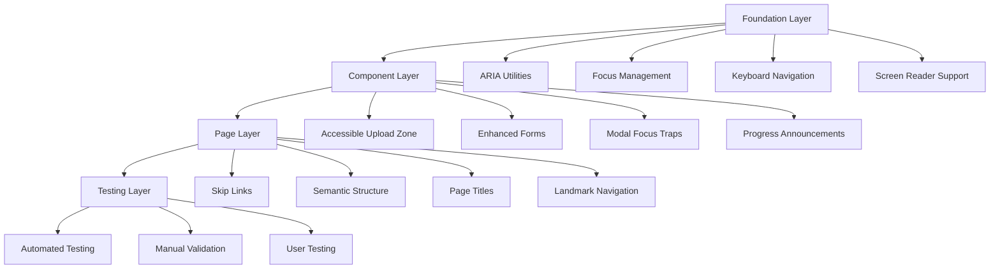

# Design Document

## Overview

This design establishes a comprehensive accessibility system for the MetaExtract images_mvp application, transforming it from a non-compliant application (20% WCAG 2.1 AA compliance) to a fully accessible, legally compliant application (100% WCAG 2.1 AA compliance). The design addresses 25+ critical accessibility barriers while maintaining the existing functionality and user experience.

## Architecture

### Accessibility-First Component Architecture

The accessibility system follows a layered architecture:

1. **Foundation Layer**: Core accessibility utilities and hooks
2. **Component Layer**: Enhanced UI components with built-in accessibility
3. **Page Layer**: Accessible page structures and navigation
4. **Testing Layer**: Automated accessibility validation



### Accessibility State Management

Centralized accessibility state management using React Context:

```typescript
interface AccessibilityContext {
  // Motion preferences
  prefersReducedMotion: boolean;
  
  // Focus management
  focusVisible: boolean;
  focusWithin: boolean;
  
  // Screen reader state
  announcements: string[];
  liveRegionContent: string;
  
  // Keyboard navigation
  keyboardNavigation: boolean;
  currentFocusId: string | null;
  
  // High contrast mode
  highContrast: boolean;
}
```

## Components and Interfaces

### 1. Accessible Upload Zone Component

**Current Issues:**
- No ARIA labels or roles
- No keyboard navigation support
- Missing focus management
- No screen reader announcements

**Enhanced Design:**

```typescript
interface AccessibleUploadZoneProps {
  onFileSelect: (file: File) => void;
  accept: string[];
  disabled?: boolean;
  ariaLabel?: string;
  ariaDescribedBy?: string;
}

interface UploadZoneState {
  isDragActive: boolean;
  isKeyboardFocused: boolean;
  hasError: boolean;
  errorMessage: string;
  uploadProgress: number;
  isUploading: boolean;
}
```

**Accessibility Features:**
- `role="button"` with proper ARIA labels
- `tabIndex={0}` for keyboard focus
- Keyboard event handlers (Enter, Space, Escape)
- `aria-live` regions for progress updates
- `aria-describedby` for error associations
- Visual focus indicators
- Alternative file input for keyboard users

### 2. Enhanced Form Components

**Current Issues:**
- Missing form labels
- No error associations
- Inadequate validation feedback

**Enhanced Design:**

```typescript
interface AccessibleInputProps extends InputHTMLAttributes<HTMLInputElement> {
  label: string;
  error?: string;
  required?: boolean;
  describedBy?: string;
  ariaLabel?: string;
}

interface FormFieldState {
  value: string;
  error: string | null;
  touched: boolean;
  focused: boolean;
}
```

**Accessibility Features:**
- Proper `<label>` associations
- `aria-required` for required fields
- `aria-describedby` for error messages
- `aria-invalid` for validation state
- `aria-live="assertive"` for error announcements

### 3. Modal Focus Management System

**Current Issues:**
- No focus trapping
- Focus not returned after close
- Missing ARIA attributes

**Enhanced Design:**

```typescript
interface AccessibleModalProps {
  isOpen: boolean;
  onClose: () => void;
  title: string;
  description?: string;
  initialFocus?: RefObject<HTMLElement>;
  returnFocus?: RefObject<HTMLElement>;
}

interface FocusTrapState {
  firstFocusableElement: HTMLElement | null;
  lastFocusableElement: HTMLElement | null;
  previousActiveElement: HTMLElement | null;
}
```

**Accessibility Features:**
- Focus trapping within modal
- `role="dialog"` with `aria-modal="true"`
- `aria-labelledby` and `aria-describedby`
- Escape key handling
- Focus return on close
- Backdrop click prevention during keyboard navigation

### 4. Progress Announcement System

**Current Issues:**
- No screen reader announcements
- Progress updates not accessible

**Enhanced Design:**

```typescript
interface ProgressAnnouncementProps {
  progress: number;
  status: 'idle' | 'uploading' | 'processing' | 'complete' | 'error';
  message?: string;
  announceInterval?: number;
}

interface ProgressState {
  lastAnnouncement: number;
  currentMessage: string;
  shouldAnnounce: boolean;
}
```

**Accessibility Features:**
- `aria-live="polite"` for progress updates
- `aria-live="assertive"` for errors
- Throttled announcements (every 10% progress)
- Descriptive status messages
- `role="progressbar"` with `aria-valuenow`

## Data Models

### Accessibility Configuration

```typescript
interface AccessibilityConfig {
  // WCAG compliance level
  complianceLevel: 'A' | 'AA' | 'AAA';
  
  // Color contrast requirements
  colorContrast: {
    normalText: number; // 4.5:1 for AA
    largeText: number;  // 3:1 for AA
    nonTextElements: number; // 3:1 for AA
  };
  
  // Touch target sizes
  touchTargets: {
    minimum: number; // 44px for AA
    recommended: number; // 48px
  };
  
  // Animation preferences
  motion: {
    respectReducedMotion: boolean;
    maxDuration: number; // 5 seconds
    providePauseControls: boolean;
  };
  
  // Keyboard navigation
  keyboard: {
    skipLinksEnabled: boolean;
    focusIndicatorsVisible: boolean;
    customKeyBindings: Record<string, string>;
  };
}
```

### ARIA Attribute Management

```typescript
interface ARIAAttributes {
  // Labels and descriptions
  label?: string;
  labelledBy?: string;
  describedBy?: string;
  
  // States and properties
  expanded?: boolean;
  selected?: boolean;
  checked?: boolean;
  disabled?: boolean;
  required?: boolean;
  invalid?: boolean;
  
  // Live regions
  live?: 'off' | 'polite' | 'assertive';
  atomic?: boolean;
  relevant?: 'additions' | 'removals' | 'text' | 'all';
  
  // Relationships
  controls?: string;
  owns?: string;
  flowTo?: string;
  
  // Roles
  role?: string;
  
  // Values
  valueNow?: number;
  valueMin?: number;
  valueMax?: number;
  valueText?: string;
}
```

### Focus Management State

```typescript
interface FocusManagementState {
  // Current focus
  activeElement: HTMLElement | null;
  focusHistory: HTMLElement[];
  
  // Focus traps
  activeTrap: {
    container: HTMLElement;
    firstElement: HTMLElement;
    lastElement: HTMLElement;
    returnElement: HTMLElement;
  } | null;
  
  // Skip links
  skipLinks: Array<{
    id: string;
    label: string;
    target: string;
  }>;
  
  // Keyboard navigation
  keyboardMode: boolean;
  lastInteractionType: 'mouse' | 'keyboard' | 'touch';
}
```

Now I need to use the prework tool to analyze the acceptance criteria before writing the correctness properties:

<function_calls>
<invoke name="prework">
<parameter name="featureName">accessibility-compliance

## Correctness Properties

*A property is a characteristic or behavior that should hold true across all valid executions of a system-essentially, a formal statement about what the system should do. Properties serve as the bridge between human-readable specifications and machine-verifiable correctness guarantees.*

### Property Reflection

After analyzing all acceptance criteria, I identified several areas where properties can be consolidated to eliminate redundancy:

- **ARIA Properties**: Multiple criteria about ARIA labels, descriptions, and states can be combined into comprehensive ARIA validation properties
- **Focus Management**: Properties about focus trapping, return, and visual indicators can be unified
- **Color Contrast**: Normal and large text contrast requirements can be combined into a single comprehensive property
- **Form Accessibility**: Label associations, error handling, and validation can be consolidated
- **Motion Preferences**: Various animation and motion requirements can be unified under motion preference respect

### Core Accessibility Properties

**Property 1: Universal ARIA Compliance**
*For any* interactive element in the application, it should have appropriate ARIA labels, roles, and state information that accurately describes its purpose and current state to assistive technologies
**Validates: Requirements 1.1, 1.5**

**Property 2: Complete Keyboard Navigation**
*For any* functionality available through mouse interaction, it should be equally accessible through keyboard navigation with logical tab order and standard key patterns
**Validates: Requirements 1.2, 4.1, 4.5**

**Property 3: Comprehensive Focus Management**
*For any* focus change in the application, it should provide clear visual indicators, maintain logical order, and properly manage focus trapping in modal contexts
**Validates: Requirements 1.3, 4.3, 4.4**

**Property 4: Upload Zone Keyboard Accessibility**
*For any* keyboard interaction with the upload zone, it should be activatable via Enter or Space keys and provide proper screen reader announcements
**Validates: Requirements 2.1, 2.2**

**Property 5: Alternative Interaction Methods**
*For any* drag-and-drop or touch-based interaction, the application should provide equivalent keyboard or alternative interaction methods
**Validates: Requirements 2.3, 10.2**

**Property 6: Progress Announcement Consistency**
*For any* file processing or system status change, updates should be announced via appropriate aria-live regions with proper timing and content
**Validates: Requirements 2.4, 9.3**

**Property 7: Error Message Association**
*For any* form validation error or system error, the error message should be properly associated with the relevant control via aria-describedby and announced appropriately
**Validates: Requirements 2.5, 5.2, 9.4, 9.5**

**Property 8: Universal Color Contrast Compliance**
*For any* text displayed over any background, the color contrast should meet WCAG AA requirements (4.5:1 for normal text, 3:1 for large text and non-text elements)
**Validates: Requirements 3.1, 3.4**

**Property 9: Multi-Modal Status Communication**
*For any* status information or interactive state change, the application should communicate the information through multiple channels (color, text, icons, ARIA states) rather than relying on color alone
**Validates: Requirements 3.2, 3.3**

**Property 10: Zoom Functionality Preservation**
*For any* content displayed at 200% zoom level, all functionality should remain accessible and readable without horizontal scrolling
**Validates: Requirements 3.5, 10.5**

**Property 11: Skip Link Navigation**
*For any* page with repetitive navigation elements, skip links should be provided and functional to allow users to bypass repetitive content
**Validates: Requirements 4.2**

**Property 12: Comprehensive Form Labeling**
*For any* form input element, it should have an associated label via label element or aria-label, with required status and instructions properly referenced
**Validates: Requirements 5.1, 5.3, 5.4**

**Property 13: Motion Preference Respect**
*For any* animation or motion effect, the application should respect the user's prefers-reduced-motion setting and provide alternative static indicators when motion is disabled
**Validates: Requirements 6.1, 6.2, 6.4, 6.5**

**Property 14: Animation Control Provision**
*For any* auto-playing animation exceeding 5 seconds, pause controls should be provided to allow users to stop the motion
**Validates: Requirements 6.3**

**Property 15: Semantic Content Structure**
*For any* page content, headings should follow logical hierarchy, lists should use proper markup, and landmark regions should be properly defined
**Validates: Requirements 7.1, 7.2, 7.5**

**Property 16: Dynamic Content Accessibility**
*For any* page content change or data table display, page titles should update appropriately and tables should include proper headers and captions
**Validates: Requirements 7.3, 7.4**

**Property 17: Results Display Accessibility**
*For any* metadata results display, proper table structure, headings, landmarks, and alternative text for visual content should be provided
**Validates: Requirements 8.1, 8.2, 8.3**

**Property 18: Dynamic Results Announcements**
*For any* filterable, sortable, or expandable results content, changes should be announced via aria-live regions and expansion states should be indicated via aria-expanded
**Validates: Requirements 8.4, 8.5**

**Property 19: Touch Target Size Compliance**
*For any* interactive element, the touch target should be minimum 44x44 pixels to ensure accessibility for users with motor disabilities
**Validates: Requirements 10.1**

**Property 20: Mobile Accessibility Support**
*For any* mobile interface, navigation should support assistive technology and forms should provide appropriate input types and labels
**Validates: Requirements 10.3, 10.4**

## Error Handling

### Accessibility Error Recovery

The system implements graceful degradation for accessibility features:

1. **ARIA Fallbacks**: If dynamic ARIA updates fail, static ARIA attributes provide baseline accessibility
2. **Focus Management Fallbacks**: If focus trapping fails, manual focus management ensures keyboard users aren't lost
3. **Announcement Fallbacks**: If live regions fail, visual indicators and status text provide alternative feedback
4. **Keyboard Navigation Fallbacks**: If custom keyboard handlers fail, native browser navigation remains functional

### Error Reporting and Monitoring

```typescript
interface AccessibilityError {
  type: 'aria' | 'focus' | 'contrast' | 'keyboard' | 'structure';
  severity: 'critical' | 'high' | 'medium' | 'low';
  element: HTMLElement;
  message: string;
  wcagCriterion: string;
  autoFixable: boolean;
}

interface AccessibilityMonitoring {
  errors: AccessibilityError[];
  warnings: AccessibilityError[];
  complianceScore: number;
  lastAudit: Date;
  autoFixesApplied: number;
}
```

## Testing Strategy

### Dual Testing Approach

The accessibility system requires both automated and manual testing:

**Automated Testing:**
- Property-based tests for universal accessibility rules
- Unit tests for specific component accessibility features
- Integration tests for complete user flows
- Automated accessibility scanning (axe-core integration)

**Manual Testing:**
- Screen reader testing (NVDA, JAWS, VoiceOver)
- Keyboard-only navigation testing
- High contrast mode testing
- Zoom level testing (up to 200%)
- Mobile assistive technology testing

### Property-Based Testing Configuration

Each accessibility property will be implemented as a property-based test using fast-check with minimum 100 iterations:

```typescript
// Example property test structure
describe('Accessibility Properties', () => {
  it('Property 1: Universal ARIA Compliance', () => {
    fc.assert(fc.property(
      fc.record({
        elementType: fc.constantFrom('button', 'input', 'select', 'textarea'),
        hasLabel: fc.boolean(),
        hasRole: fc.boolean(),
        hasState: fc.boolean()
      }),
      (config) => {
        const element = createTestElement(config);
        const ariaCompliance = checkARIACompliance(element);
        return ariaCompliance.isCompliant;
      }
    ), { numRuns: 100 });
  });
});
```

**Test Tags Format:**
- **Feature: accessibility-compliance, Property 1: Universal ARIA Compliance**
- **Feature: accessibility-compliance, Property 2: Complete Keyboard Navigation**
- etc.

### Accessibility Testing Tools Integration

1. **axe-core**: Automated accessibility scanning
2. **jest-axe**: Jest integration for accessibility testing
3. **@testing-library/jest-dom**: Accessibility-focused DOM testing utilities
4. **pa11y**: Command-line accessibility testing
5. **lighthouse**: Performance and accessibility auditing

### Manual Testing Protocols

1. **Screen Reader Testing Protocol**:
   - Test with NVDA (Windows), JAWS (Windows), VoiceOver (macOS)
   - Verify all content is announced correctly
   - Test navigation patterns and shortcuts
   - Validate form completion workflows

2. **Keyboard Navigation Protocol**:
   - Test all functionality with keyboard only
   - Verify tab order is logical
   - Test custom keyboard shortcuts
   - Validate focus trapping in modals

3. **Visual Testing Protocol**:
   - Test with high contrast mode
   - Verify color contrast ratios
   - Test at 200% zoom level
   - Validate focus indicators visibility

### Continuous Accessibility Monitoring

```typescript
interface AccessibilityCI {
  // Pre-commit hooks
  lintAccessibility: boolean;
  
  // Build-time checks
  contrastValidation: boolean;
  ariaValidation: boolean;
  structureValidation: boolean;
  
  // Runtime monitoring
  errorTracking: boolean;
  performanceImpact: boolean;
  userFeedback: boolean;
  
  // Compliance reporting
  wcagComplianceLevel: 'A' | 'AA' | 'AAA';
  complianceScore: number;
  lastAuditDate: Date;
}
```

This comprehensive accessibility design ensures the MetaExtract images_mvp application will achieve full WCAG 2.1 AA compliance, eliminate legal liability, and provide an inclusive experience for all users including those with disabilities.