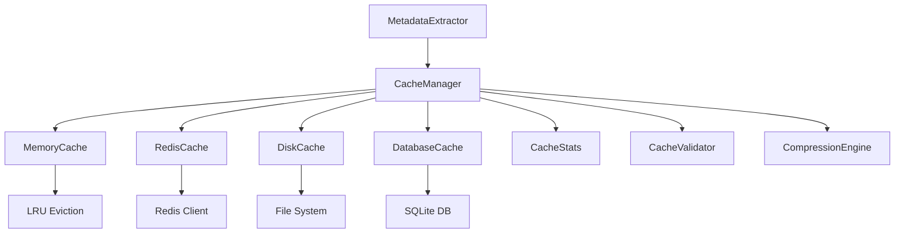

# Design Document: Cache System Infrastructure Fix

## Overview

This design addresses critical structural issues in the MetaExtract cache system to ensure reliable, high-performance metadata caching. The current implementation has Python syntax errors, method definition issues, and architectural problems that prevent proper functionality.

## Architecture

### Current Issues Analysis

The existing cache system has several critical problems:

1. **Method Definition Issues**: Some methods appear to be defined outside their proper class scope
2. **Incomplete Class Structure**: The `AdvancedMetadataCache` class has methods that reference `self` but may not be properly indented
3. **Global State Management**: Mixed global functions and class-based approaches create confusion
4. **Error Handling Gaps**: Insufficient error handling for cache tier failures
5. **Thread Safety Issues**: Potential race conditions in multi-threaded environments

### Proposed Architecture



## Components and Interfaces

### 1. CacheManager (Main Interface)

```python
class CacheManager:
    """Main cache management interface"""
    
    def __init__(self, config: CacheConfig):
        """Initialize cache with configuration"""
        
    def get(self, file_path: str, tier: str) -> Optional[Dict[str, Any]]:
        """Retrieve metadata from cache"""
        
    def put(self, file_path: str, metadata: Dict[str, Any], tier: str) -> bool:
        """Store metadata in cache"""
        
    def invalidate(self, file_path: str, tier: Optional[str] = None) -> bool:
        """Invalidate cache entries"""
        
    def get_stats(self) -> CacheStats:
        """Get cache performance statistics"""
```

### 2. Cache Tier Implementations

```python
class CacheTier(ABC):
    """Abstract base class for cache tiers"""
    
    @abstractmethod
    def get(self, key: str) -> Optional[CacheEntry]:
        """Retrieve entry from this tier"""
        
    @abstractmethod
    def put(self, key: str, entry: CacheEntry) -> bool:
        """Store entry in this tier"""
        
    @abstractmethod
    def remove(self, key: str) -> bool:
        """Remove entry from this tier"""

class MemoryCache(CacheTier):
    """In-memory LRU cache implementation"""
    
class RedisCache(CacheTier):
    """Redis-based distributed cache"""
    
class DiskCache(CacheTier):
    """File system-based cache"""
    
class DatabaseCache(CacheTier):
    """SQLite database cache"""
```

### 3. Cache Entry Model

```python
@dataclass
class CacheEntry:
    """Immutable cache entry with validation"""
    file_path: str
    file_hash: str
    file_size: int
    file_mtime: float
    metadata: Dict[str, Any]
    extraction_tier: str
    extraction_time_ms: int
    cached_at: datetime
    access_count: int = 0
    last_accessed: Optional[datetime] = None
    compression_ratio: float = 1.0
    
    def is_valid_for_file(self, file_stat: os.stat_result) -> bool:
        """Validate entry against current file state"""
        
    def to_storage_dict(self) -> Dict[str, Any]:
        """Convert to storage-compatible format"""
```

### 4. Configuration Management

```python
@dataclass
class CacheConfig:
    """Cache system configuration"""
    cache_dir: Path
    max_memory_entries: int = 1000
    max_disk_size_mb: int = 500
    enable_compression: bool = True
    enable_redis: bool = True
    enable_database: bool = True
    cache_ttl_hours: int = 24
    redis_host: str = "localhost"
    redis_port: int = 6379
    compression_level: int = 6
    background_cleanup: bool = True
    
    @classmethod
    def from_env(cls) -> 'CacheConfig':
        """Create configuration from environment variables"""
```

## Data Models

### Cache Key Generation

```python
class CacheKeyGenerator:
    """Generates consistent, collision-resistant cache keys"""
    
    def generate_key(self, file_path: str, tier: str) -> str:
        """Generate cache key from file and tier"""
        file_hash = self._calculate_file_hash(file_path)
        return f"meta_{file_hash}_{tier}"
    
    def _calculate_file_hash(self, file_path: str) -> str:
        """Calculate optimized file hash"""
        # For small files: full content hash
        # For large files: size + mtime + first/middle/last chunks
```

### Compression Engine

```python
class CompressionEngine:
    """Handles metadata compression and decompression"""
    
    def compress(self, data: Dict[str, Any]) -> Tuple[bytes, float]:
        """Compress metadata, return data and compression ratio"""
        
    def decompress(self, compressed_data: bytes, ratio: float) -> Dict[str, Any]:
        """Decompress metadata"""
```

### Cache Statistics

```python
@dataclass
class CacheStats:
    """Cache performance statistics"""
    total_requests: int
    hits: int
    misses: int
    memory_hits: int
    redis_hits: int
    disk_hits: int
    database_hits: int
    evictions: int
    compression_savings_bytes: int
    
    @property
    def hit_rate(self) -> float:
        """Calculate hit rate percentage"""
        return (self.hits / self.total_requests * 100) if self.total_requests > 0 else 0.0
```

## Correctness Properties

*A property is a characteristic or behavior that should hold true across all valid executions of a system-essentially, a formal statement about what the system should do. Properties serve as the bridge between human-readable specifications and machine-verifiable correctness guarantees.*

### Property 1: Cache Consistency
*For any* file and tier combination, when metadata is cached and the file hasn't changed, retrieving from cache should return the same metadata that was stored.

**Formal Statement:** `∀ file_path, tier, metadata: cache.put(file_path, metadata, tier) ∧ file_unchanged(file_path) → cache.get(file_path, tier) = metadata`

**Test Strategy:** Property-based testing with random file paths, metadata dictionaries, and tier values. Verify that stored and retrieved metadata are identical when file hasn't changed.

**Validates: Requirements 3.1, 3.2**

### Property 2: Cache Tier Promotion
*For any* cache entry retrieved from a lower tier, the entry should be promoted to all higher-performance tiers for faster future access.

**Formal Statement:** `∀ entry: retrieved_from_tier(entry, lower_tier) → ∃ higher_tiers: entry ∈ all(higher_tiers)`

**Test Strategy:** Store entries in lower tiers only, retrieve them, then verify they exist in higher-performance tiers (memory, Redis).

**Validates: Requirements 2.3**

### Property 3: Cache Invalidation Completeness
*For any* file that is modified, all cache entries for that file across all tiers should be invalidated when the modification is detected.

**Formal Statement:** `∀ file_path: file_modified(file_path) → ∀ tier: cache.get(file_path, tier) = None`

**Test Strategy:** Cache entries for a file, modify the file, then verify all tier lookups return cache misses.

**Validates: Requirements 3.1**

### Property 4: Thread Safety
*For any* concurrent cache operations on the same or different keys, the cache should maintain data consistency without race conditions or corruption.

**Formal Statement:** `∀ operations: concurrent_execution(operations) → consistent_state(cache) ∧ no_corruption(cache)`

**Test Strategy:** Concurrent property testing with multiple threads performing cache operations simultaneously. Verify final state consistency.

**Validates: Requirements 5.1**

### Property 5: Error Recovery
*For any* cache tier failure, the cache system should continue operating with remaining tiers without losing functionality or data.

**Formal Statement:** `∀ tier_failure: tier_fails(tier) → cache_operations_continue() ∧ data_preserved(other_tiers)`

**Test Strategy:** Mock tier failures (Redis down, disk full, database locked) and verify cache continues operating with remaining tiers.

**Validates: Requirements 5.2, 5.4**

### Property 6: Cache Key Uniqueness
*For any* two different files or different extraction tiers, the generated cache keys should be unique to prevent collisions.

**Formal Statement:** `∀ (file1, tier1), (file2, tier2): (file1 ≠ file2 ∨ tier1 ≠ tier2) → cache_key(file1, tier1) ≠ cache_key(file2, tier2)`

**Test Strategy:** Generate cache keys for many file/tier combinations and verify no collisions occur.

**Validates: Requirements 6.1, 6.3**

### Property 7: Compression Round Trip
*For any* metadata that is compressed and stored, decompressing the stored data should yield the original metadata.

**Formal Statement:** `∀ metadata: decompress(compress(metadata)) = metadata`

**Test Strategy:** Property-based testing with random metadata structures, compress then decompress, verify equality.

**Validates: Requirements 7.1, 7.3**

### Property 8: LRU Eviction Correctness
*For any* memory cache at capacity, when a new entry is added, the least recently used entry should be evicted.

**Formal Statement:** `∀ cache_at_capacity: add_entry(new_entry) → evicted_entry = least_recently_used(cache)`

**Test Strategy:** Fill cache to capacity, track access patterns, add new entry, verify correct LRU eviction.

**Validates: Requirements 2.4**

### Property 9: TTL Expiration
*For any* cache entry older than the configured TTL, the entry should be automatically removed during cleanup operations.

**Formal Statement:** `∀ entry: age(entry) > TTL → cleanup() → entry ∉ cache`

**Test Strategy:** Create entries with known timestamps, advance time past TTL, run cleanup, verify entries are removed.

**Validates: Requirements 3.3**

### Property 10: Statistics Accuracy
*For any* cache operation, the corresponding statistics counters should be incremented correctly to reflect actual system behavior.

**Formal Statement:** `∀ operation: execute(operation) → stats_after = stats_before + expected_increment(operation)`

**Test Strategy:** Track statistics before/after operations, verify counters increment correctly for hits, misses, evictions, etc.

**Validates: Requirements 4.1, 4.2**

### Property 11: Method Definition Correctness
*For any* method in the cache classes, the method should be properly defined within its class scope and accessible via self.

**Formal Statement:** `∀ method ∈ class: method.scope = class ∧ method.accessible_via_self = True`

**Test Strategy:** Static analysis and runtime verification that all methods are properly indented and accessible.

**Validates: Requirements 1.2, 1.4**

### Property 12: Class Instantiation Success
*For any* cache class, instantiation should succeed without Python syntax or structural errors.

**Formal Statement:** `∀ cache_class: instantiate(cache_class) → success ∧ no_syntax_errors`

**Test Strategy:** Attempt to instantiate all cache classes and verify no exceptions are raised during initialization.

**Validates: Requirements 1.1, 1.3**

## Error Handling

### Cache Tier Failure Handling

```python
class CacheTierManager:
    """Manages cache tier availability and fallback"""
    
    def execute_with_fallback(self, operation: Callable, tiers: List[CacheTier]) -> Any:
        """Execute operation with automatic tier fallback"""
        for tier in tiers:
            try:
                return operation(tier)
            except Exception as e:
                logger.warning(f"Cache tier {tier.__class__.__name__} failed: {e}")
                continue
        raise CacheOperationError("All cache tiers failed")
```

### Error Recovery Strategies

1. **Redis Unavailable**: Fall back to local caching (memory + disk + database)
2. **Disk Full**: Continue with memory + Redis, log warnings
3. **Database Locked**: Skip database tier, use other tiers
4. **Compression Failure**: Store uncompressed data with warning
5. **Key Generation Failure**: Use fallback key based on file path + mtime

### Graceful Degradation

```python
class CacheHealthMonitor:
    """Monitors cache tier health and manages degradation"""
    
    def check_tier_health(self, tier: CacheTier) -> bool:
        """Check if cache tier is healthy"""
        
    def get_available_tiers(self) -> List[CacheTier]:
        """Return list of currently available cache tiers"""
```

## Testing Strategy

### Unit Testing Approach
- Test each cache tier implementation independently
- Mock external dependencies (Redis, file system, database)
- Test error conditions and edge cases
- Validate thread safety with concurrent access tests

### Property-Based Testing Configuration
- Use **pytest** with **hypothesis** for property-based testing
- Minimum 100 iterations per property test
- Generate random file paths, metadata structures, and tier configurations
- Test with various file sizes and modification patterns

### Integration Testing
- Test full cache system with real Redis instance
- Test with actual file system operations
- Test cache warming with multiple files
- Test system behavior under resource constraints

### Performance Testing
- Benchmark cache hit/miss performance
- Test memory usage under load
- Validate compression effectiveness
- Test concurrent access scalability

## Implementation Notes

### Thread Safety Implementation
- Use `threading.Lock` for memory cache operations
- Implement connection pooling for database access
- Use Redis pipeline operations for atomic multi-key operations
- Ensure all shared state is properly protected

### Performance Optimizations
- Implement connection pooling for database and Redis
- Use batch operations where possible
- Implement smart cache key generation for large files
- Use background threads for cleanup operations

### Monitoring and Observability
- Structured logging with cache operation details
- Metrics collection for cache performance
- Health check endpoints for cache tier status
- Configuration validation on startup