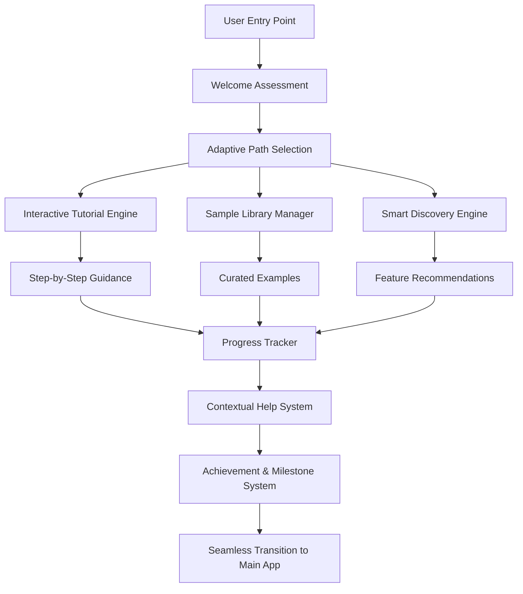
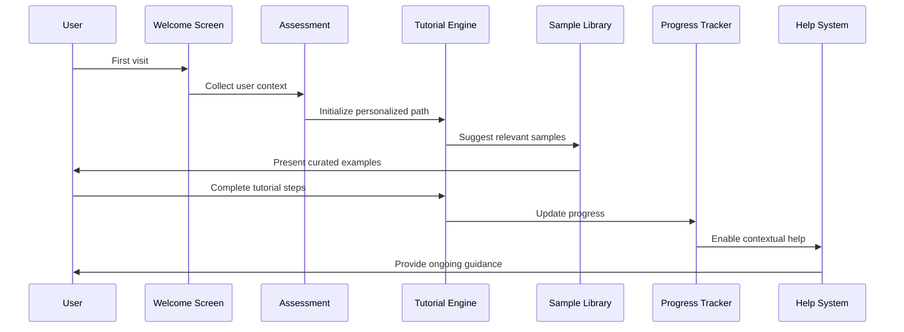

# Design Document: Intelligent User Onboarding & First-Time Experience

## Overview

This design creates a comprehensive onboarding system that transforms new user experience from overwhelming to delightful. The system uses progressive disclosure, contextual guidance, and adaptive learning paths to help users discover the full value of MetaExtract's capabilities while maintaining simplicity for beginners.

The design emphasizes three core principles:
1. **Progressive Disclosure**: Introduce complexity gradually as users demonstrate readiness
2. **Contextual Relevance**: Show the right information at the right time
3. **Adaptive Intelligence**: Customize the experience based on user behavior and needs

## Architecture

### Onboarding System Architecture



### Component Interaction Flow



## Components and Interfaces

### Frontend Component Architecture

**Core Onboarding Components**

```typescript
interface OnboardingState {
  currentStep: number;
  totalSteps: number;
  userProfile: UserProfile;
  completedMilestones: string[];
  availableFeatures: string[];
  adaptivePath: OnboardingPath;
}

interface UserProfile {
  useCase: 'personal' | 'professional' | 'forensic' | 'research' | 'enterprise';
  technicalLevel: 'beginner' | 'intermediate' | 'advanced';
  primaryFileTypes: string[];
  industry?: string;
  goals: string[];
}

interface OnboardingPath {
  id: string;
  name: string;
  description: string;
  steps: OnboardingStep[];
  estimatedDuration: number;
  prerequisites: string[];
}

interface OnboardingStep {
  id: string;
  title: string;
  description: string;
  component: React.ComponentType;
  targetElement?: string;
  position: 'top' | 'bottom' | 'left' | 'right' | 'center';
  skippable: boolean;
  completionCriteria: CompletionCriteria;
}
```

**Tutorial Engine Components**

```typescript
// Main tutorial orchestrator
export function TutorialEngine({
  path,
  onComplete,
  onSkip
}: TutorialEngineProps) {
  // Manages step progression, overlay positioning, user interaction
}

// Interactive overlay for highlighting elements
export function TutorialOverlay({
  targetElement,
  content,
  position,
  onNext,
  onSkip
}: TutorialOverlayProps) {
  // Creates spotlight effect, positions tooltip, handles interactions
}

// Progress indicator with milestone tracking
export function OnboardingProgress({
  currentStep,
  totalSteps,
  milestones,
  achievements
}: OnboardingProgressProps) {
  // Visual progress bar, milestone markers, achievement badges
}
```

**Sample Library Components**

```typescript
interface SampleFile {
  id: string;
  name: string;
  type: string;
  size: number;
  description: string;
  highlights: string[];
  difficulty: 'basic' | 'intermediate' | 'advanced';
  useCase: string[];
  expectedResults: MetadataPreview;
}

export function SampleLibrary({
  userProfile,
  onFileSelect,
  onProcess
}: SampleLibraryProps) {
  // Curated file grid, filtering, recommendations
}

export function SampleFileCard({
  file,
  isRecommended,
  onSelect
}: SampleFileCardProps) {
  // File preview, metadata highlights, selection interface
}
```

**Smart Discovery Components**

```typescript
interface FeatureRecommendation {
  featureId: string;
  title: string;
  description: string;
  value: string;
  trigger: 'file-type' | 'usage-pattern' | 'milestone' | 'time-based';
  confidence: number;
  prerequisites: string[];
}

export function SmartDiscovery({
  userBehavior,
  currentContext,
  onFeatureIntroduce
}: SmartDiscoveryProps) {
  // Analyzes user patterns, suggests relevant features
}

export function FeatureIntroduction({
  feature,
  onTry,
  onDismiss,
  onLearnMore
}: FeatureIntroductionProps) {
  // Non-intrusive feature highlight, value explanation
}
```

### Backend Service Architecture

**Onboarding Analytics Service**

```typescript
interface OnboardingAnalytics {
  trackStepCompletion(userId: string, stepId: string, duration: number): void;
  trackFeatureDiscovery(userId: string, featureId: string, context: string): void;
  trackSampleFileUsage(userId: string, fileId: string, outcome: string): void;
  generatePersonalizedPath(userProfile: UserProfile): OnboardingPath;
  getFeatureRecommendations(userId: string, context: UserContext): FeatureRecommendation[];
}

interface UserContext {
  currentFiles: string[];
  recentActions: string[];
  completedSteps: string[];
  timeSpent: number;
  errorEncountered: string[];
}
```

**Sample File Management Service**

```typescript
interface SampleFileService {
  getCuratedSamples(criteria: SampleCriteria): Promise<SampleFile[]>;
  getRecommendedSamples(userProfile: UserProfile): Promise<SampleFile[]>;
  processSampleFile(fileId: string, tier: string): Promise<MetadataResult>;
  trackSampleUsage(userId: string, fileId: string, outcome: string): void;
}

interface SampleCriteria {
  fileTypes?: string[];
  difficulty?: string;
  useCase?: string;
  industry?: string;
  limit?: number;
}
```

## Data Models

### Onboarding Data Models

```typescript
interface OnboardingSession {
  id: string;
  userId: string;
  startedAt: Date;
  completedAt?: Date;
  currentStep: number;
  pathId: string;
  userProfile: UserProfile;
  progress: OnboardingProgress;
  interactions: UserInteraction[];
}

interface OnboardingProgress {
  stepsCompleted: string[];
  milestonesAchieved: string[];
  featuresDiscovered: string[];
  samplesProcessed: string[];
  timeSpent: number;
  completionRate: number;
}

interface UserInteraction {
  timestamp: Date;
  type: 'step-complete' | 'skip' | 'help-request' | 'feature-try' | 'error';
  stepId?: string;
  featureId?: string;
  duration?: number;
  metadata: Record<string, any>;
}
```

### Sample Library Data Models

```typescript
interface SampleFileMetadata {
  id: string;
  filename: string;
  originalName: string;
  fileType: string;
  size: number;
  uploadedAt: Date;
  description: string;
  tags: string[];
  difficulty: 'basic' | 'intermediate' | 'advanced';
  useCases: string[];
  industries: string[];
  highlights: MetadataHighlight[];
  processingTime: number;
  popularityScore: number;
}

interface MetadataHighlight {
  category: string;
  field: string;
  value: string;
  explanation: string;
  significance: 'low' | 'medium' | 'high';
}
```

### Achievement System Data Models

```typescript
interface Achievement {
  id: string;
  title: string;
  description: string;
  icon: string;
  category: 'onboarding' | 'feature-discovery' | 'expertise' | 'milestone';
  requirements: AchievementRequirement[];
  reward?: string;
  rarity: 'common' | 'uncommon' | 'rare' | 'legendary';
}

interface UserAchievement {
  userId: string;
  achievementId: string;
  unlockedAt: Date;
  progress: number;
  completed: boolean;
}
```

## Correctness Properties

*A property is a characteristic or behavior that should hold true across all valid executions of a system-essentially, a formal statement about what the system should do. Properties serve as the bridge between human-readable specifications and machine-verifiable correctness guarantees.*

<function_calls>
<invoke name="prework">
<parameter name="featureName">intelligent-user-onboarding

### Tutorial System Properties

Property 1: New user welcome screen display
*For any* user without existing session data or onboarding completion status, the welcome screen should be displayed on first application visit
**Validates: Requirements 1.1**

Property 2: Interactive overlay presence
*For any* tutorial step that specifies a target UI element, an interactive overlay should appear that highlights that specific element
**Validates: Requirements 1.2**

Property 3: Step completion feedback
*For any* completed tutorial step, the system should provide positive feedback and preview the next step in the sequence
**Validates: Requirements 1.3**

Property 4: Tutorial control availability
*For any* active tutorial session, skip, pause, and restart controls should be accessible and functional
**Validates: Requirements 1.4**

Property 5: Advanced tutorial unlocking
*For any* user completing the basic tutorial, advanced tutorial options should be offered based on their demonstrated interests and interactions
**Validates: Requirements 1.5**

Property 6: Adaptive tutorial pacing
*For any* user interaction pattern (fast, slow, error-prone, successful), the tutorial engine should adjust its pace and complexity accordingly
**Validates: Requirements 1.6**

### Sample Library Properties

Property 7: Sample file coverage
*For any* major file type or use case supported by the application, corresponding curated sample files should be available in the library
**Validates: Requirements 2.1**

Property 8: Sample file explanation
*For any* selected sample file, the system should provide clear explanation of what metadata will be extracted and why it's valuable
**Validates: Requirements 2.2**

Property 9: Difficulty level representation
*For any* difficulty level (basic, intermediate, advanced), the sample library should contain representative files demonstrating that complexity
**Validates: Requirements 2.3**

Property 10: Metadata highlighting
*For any* processed sample file, the system should highlight the most interesting and valuable metadata findings
**Validates: Requirements 2.4**

Property 11: Personalized sample recommendations
*For any* user profile with stated interests or industry, relevant sample files should be recommended that match those criteria
**Validates: Requirements 2.5**

Property 12: Sample file comparison availability
*For any* set of sample files of the same type, comparison functionality should be available to show differences and similarities
**Validates: Requirements 2.6**

### Smart Discovery Properties

Property 13: Prerequisite-based feature introduction
*For any* advanced feature with defined prerequisites, the feature should only be introduced after users have demonstrated mastery of those prerequisites
**Validates: Requirements 3.1**

Property 14: Context-aware feature suggestions
*For any* uploaded file that could benefit from advanced analysis, relevant premium features should be suggested with clear value explanations
**Validates: Requirements 3.2**

Property 15: Usage-based recommendations
*For any* user who engages with specific features, similar or complementary capabilities should be recommended based on that usage pattern
**Validates: Requirements 3.3**

Property 16: Proficiency-based tutorial unlocking
*For any* user demonstrating proficiency with basic features, intermediate tutorials should be unlocked and made available
**Validates: Requirements 3.4**

Property 17: Personalized feature recommendations
*For any* user's file types and usage patterns, feature recommendations should be personalized to match their specific needs and behaviors
**Validates: Requirements 3.5**

Property 18: Value-first upgrade suggestions
*For any* upgrade suggestion, clear explanations of feature value and benefits should be provided before presenting pricing or upgrade options
**Validates: Requirements 3.6**

### Contextual Help Properties

Property 19: Unfamiliar feature detection
*For any* user interaction with features they haven't used before, contextual help should be triggered automatically
**Validates: Requirements 4.1**

Property 20: Error-specific guidance
*For any* error state encountered by users, specific guidance for resolution should be provided rather than generic error messages
**Validates: Requirements 4.2**

Property 21: Metadata field explanations
*For any* metadata field displayed in results, plain language explanations should be available to help users understand the meaning
**Validates: Requirements 4.3**

Property 22: First-time feature tooltips
*For any* advanced feature accessed for the first time, brief explanatory tooltips should appear to guide initial usage
**Validates: Requirements 4.4**

Property 23: Expandable help depth
*For any* help content, expandable sections should be available to provide deeper explanations for users who want more detail
**Validates: Requirements 4.5**

Property 24: Help topic memory
*For any* help topic viewed by a user, the system should remember this to avoid repetitive suggestions of the same content
**Validates: Requirements 4.6**

### Progress Tracking Properties

Property 25: Visual progress accuracy
*For any* point in the onboarding process, the visual progress indicator should accurately reflect the user's completion status
**Validates: Requirements 5.1**

Property 26: Milestone celebration
*For any* significant milestone completion, celebratory feedback should be provided and new capabilities should be unlocked
**Validates: Requirements 5.2**

Property 27: Feature exploration tracking
*For any* user's feature usage, the progress tracker should accurately show which features have been tried and which remain unexplored
**Validates: Requirements 5.3**

Property 28: Achievement badge awarding
*For any* completed analysis type or significant action, appropriate achievement badges should be awarded to recognize the accomplishment
**Validates: Requirements 5.4**

Property 29: Proficiency-based tier suggestions
*For any* user reaching defined proficiency levels, appropriate subscription tier suggestions should be made based on their demonstrated usage
**Validates: Requirements 5.5**

Property 30: Personalized dashboard accuracy
*For any* user's extraction history and unlocked capabilities, the personalized dashboard should accurately reflect their journey and current status
**Validates: Requirements 5.6**

### Adaptive Learning Properties

Property 31: Use case customization
*For any* user's selected primary use case, the onboarding content and tutorial path should be customized to match that specific context
**Validates: Requirements 6.2, 6.3**

Property 32: Expertise-based explanation depth
*For any* user's indicated technical expertise level, explanation depth and complexity should be adjusted to match their knowledge level
**Validates: Requirements 6.2**

Property 33: Advanced knowledge adaptation
*For any* user demonstrating advanced knowledge through their interactions, basic explanations should be skipped in favor of unique feature focus
**Validates: Requirements 6.4**

Property 34: Interaction-based path modification
*For any* user's interaction speed and success rate patterns, the onboarding path should be modified to optimize their learning experience
**Validates: Requirements 6.5**

Property 35: User type differentiation
*For any* user type (personal, professional, enterprise), different onboarding tracks should be provided that match their specific needs and context
**Validates: Requirements 6.6**

### Integration Properties

Property 36: Workflow integration seamlessness
*For any* existing upload and processing workflow, the onboarding system should integrate without disrupting or breaking normal functionality
**Validates: Requirements 7.1**

Property 37: Data preservation on completion
*For any* user completing onboarding, their tutorial progress and sample results should be preserved and accessible in their account
**Validates: Requirements 7.2**

Property 38: Ongoing help availability
*For any* user who has completed onboarding, contextual help should remain available throughout regular application usage
**Validates: Requirements 7.3**

Property 39: Mini-tutorial provision
*For any* returning user accessing new features, mini-tutorials should be provided without requiring full onboarding restart
**Validates: Requirements 7.4**

Property 40: Guidance preference respect
*For any* user's set preferences for guidance level, these should be respected throughout ongoing application usage
**Validates: Requirements 7.5**

Property 41: Help menu accessibility
*For any* user at any time, onboarding resources and tutorials should be accessible through the help menu system
**Validates: Requirements 7.6**

### Performance and Accessibility Properties

Property 42: Load time compliance
*For any* standard internet connection, the onboarding system should load and respond within 2 seconds
**Validates: Requirements 8.1**

Property 43: Keyboard accessibility
*For any* tutorial step or onboarding interaction, full functionality should be available via keyboard navigation and screen readers
**Validates: Requirements 8.2**

Property 44: Cross-device consistency
*For any* device type (desktop, tablet, mobile), the onboarding experience should work consistently with appropriate responsive adaptations
**Validates: Requirements 8.3**

Property 45: Content prioritization under constraints
*For any* slow connection scenario, essential onboarding content should be prioritized for loading before non-critical elements
**Validates: Requirements 8.4**

Property 46: Multi-language support
*For any* supported language, the onboarding system should provide complete functionality and content in that language
**Validates: Requirements 8.5**

Property 47: Accessibility option availability
*For any* user requiring visual accommodations, high contrast and large text options should be available and functional throughout onboarding
**Validates: Requirements 8.6**

## Error Handling

### Graceful Onboarding Failures

**Tutorial Engine Error Recovery**
- Step loading failures: Skip to next step with explanation
- Overlay positioning errors: Fall back to modal dialog
- Progress tracking failures: Maintain local state, sync when possible
- Sample file loading errors: Provide alternative samples

**User Experience Continuity**
```typescript
interface OnboardingErrorHandler {
  handleStepFailure(stepId: string, error: Error): OnboardingRecovery;
  handleSampleLoadFailure(fileId: string): SampleFile[];
  handleProgressSyncFailure(progress: OnboardingProgress): void;
  handleTutorialCrash(context: TutorialContext): OnboardingPath;
}

interface OnboardingRecovery {
  action: 'retry' | 'skip' | 'alternative' | 'fallback';
  message: string;
  alternativeStep?: OnboardingStep;
  fallbackPath?: OnboardingPath;
}
```

**Data Persistence Strategies**
- Local storage backup for progress
- Periodic sync with server
- Offline mode for basic tutorials
- Recovery from partial completion states

## Testing Strategy

### Dual Testing Approach

The onboarding system requires both unit testing and property-based testing to ensure comprehensive coverage:

**Unit Tests** focus on:
- Specific user interaction scenarios (clicking tutorial buttons, selecting samples)
- Tutorial step transitions and state management
- Sample file loading and processing
- Achievement unlocking logic
- Error handling and recovery paths

**Property-Based Tests** focus on:
- Tutorial engine behavior across all possible user paths
- Sample recommendation accuracy across different user profiles
- Progress tracking consistency across all interaction patterns
- Contextual help availability across all features and states
- Adaptive behavior correctness across different user types and speeds

### Property-Based Testing Configuration

**Testing Framework**: fast-check for TypeScript property-based testing
**Test Configuration**: Minimum 100 iterations per property test
**Test Tagging**: Each property test must reference its design document property

Example property test structure:
```typescript
// Feature: intelligent-user-onboarding, Property 1: New user welcome screen display
test('new users see welcome screen on first visit', () => {
  fc.assert(fc.property(
    fc.record({
      hasExistingSession: fc.constant(false),
      hasCompletedOnboarding: fc.constant(false),
      userAgent: fc.string(),
      visitTimestamp: fc.date()
    }),
    (userState) => {
      const app = renderApp(userState);
      const welcomeScreen = app.getByTestId('welcome-screen');
      expect(welcomeScreen).toBeVisible();
      expect(welcomeScreen).toHaveTextContent('Welcome');
    }
  ));
});

// Feature: intelligent-user-onboarding, Property 13: Prerequisite-based feature introduction
test('advanced features only appear after prerequisites', () => {
  fc.assert(fc.property(
    fc.record({
      completedSteps: fc.array(fc.string()),
      currentFeature: fc.string(),
      userProfile: fc.record({
        technicalLevel: fc.constantFrom('beginner', 'intermediate', 'advanced'),
        useCase: fc.constantFrom('personal', 'professional', 'forensic')
      })
    }),
    ({ completedSteps, currentFeature, userProfile }) => {
      const prerequisites = getFeaturePrerequisites(currentFeature);
      const shouldShowFeature = prerequisites.every(req => completedSteps.includes(req));
      
      const discoveryEngine = new SmartDiscovery(userProfile, completedSteps);
      const recommendations = discoveryEngine.getFeatureRecommendations();
      const isRecommended = recommendations.some(rec => rec.featureId === currentFeature);
      
      expect(isRecommended).toBe(shouldShowFeature);
    }
  ));
});
```

### Testing Coverage Requirements

**Critical User Flows**
- First-time user complete onboarding journey
- Returning user accessing new features
- Different user types (personal, professional, enterprise) experiencing customized paths
- Error recovery and graceful degradation scenarios
- Cross-device onboarding consistency

**Performance Testing**
- Onboarding load times across different connection speeds
- Tutorial engine responsiveness during step transitions
- Sample file loading and processing performance
- Progress tracking and sync performance

**Accessibility Testing**
- Complete keyboard navigation through all tutorial steps
- Screen reader compatibility for all onboarding content
- High contrast and large text mode functionality
- Multi-language content accuracy and completeness

### Continuous Quality Assurance

**Automated Testing Pipeline**
- Pre-commit hooks for onboarding component changes
- Visual regression testing for tutorial overlays and progress indicators
- Performance benchmark comparisons for onboarding load times
- Accessibility compliance verification for new onboarding content

**User Experience Monitoring**
- Real user monitoring for onboarding completion rates
- A/B testing framework for different tutorial approaches
- User feedback collection at key onboarding milestones
- Conversion funnel analysis from onboarding to feature adoption