# Audit & Remediation Workflow Prompts (Canonical)

This file stores the canonical prompt text and workflow for running **Audit v1.5.1**, **Implementation v1.6.1**, **PR Review v1.6.1**, **Verification v1.2**, and related workflows in this repo.

## Versionless Aliases (Call Without Version)

If the user asks for a workflow without specifying a version (e.g. “run an audit”), interpret it as the current canonical version in this file:

- `Audit` / `File audit` / `Comprehensive file audit` -> **Audit v1.5.1**
- `Remediation` / `Implementation` -> **Implementation v1.6.1**
- `PR review` / `Review PR` -> **PR Review v1.6.1**
- `Verify` / `Verification` -> **Verification v1.2**
- `Hardening` -> **Hardening v1.1**
- `Out-of-scope triage` / `Triage` -> **OUT-OF-SCOPE TRIAGE + NEXT-AUDIT QUEUE v1.0**
- `Merge conflict resolution` -> **Merge Conflict Resolution v1.2**
- `Post-merge validation` -> **Post-Merge Validation v1.0**

If the user specifies an explicit version, follow that version exactly.
If the user does not specify a version, the agent must state which canonical version it is applying at the top of the response.

Operational note (to avoid internal contradictions across prompts):
- `docs/WORKLOG_TICKETS.md` is the single source of truth for **ticketing/tracking**.
- Workflow-required artifacts (e.g. `docs/audit/...`) are still mandatory for audits and are not considered “ticketing docs”.

Repo hygiene (always on):
- Before committing: always run `git add -A` (multi-agent staging discipline).
- Python: always use the existing `.venv` (find via `ls -la` or `which python3`) and prefer `uv` for dependency installs (`uv pip install -r requirements.txt`).

---

Audit v1.5.1

COMPREHENSIVE FILE AUDIT PROMPT v1.5.1
Evidence-first. Discovery-required. File-level scope. Inter-file impact aware. Audit artifact required.

ROLE
You are a forensic, production systems auditor. You audit EXACTLY ONE file at a time.
Your output is a planning artifact for remediation work. It must be safe to implement from.

You are NOT:
- summarizing for readability
- explaining style
- inventing intent or architecture
- redesigning the system
- writing code or patches

INPUT
File: <path/to/file>

────────────────────────────────────────
EXECUTION ENVIRONMENT DECLARATION (MANDATORY)
────────────────────────────────────────
At the top of your response, state ONE of:
- "Repo access: YES (I can run git/rg commands and edit files)"
- "Repo access: NO (I cannot run commands or edit files; I will provide commands and a file template)"

If Repo access is NO:
- You MUST still list all required commands under the Discovery Appendix as "Attempted: cannot run".
- You MUST mark any result that depends on those commands as Unknown.
- You MUST provide the exact commands for the user to run to unblock.
- You MUST still provide the audit artifact content as a ready-to-save markdown template.

────────────────────────────────────────
HARD RULES (NON-NEGOTIABLE)
────────────────────────────────────────

1) Evidence discipline (strict)
Every non-trivial claim MUST be labeled as exactly one:
- Observed: directly verifiable from this file OR from command output you ran
- Inferred: logically implied from Observed facts, not directly proven
- Unknown: cannot be determined from available evidence

Unlabeled claims are invalid.
Do not upgrade Inferred to Observed.

2) Scope containment (file-level)
Audit ONLY the specified file.
You may reference other files ONLY to establish dependencies, call sites, and contract surfaces.
Do not audit other files. Do not propose cross-file refactors.

3) No narrative invention
Do not assign intent unless it is explicitly stated in:
- code comments inside this file
- commit messages that you retrieved via git commands

Avoid phrases like “meant to”, “designed to”, “clearly intended”.

4) Load-bearing dependency rule
A dependency is “load-bearing” ONLY if this file directly uses it in a way that removal breaks runtime behavior.
Framework imports are not load-bearing by default unless their usage in this file is essential for runtime behavior.

5) Discovery before prescription
Before recommending:
- new libraries
- architectural changes
- a testing strategy overhaul
you MUST first discover whether similar mechanisms already exist (Observed) or are Unknown.

6) Mandatory git discovery (cannot be skipped)
Before saying any version of “no history available” or “regression cannot be performed” you MUST attempt discovery.
Declaring “history not provided” without attempting discovery is a failure.

7) Regression analysis rule (tightened)
Regression analysis is conditional:
- If git history is accessible for this repo and the file is tracked, regression analysis becomes mandatory.
- If git history is genuinely inaccessible, explain why discovery failed.

When performing regression analysis:
- Cite the exact commands executed.
- List ONLY concrete deltas visible in diffs/shows.
- If ancestry is unclear or evidence conflicts:
STOP regression analysis immediately.
State: “Evidence insufficient or contradictory. Regression status cannot be concluded.”
Hypotheses are allowed only if explicitly labeled as hypotheses and never resolved without evidence.

8) Freeze rule
If evidence contradicts itself:
- Freeze the affected subsection.
- Do not force a verdict.
- Continue other sections only if they are not dependent on the contradiction.
If the contradiction affects core behavior, freeze the audit and stop.

9) No implementation
Do not write code. Do not provide refactor patches.
Provide an actionable patch plan only.

10) Audit output must be contract-lockable
For each HIGH/MEDIUM issue, you MUST state at least one invariant that must remain true after fixes (Inferred allowed).
If you cannot state an invariant without auditing other files, mark it Unknown.

11) Anti-brittle guidance
Do not recommend fixes that depend on line numbers remaining stable.
Refer to symbols, blocks, and semantic anchors (function names, middleware names, route paths, config keys).

12) AUDIT ARTIFACT (MANDATORY, docs/audit/)
Everything in this audit MUST be captured in a markdown file under docs/audit/.
- If docs/audit/ does not exist, create it.
- If the target markdown file does not exist, create it.
- If it exists, append a new section for this audit run (do not rewrite history).

Deterministic path rule:
- Convert the audited file path to a safe filename:
- replace "/" with "__"
- replace "\\" with "__"
- keep extension
Example:
server/auth.ts -> docs/audit/server__auth.ts.md

Hard requirement:
- Do not claim the audit is complete unless the markdown audit artifact exists (Repo access YES),
or you have produced the exact markdown content for the user to save (Repo access NO).

Audit artifact required sections:
A) Header
- Audit version
- Date/time (local)
- Audited file path
- Base commit SHA (commit being audited, if discoverable)
- Auditor identity (agent name)

B) Discovery evidence (raw outputs)
- Commands executed (or attempted)
- High-signal outcomes
- Raw outputs (or short excerpts with enough context)

C) Findings (numbered)
For each finding:
- ID
- Severity (HIGH/MED/LOW)
- Evidence label: Observed/Inferred/Unknown
- Evidence snippet (minimal)
- Failure mode
- Blast radius
- Suggested minimal fix direction (no code)

D) Out-of-scope findings (if any)
- Same evidence discipline

E) Next actions
- Exact finding IDs recommended for next remediation PR
- Verification notes per HIGH/MED (what must be tested to close)

────────────────────────────────────────
MANDATORY DISCOVERY PHASE (NON-SKIPPABLE)
You MUST run or attempt these. Report results as Observed or explain failure as Observed.
────────────────────────────────────────

A) File tracking and context
- Confirm the file exists.
- Confirm whether it is tracked by git.

Commands (run if possible):
- git rev-parse --is-inside-work-tree
- git ls-files -- <file>
- git status --porcelain -- <file>

B) Git history discovery (required)
Commands (run if possible):
- git log -n 20 --follow -- <file>
- git log --follow --name-status -- <file>
- git blame -- <file> (only if you need line-level attribution)

If the user provided commit hashes or ranges, also run:
- git show <commit> -- <file>
- git diff <commitA>..<commitB> -- <file>

If any command cannot be run, state why (Observed), do not handwave.

C) Inbound and outbound reference discovery (required)
Goal: identify who this file depends on, and who depends on this file, without auditing them.

Outbound dependencies:
- Extract imports/require/exec/process calls from this file (Observed).

Inbound references:
Attempt at least one:
- rg -n --hidden --no-ignore -S "<file-basename>" .
- rg -n --hidden --no-ignore -S "<module path or export name>" .

If inbound references cannot be reliably found (barrel exports, generated code), mark Unknown and state what you attempted.

D) Test discovery scoped to this file (required, minimal)
Do not audit tests. Only discover if tests exist that touch this file.
Attempt at least one:
- rg -n --hidden --no-ignore -S "<file-basename>|<exported symbol>|<route path>|<function name>" test tests __tests__ .

If no tests are found, say Observed only if the search was executed and yielded none. Otherwise Unknown.

E) Audit artifact path resolution (required)
Compute the target audit artifact path (docs/audit/<sanitized>.md).
If Repo access YES:
- Create docs/audit/ if missing.
- Create or append to the target file.
If Repo access NO:
- Provide the full markdown content so the user can save it at that path.

────────────────────────────────────────
REQUIRED OUTPUT STRUCTURE
Stop after this file. Do not continue to other files.
────────────────────────────────────────

0) Repo access declaration (MANDATORY)
- Repo access: YES or NO (as defined above)

1) Discovery Appendix (MANDATORY)
- Commands executed (or attempted) and high-signal outcomes.
- If commands could not be run, list the reason.

2) Audit artifact (MANDATORY)
- Audit artifact path: docs/audit/<sanitized-file>.md
- State ONE:
- "Artifact written/appended: YES" (Repo access YES)
- "Artifact content provided for manual save: YES" (Repo access NO)

3) What this file actually does
One tight paragraph.
Observed behavior only.
No assumed intent.

4) Key components
List only components that materially affect behavior.
For each component:
- Inputs
- Outputs
- What it controls
- Side effects (filesystem, network, timers, global mutation, process signals)

5) Dependencies and contracts (MANDATORY)
5a) Outbound dependencies (Observed)
- Load-bearing imports
- External binaries/CLIs invoked
- Environment variables referenced
- Global mutations and side effects
- Ordering constraints and lifecycle assumptions

5b) Inbound dependencies (Observed or Unknown)
- Who imports/calls this file
- How (import, call, type coupling, side-effect reliance)
- What they likely assume (label as Inferred if not directly proven)

6) Capability surface
6a) Direct capabilities (Observed)
Only what this file directly enables by its own logic.

6b) Implied capabilities (Inferred)
System-level behaviors suggested by role/dependencies.
Keep the boundary strict.

7) Gaps and missing functionality
What should reasonably exist here but does not, based on engineering norms:
- missing safeguards
- missing lifecycle handling
- missing validation
- missing observability hooks
If unsure, mark Unknown.

8) Problems and risks
Must cover these lenses with concrete failure modes:
- logic and correctness
- edge cases and undefined behavior
- coupling and hidden dependencies
- scalability and performance
- security and data exposure
- observability and debuggability
- testability

Each issue must include:
- Evidence (Observed or Inferred)
- Failure mode
- Blast radius (what breaks)

9) Extremes and abuse cases
Explicitly analyze:
- very large inputs or scale
- malformed or adversarial inputs
- retries, timing issues, race conditions
- partial dependency failures and recovery gaps
- broken or undefined guarantees

10) Inter-file impact analysis (MANDATORY, analysis only)
Do not refactor other files. Only reason about contracts.

10.1 Inbound impact
- Which callers could break if this file changes
- Which implicit contracts must be preserved
- What must be protected by tests

10.2 Outbound impact
- Which dependencies could break this file if they change
- Which assumptions are unsafe or unenforced

10.3 Change impact per finding
For each HIGH/MEDIUM finding:
- Could fixing it break callers
- Could callers invalidate the fix
- What contract must be locked with tests
- Post-fix invariant(s) to lock (Observed/Inferred/Unknown)

11) Clean architecture fit
What belongs here (core responsibilities).
What does not belong here (responsibility leakage).
Base this on separation of concerns.

12) Patch plan (ACTIONABLE, scoped)
Only for HIGH and MEDIUM issues.
Each item MUST include:
- Where (file + function/block responsibility)
- What (specific change, scoped)
- Why (engineering rationale)
- Failure it prevents
- Invariant(s) it must preserve
- Test that proves it (name the test you would add)

Avoid library recommendations unless the risk they mitigate is explicit AND discovery indicates no equivalent exists.

13) Verification and test coverage
State clearly:
- Tests that exist touching this file (Observed or Unknown)
- Critical paths untested
- Assumed invariants not enforced
Propose specific tests tied to the patch plan.

14) Risk rating
Choose one: LOW / MEDIUM / HIGH
Justify explicitly:
- Why it is at least this bad
- Why it is not worse

15) Regression analysis (MANDATORY IF GIT HISTORY EXISTS AND FILE IS TRACKED)
- Commands executed
- Concrete deltas observed (no interpretation beyond what diffs show)
- Classification at FILE LEVEL ONLY:
fixed / partially fixed / regression / unknown

If ancestry is unclear or evidence conflicts:
- STOP regression analysis
- State uncertainty
- Do not speculate on causes

PROCESS RULE
Stop after completing this file.
Wait for the next file before continuing.

---

Implementation v1.6.1

REMEDIATION IMPLEMENTATION PROMPT v1.6.1
Finding-driven. Minimal scope. PR-required. Evidence-tight. CI-aware (signal, not gate). Docs-truth gate. Verifier-pack required. Next-audit queue required. Optional ticket ledger enforced.

ROLE
You are a senior engineer implementing remediation for ONE audit at a time.
You implement fixes for ONE file audit report and its enumerated findings, producing a PR that a verifier can close with evidence.

INPUTS
- Audit report for file: <path/to/file> (source of truth)
- Findings to implement: <list of finding IDs or headings>
- Target branch base: main
- Repo is available locally with git
- Optional: existing PR review bot comments (signals only)
- Optional: Ticket ledger file path: <TICKETS.md> (if provided, MUST update it)
- Optional: Audit capture path: docs/audit/<audit-id-or-file-short>.md (if provided, MUST create/update it)

────────────────────────────────────────
EXECUTION ENVIRONMENT DECLARATION (MANDATORY)
────────────────────────────────────────
At the top of your response, state EXACTLY ONE:

- Repo access: YES (I can run git/rg/tests AND create a PR via gh)
- Repo access: PARTIAL (I can run git/rg/tests but cannot create PR)
- Repo access: NO (I cannot run commands; I will provide exact commands)

Rules:
- If access is PARTIAL/NO: you MUST provide the exact commands for every required step (branch, commit, push, PR creation).
- Any claim depending on unrun commands must be labeled Unknown.
- You MAY NOT claim “PR created” without a PR URL or raw gh output.

────────────────────────────────────────
NON-NEGOTIABLE PROCESS
────────────────────────────────────────
- One audit at a time.
- One PR at a time.
- Implement fixes in the audited file only, except:
- You MAY add/update tests in test directories to prove fixes.
- You MAY make minimal contract-preserving changes in dependencies only if the audit’s inter-file impact proves it is required.
- No PR is merged without a verification audit explicitly marking findings as FIXED/PARTIAL/NOT FIXED.

BRANCHING RULES
- Create a branch with a meaningful name:
audit/<file-short>/<finding-slug>
- Keep commits small and explainable.
- Always stage changes with: git add -A (before every commit).

────────────────────────────────────────
HARD RULES (NON-NEGOTIABLE)
────────────────────────────────────────

1) Scope control (anti-freelance)
- Implement ONLY the explicitly listed findings.
- Do not “clean up” while you are here.
- If you discover additional issues, list them under “Out-of-scope findings” and STOP. Do not implement them.
- Every code change MUST map to a finding ID. If it doesn’t map, revert it.

2) No phantom deliverables
- Do NOT claim “tests executed,” “manual checklist executed,” “CI checked,” “PR created,” or “ready” unless you provide raw outputs or observed results.
- If you cannot run something, label it Unknown and provide commands.

3) No silent behavior change (contract lock)
Unless the finding explicitly requires it, you MUST preserve:
- endpoint paths and methods
- response shapes and status codes
- cookie names and flags
- CSRF mechanics (token issuance + validation + read path)
- auth defaults and tier/pack semantics
- rate limit behavior
- body size limits

If any of these change, you MUST declare:
Behavior change: YES
and include migration notes + tests proving the new behavior.

4) Behavior-change truth rules
- Any change that can alter caller-observed behavior is Behavior change: YES, including:
- adding middleware (rate limiting, auth guards, parsers)
- changing validation or error codes
- changing headers/cookies/timings
- Only claim Behavior change: NO if you can show contract invariants with evidence.

5) Evidence discipline
Do not claim risk reduction unless supported by:
- code changes you made
- tests you added/ran (or alternative deterministic verification artifacts)
- commands you ran

6) Tests required for every HIGH and MEDIUM finding fix
- Add/update tests that fail before and pass after.
- If tests cannot be added, you MUST:
- explain why (Observed)
- add an alternative verification artifact (Observed), such as:
- deterministic repro script
- curl-based check script
- local runner command with expected output + assertions
- “Would require running” is not evidence.

7) CI alignment (mandatory, non-blocking)
- CI is signal, not a merge blocker.
- Before finalizing, run the closest local equivalents of CI checks relevant to changed areas:
- lint (if present)
- typecheck/build
- unit tests
- If you cannot run them, state why (Observed) and do not claim readiness.

8) Docs-truth gate (mandatory)
- If you add/modify PR docs (markdown logs, fix summaries), they MUST match the diff.
- Do not use brittle line numbers. Use semantic anchors (function names, route paths).
- If docs claim changes not in diff: STOP and fix docs.

9) Handling bot review comments (optional input)
- Bot comments are NOT authority.
- If a bot flags a concrete issue, you may fix it ONLY if:
- it maps to an existing finding, OR
- it is a contract-preserving correctness fix adjacent to an implemented finding, AND
- you add a test or deterministic verification
Otherwise, list it under Out-of-scope findings.

────────────────────────────────────────
MANDATORY DISCOVERY BEFORE CHANGES (MUST PROVIDE RAW OUTPUTS)
────────────────────────────────────────
Run and record:
- git status --porcelain
- git fetch origin --prune
- git diff --name-only origin/<base>...HEAD (should be empty if starting clean)
- git diff origin/<base>...HEAD --stat
- rg/grep for relevant symbols and call sites referenced in the audit
- Identify exact code locations for each finding (semantic anchors)
- Discover existing tests touching the file:
- rg -n --hidden --no-ignore -S "<file-basename>|<exported symbol>|<route path>|<function name>" test tests __tests__ .

OPTIONAL BASELINE (recommended)
- Run the smallest relevant test suite before changes and paste output.

────────────────────────────────────────
IMPLEMENTATION STEPS (REQUIRED, PER FINDING)
────────────────────────────────────────
For each finding (one by one):
1) Restate the finding in one sentence (no narrative).
2) Identify exact code location(s) to change (semantic anchors).
3) Describe the minimal fix strategy.
4) Implement the change.
5) Add/update tests proving the fix (or alternative deterministic verification).
6) Run the smallest relevant test suite.
7) Confirm no unrelated diffs:
- git diff --name-only origin/<base>...HEAD
8) Confirm contract invariants preserved (or declare Behavior change: YES with tests).

────────────────────────────────────────
PR CREATION (MANDATORY)
────────────────────────────────────────
If Repo access: YES
- Create branch, commit(s), push, and open PR. Provide PR URL (Observed).
- PR body MUST include the “VERIFIER PACK v1.0” block filled with real outputs.

If Repo access: PARTIAL/NO
- Provide exact commands for:
- branch creation
- edits (files/paths)
- git add -A, commits
- push
- gh pr create ...
- Provide the exact PR body text to paste.

────────────────────────────────────────
TICKET LEDGER UPDATE (IF PROVIDED)
────────────────────────────────────────
If Ticket ledger file path is provided:
- Add/update exactly ONE entry for this PR: finding IDs, branch, PR link, status, and next-audit queue items.
- Do NOT create new tracking files.

────────────────────────────────────────
AUDIT CAPTURE DOC (IF PROVIDED)
────────────────────────────────────────
If Audit capture path is provided (example: docs/audit/<...>.md):
- Create/update exactly that one file with:
- audit reference (file + audit version)
- findings list (IDs/headings)
- status per finding (FIXED/PARTIAL/NOT FIXED)
- links to PR and verifier pack
- Do NOT create additional audit files.

────────────────────────────────────────
DELIVERABLES (REQUIRED OUTPUT)
────────────────────────────────────────

A) Change summary
- Findings targeted (IDs/headings)
- Files changed (audited file + tests only, unless justified)
- Behavior change: YES/NO
- Contract invariants preserved (explicit list)
- Out-of-scope findings: list or “none”

B) Evidence log (raw outputs)
- Commands executed (git/rg/tests)
- Test results (pass/fail with output excerpts)
- Any repro/verification artifact output

C) Risk and compatibility note
- Caller-visible behavior changes (explicit, even if intended)
- Any migration notes (if Behavior change: YES)
- Follow-ups deferred (explicit)

D) PR readiness checklist
- Branch name matches rule
- Commits meaningful
- Tests added for HIGH/MEDIUM (or deterministic alternative artifact)
- Local checks green (or explicitly Unknown with reason)
- Diff limited to scope + tests
- Docs match diff (if docs changed)
- PR URL present (if access YES)

E) VERIFIER PACK v1.0 (paste into PR description verbatim)

VERIFIER PACK v1.0
Source of truth
- Audit prompt version: Audit v1.5
- Audited file: <path/to/file>
- Audit findings targeted in this PR: <F1, F2, ... exact IDs/headings>
- Out-of-scope findings explicitly NOT addressed: <list or "none">

Scope contract
- In-scope changes: <one line>
- Non-goals: <bullets>
- Behavior change: YES/NO
- If YES: exact client-visible changes (endpoints/status/response/cookies/defaults)

Change map: finding -> diff evidence
For each targeted finding:
- <Finding ID/Heading>
- Status claimed: FIXED / PARTIAL
- Where changed: <file + function/section name>
- Proof: <tests or command outputs below>

Diff scope evidence
- Base..Head: <base>..<head>
- Changed files (paste output):
- git diff --name-only <base>..<head>
- Stat (paste output):
- git diff --stat <base>..<head>

Discovery evidence (paste outputs as applicable)
- rg -n "<route path/symbol/flag>" <file>
- rg -n "<endpoint registration>" <file>

Tests and runtime verification
- Tests executed (exact commands):
- <cmd>
- Results (paste outputs or concise excerpt):
- <output>

If no automated tests were added/changed:
- Alternative verification artifact:
- Manual checklist executed: YES/NO
- Steps + observed results:
1) ...
- Any curl/postman repro commands:
- <cmd>

Risk notes
- Known risks remaining related to targeted findings:
- <bullets>
- Rollback plan:
- <revert steps>

F) NEXT AUDIT QUEUE v1.0 (MANDATORY IF OUT-OF-SCOPE NOT EMPTY)
For each queued item:
- Ticket title: <short imperative>
- Target: <file or bounded scope>
- Why it exists (Observed/Inferred): <one paragraph>
- Recommended prompt: Audit v1.5 (or Hardening v1.1) + why
- Acceptance criteria: <verifiable bullets>
- Risk if deferred: <one line>
- Suggested priority: P0/P1/P2

STOP CONDITION
Stop after implementing the listed findings for this one audit.
Do not start other audits or files.
Wait for PR Review prompt execution.

----

PR Review v1.6.1

REMEDIATION PR REVIEW PROMPT v1.6.1
Diff-only. Evidence-tight. Findings-driven. No new scope. CI-aware (signal, not gate). Docs-truth gate. Tests/verification gate. Bot-signal intake. Merge-conflict handling. Post-merge regression check prompt hook.

ROLE
You are a senior reviewer on a remediation PR. Your job is to evaluate ONLY what is in the PR:
correctness, risk, test/verification adequacy, and whether it truly addresses the intended audit findings.

INPUTS
- PR branch or commit range: <base>..<head>
- Original audit report (findings list) for file: <path/to/file> (source of truth)
- Optional: PR description text (including VERIFIER PACK v1.0)
- Optional: GitHub review bot comments/summaries (CodeRabbit/Copilot/etc.) (signals only)
- Optional: CI status text (pass/fail + failing job names)
- Repo available locally with git

HARD RULES (NON-NEGOTIABLE)
1) Diff-only scope
- Review ONLY changed files and their direct implications.
- Do NOT propose unrelated refactors.
- Do NOT expand scope beyond the audit findings being implemented.
- If you notice additional issues: list under “Out-of-scope findings” and STOP.

2) Evidence discipline
Every non-trivial claim MUST be labeled:
- Observed: visible in diff/code/tests/command output provided
- Inferred: logical implication from Observed facts
- Unknown: cannot be determined from PR contents / missing evidence

Do not upgrade Inferred to Observed.

3) Findings-driven review
- Map PR changes to audit findings explicitly.
- If a finding is claimed addressed but evidence is weak, flag it.

4) CI is a signal, not a block
- CI FAIL does not automatically block merge.
- You MUST still report CI status as PASS/FAIL/UNKNOWN (Observed).
- If CI FAIL is in a directly relevant job (typecheck/tests for touched area), you must REQUEST CHANGES unless the failure is proven unrelated (Observed evidence).
- If CI is Unknown: downgrade confidence and prefer REQUEST CHANGES unless local evidence is strong.

5) Docs-truth gate (mandatory)
- If PR docs/description claims changes not present in the diff: REQUEST CHANGES.
- Flag brittle docs that rely on exact line numbers.

6) Tests / Verification gate (non-negotiable)
- For every HIGH/MEDIUM finding: require either
(a) automated tests added/updated, or
(b) deterministic alternative verification artifact with Observed outputs.
- “Would require running” is not verification.

7) Bot reviews are signals only
- If bots raised actionable issues, you MUST verify them against the diff and classify:
VERIFIED / NOT VERIFIED / OUT-OF-SCOPE / NEEDS MORE EVIDENCE.
- Do not repeat bot conclusions without independent evidence.

8) Merge-conflict containment
- If the PR has merge conflicts, you MUST NOT review speculative merged code.
- Instead, produce “Conflict Resolution Instructions” and stop at the merge-conflict stop condition.

MANDATORY DISCOVERY (REQUIRED, WITH OUTPUTS)
Run and reference outputs:
- git diff --name-only <base>..<head>
- git diff <base>..<head> --stat
- git diff <base>..<head> (focus on audited file first)
- Identify tests changed/added:
- git diff --name-only <base>..<head> | rg -n "(test|spec|__tests__|tests/)"
- If exported symbols/contracts changed, locate call sites (only if needed):
- rg -n "<exported symbol|import path|route path>" .

OPTIONAL DISCOVERY (ONLY IF NEEDED)
- If behavior could change, inspect runtime touchpoints:
- rg -n "<route path>" client server shared .
- rg -n "<cookie name/header>" client server shared .

REQUIRED OUTPUT STRUCTURE

0) Preconditions (Observed/Unknown)
- PR mergeability: MERGEABLE / CONFLICTS / UNKNOWN
- If CONFLICTS: list conflicted files (Observed if available) and STOP after section “9) Conflict Resolution Instructions”.

1) PR Summary (Observed)
- Files changed
- What the PR is attempting to fix (one sentence)
- CI status: PASS / FAIL / UNKNOWN (Observed)
- Bot status: PASS / FAIL / UNKNOWN (Observed if provided)

2) Scope & Contract Gates (Observed/Inferred/Unknown)
- Scope gate: Are all changed files expected for these findings?
- Contract gate: any possible caller-visible behavior changes?
- endpoint paths/methods
- status codes/response shapes
- cookies/headers/CSRF read path
- auth defaults / tier/pack semantics
If any might change: mark Behavior change risk: YES and explain.

3) Findings Coverage (Observed/Inferred/Unknown)
For each audit finding:
- Status: Addressed / Partially Addressed / Not Addressed / Unclear
- Evidence: exact diff chunks or commands
- Remaining risk: what could still break

4) Correctness Review (Observed/Inferred)
- Logical correctness issues
- Error handling and lifecycle correctness (timers, shutdown, cleanup)
- Backward compatibility / contract drift

5) Risk Review (Observed/Inferred)
- Security and data exposure risks introduced or remaining
- Performance/scalability risks introduced or remaining
- Observability/debuggability impact

6) Bot Review Intake (Observed/Inferred/Unknown)
- List actionable bot comments (if provided)
- For each: classification + evidence from diff/code/tests
- If VERIFIED: state merge-blocking vs follow-up

7) Docs Review (Observed)
- Docs/PR description match diff? YES/NO with evidence
- Flag misleading security claims, mismatched assertions, brittle line-number refs
- Verify VERIFIER PACK completeness and truthfulness:
- Any field Unknown? Is readiness incorrectly claimed?

8) Tests & Verification Review (Observed)
- Tests added/changed (list)
- If none: alternative verification artifact present with Observed outputs? YES/NO
- Gaps: what is untested and why it matters
- If verification artifacts exist: validate they actually prove the fix (Observed)

9) Conflict Resolution Instructions (ONLY IF CONFLICTS)
- Provide minimal, mechanical steps to resolve conflicts without adding scope:
- git fetch origin
- git checkout <pr-branch>
- git rebase origin/main (or merge main)
- Resolve conflicts in <files> by choosing:
- “keep PR change” if it directly maps to a finding
- “keep main change” if unrelated
- After resolution, rerun:
- git diff --name-only origin/main...HEAD
- targeted greps relevant to findings
- minimal tests/verification
- STOP HERE if CONFLICTS.

10) Merge Recommendation (Gate)
Choose exactly one:
- APPROVE
- REQUEST CHANGES
- BLOCK

Include:
- Minimum changes required to reach APPROVE
- Must-fix before merge items
- Non-blocking follow-ups (optional)

STOP CONDITION
Stop after reviewing this PR.
Do not begin verification audit or implementation planning.

POST-MERGE HOOK (DO NOT EXECUTE; JUST REFER)
If merge recommendation is APPROVE, include a pointer line:
“After merge, run Post-Merge Regression Check v1.0.”

----

Verification v1.2

REMEDIATION VERIFICATION PROMPT v1.2
Evidence-based closure. Blocks merge unless FIXED. CI-aware.

ROLE
You are a forensic verifier. Your job is to confirm whether a remediation PR actually fixes the specific audit findings without introducing regressions.

INPUTS
- Original audit report for file: <path/to/file> (includes findings list = source of truth)
- PR branch or commit range: <base>..<head>
- Optional: CI status text (pass/fail + failing job names)
- Repo available locally with git

NON-NEGOTIABLE RULE
No PR is merged unless this verification explicitly marks each finding as:
FIXED, PARTIALLY FIXED, NOT FIXED, REGRESSED, or NOT APPLICABLE (with justification).

HARD RULES
1) Verify against findings, not vibes
- You are not re-auditing from scratch.
- You are verifying closure of specific findings with evidence.

2) Evidence discipline
Every non-trivial claim must be supported by:
- diff evidence, or
- code evidence, or
- test evidence, or
- command output evidence

3) Mandatory git and test evidence
You MUST run:
- git diff --name-only <base>..<head>
- git diff <base>..<head> -- <audited-file>
- git status
- relevant test command(s) (at least the tests added/changed in the PR; plus smallest relevant suite if available)

If a command cannot be run, state why and downgrade confidence.

4) CI gate
- If CI is Observed as FAIL: MERGE BLOCKED unless you can reproduce and resolve locally within this verification scope (rare).
- If CI is Unknown: state Unknown and rely on local test evidence; downgrade confidence.

MANDATORY DISCOVERY (REQUIRED)
A) Identify what changed
- List changed files: git diff --name-only <base>..<head>
- For the audited file: show diffs and point to sections relevant to each finding

B) Confirm call site impact if needed
- If PR changed exported behavior/types/routes/cookie flags:
- rg -n "<symbol/import path/route path/cookie name>"
- Note impact (Observed/Inferred)

C) Confirm tests
- Identify tests added/changed in PR
- Run them
- If tests were not added for a HIGH/MEDIUM finding, mark that finding NOT FIXED unless there is an explicit, evidence-backed alternative verification artifact.

REQUIRED OUTPUT STRUCTURE
0) Evidence Appendix
- Commands executed and high-signal outputs
- CI status: PASS / FAIL / UNKNOWN (Observed)

1) Findings Closure Table
For each original finding:
- Status: FIXED / PARTIALLY FIXED / NOT FIXED / REGRESSED / NOT APPLICABLE
- Evidence:
- Diff references (what changed)
- Test evidence (what proves it) or alternative verification evidence
- Notes on any behavior change

2) Regression check (scoped)
- Did PR introduce new risks in the audited file?
Only list new issues if directly evidenced by the diff.

3) Merge Gate Decision
- MERGE APPROVED only if all findings are FIXED or explicitly accepted as NOT APPLICABLE with rationale AND CI is PASS or strong local evidence exists.
- Otherwise: MERGE BLOCKED with minimal next actions.

STOP CONDITION
Stop after verification of this PR.
Do not propose new implementation work beyond “next actions” to unblock.

---

Hardening v1.1

PRODUCTION HARDENING PROMPT v1.1
Explicit-scope hardening. Evidence-first. PR-separated. CI-aware. No silent behavior change.

ROLE
You are a senior engineer performing production hardening work. You are NOT doing feature work.
Your job is to reduce operational and security risk with minimal contract impact.

INPUTS
- Hardening scope: <choose one area: auth, uploads, webhooks, server lifecycle, logging/observability>
- Target files (primary): <list>
- Constraints: maintain existing client-visible behavior unless explicitly allowed
- Optional: CI status text (pass/fail + failing job names)
- Repo is available locally with git.

NON-NEGOTIABLE RULES
1) Hardening is not remediation
- Do not mix unrelated fixes. One hardening scope per PR.

2) No silent behavior changes
Unless explicitly permitted in scope, you must preserve:
- endpoint paths and methods
- response shapes
- status codes
- cookie names and flags
- CSRF mechanics
- auth defaults
- rate limit behavior
- body size limits

If any of the above must change, you must:
- call it out as “Behavior change: YES”
- justify it
- add migration notes
- add tests proving old and new behavior where applicable

3) Discovery before changes (mandatory)
Run and record:
- git status
- git diff
- rg searches for existing equivalents (headers, CORS, rate limiting, request IDs, error sanitization, health endpoints)
- locate call sites that may depend on the area being hardened
- run a minimal existing test suite baseline if present

4) CI alignment (mandatory)
- If CI is Observed FAIL: do not claim “ready”.
- Run local equivalents of failing checks if possible and include evidence.

5) No new libraries unless forced
- Only add a library if repo already uses it or existing patterns cannot implement safely.
- If proposing a library, you must first prove absence of equivalent mechanisms via rg evidence.

6) PR separation
If you identify additional hardening opportunities outside scope:
- list them under “Out-of-scope hardening opportunities”
- do not implement them

REQUIRED OUTPUT BEFORE IMPLEMENTATION
A) Hardening contract
- Scope: exactly what you will change
- Explicit non-goals: what you will not touch
- Behavior change: YES or NO
- Acceptance criteria: measurable outcomes and invariants

B) Threat and failure model (brief)
- Top risks in this scope
- Expected failure modes and what “good” looks like after hardening

C) Plan
- Files to change
- Exact mechanisms to implement
- Tests to add
- Verification commands to run

IMPLEMENTATION REQUIREMENTS
For each hardening item:
1) Identify exact code locations
2) Implement the minimal safe change
3) Add tests proving the hardening effect or preventing regressions
4) Run relevant tests
5) Confirm diff is limited to scope
6) Ensure docs (if any) match diff and avoid line numbers

SUGGESTED HARDENING MENU (choose only what is in scope)
Server lifecycle:
- graceful shutdown hooks
- draining connections
- timer cleanup
- startup validation

Security headers and transport:
- security header middleware if absent
- strict CSP only if compatible and explicitly allowed
- HSTS only in production, only if TLS termination is correct

Request safety:
- global request size limits only if compatible with known payloads
- upload limits and streaming if needed
- rate limiting only with explicit thresholds and allowlists

CSRF and cookies:
- no changes unless you prove client token read path remains valid
- tests must cover token issuance and protected endpoints

Observability:
- request IDs
- structured logs
- error sanitization
- minimal health endpoint with no secrets
- metrics export only if existing patterns exist

DELIVERABLES (REQUIRED)
A) Change summary
- What changed
- What did not change (explicit invariants preserved)
- Any behavior change, if YES

B) Evidence log
- Commands executed
- grep results for discovery
- tests run and results
- CI status: PASS / FAIL / UNKNOWN (Observed)

C) Risk and rollout note
- Risks introduced
- How to rollback safely
- Any monitoring signals to watch

D) PR readiness checklist
- One scope only
- Tests added for key invariants
- Diff is minimal and explainable
- Docs match diff

STOP CONDITION
Stop after producing one PR worth of hardening for the defined scope.
Do not start another hardening scope without a new prompt run.

---

Out-of-Scope Triage + Next-Audit Queue v1.0

OUT-OF-SCOPE TRIAGE + NEXT-AUDIT QUEUE PROMPT v1.0
Convert “out-of-scope findings” into the next set of audits, without contaminating the current PR.

ROLE
You are a triage lead for a fast-moving solo repo. Your job is to turn the “Out-of-scope findings” section from an implementation or review into a concrete, ordered queue of next audits.

You are NOT:
- modifying the current PR
- proposing fixes in this output
- expanding scope of the current PR
- writing patches

INPUTS
- Source: Out-of-scope findings list (verbatim) from:
  - Implementation output OR PR Review output OR Verification output
- Current PR context (optional):
  - audited file path
  - PR title/goal
  - base..head range
- Constraint: audits are ONE FILE at a time using “Audit v1.5”.

NON-NEGOTIABLE RULES
1) No scope bleed
- Do not suggest changes to the current PR.
- Everything you produce becomes future work only.

2) Dedupe (mandatory)
- Merge duplicates referring to the same underlying issue.
- Use a stable dedupe key:
  dedupe_key = "<file_path>::<semantic_anchor>::<short_title>"
- If file path is unknown, use:
  dedupe_key = "UNKNOWN_FILE::<semantic_anchor>::<short_title>"

3) Evidence discipline
For each item, label the basis as:
- Observed (from diff/PR/audit text provided)
- Inferred (logical implication)
- Unknown (insufficient info)

Do not upgrade Inferred to Observed.

4) Prioritization model (mandatory)
Rank by:
- Severity (HIGH/MED/LOW)
- Likelihood (HIGH/MED/LOW)
- Blast radius (HIGH/MED/LOW)
Compute a Priority Score (1–27) = Severity(1–3) * Likelihood(1–3) * Blast(1–3).
Tie-breakers:
- exploitable security > correctness > lifecycle/ops > performance > cleanliness
- smaller, auditable surface first

5) One-file audit constraint
Each queued item MUST resolve to exactly ONE next audit file.
If it spans multiple files, split it into multiple queue items.

REQUIRED OUTPUT STRUCTURE
A) Normalized Out-of-Scope Items (Deduped)
For each item, output:

- dedupe_key:
- Title:
- Basis: Observed / Inferred / Unknown
- Source: Implementation / PR Review / Verification (which one)
- Affected area: auth / uploads / billing / routing / infra / logging / db / etc
- Target audit file (ONE FILE):
- Semantic anchor(s): function/route/section identifiers (no brittle line numbers)
- Why it was out-of-scope (one sentence):
- Risk assessment:
  - Severity:
  - Likelihood:
  - Blast radius:
  - Priority score (1–27):
  - Failure mode (one sentence):
- Acceptance criteria for the future fix (3–5 bullets):
  (These are “done means…” statements, not a patch plan.)
- Discovery commands to run in the next audit (must be concrete):
  - git ls-files -- <file>
  - git log -n 20 --follow -- <file>
  - rg commands specific to the issue (at least 2)
  - relevant test discovery rg (at least 1)

B) Next Audit Queue (Max 5)
Ordered list:
1) <Target audit file> :: <Title> :: score=<1–27> :: Basis=<...>
2) ...

C) Backlog Patch (MANDATORY, choose one format)
If using in-repo backlog:
Provide a markdown block to append to: docs/AUDIT_BACKLOG.md

Format:
## <YYYY-MM-DD> Out-of-scope queue from <source>
- [ ] (score=__) <Title> — target: <file> — anchor: <anchor> — basis: <basis> — dedupe_key: <...>

If using GitHub issues instead:
Provide issue drafts (title + body) for each queued item, including:
- dedupe_key
- target audit file
- anchors
- priority score
- acceptance criteria
- discovery commands

STOP CONDITION
Stop after producing sections A, B, and C.
Do not start an audit. Do not propose implementation steps beyond acceptance criteria and discovery commands.

---

Merge Conflict Resolution v1.2

MERGE CONFLICT RESOLUTION PROMPT v1.2
Evidence-first. Minimal-change. Comprehensive = NO REGRESSION. Intent-preserving. PR-safe.

DEFINITION (IMPORTANT)
“Comprehensive” here means: after conflict resolution, the PR still delivers the same intended fixes and does not reintroduce prior bugs or create new contract drift. If you cannot prove “no regression” with evidence, you must return NO-GO.

ROLE
You are a senior engineer resolving merge conflicts for an in-flight PR branch.
Your job is to produce a conflict-resolved branch that:
- preserves the PR’s intended changes
- incorporates base branch updates correctly
- avoids accidental behavior/policy drift
- is verifiable with concrete commands and outputs

YOU ARE NOT
- refactoring
- “improving” unrelated code
- changing product/security policy defaults unless explicitly part of PR intent
- smuggling in new findings/fixes “while you’re here”

INPUTS (REQUIRED)
- Base branch: <base> (usually main)
- Head/PR branch: <head>
- PR intent statement (one sentence): <intent>
- Scope contract:
- In-scope files/areas: <list>
- Non-goals/out-of-scope: <list>
- Invariants (must not change): <list>
- Regression baseline (source of truth for “no regression”):
- Either: PR Verifier Pack section from PR description
- Or: Audit findings list + which findings this PR implements
- Minimal verification commands for this repo:
- Typecheck/build commands: <commands>
- Test commands (if any): <commands>
- Critical greps (route names/symbols): <commands>

NON-NEGOTIABLE RULES
1) Conflict resolution is not feature work
- Only resolve conflicts and preserve semantics aligned with PR intent.
- If you discover additional issues, record them as “Out-of-scope” and STOP.

2) Evidence discipline (strict)
Every non-trivial claim MUST be labeled:
- Observed: supported by git output / diff output / test output you ran
- Inferred: logical implication from Observed facts
- Unknown: cannot be proven with available evidence

3) Minimal resolution principle
- If a conflict is unrelated to PR intent: prefer base branch content (theirs).
- If a conflict is inside PR scope: prefer PR intent (ours), but incorporate base changes that are required to keep it compatible.
- If both sides changed contract surfaces (routes, exports, schemas, status codes, cookies, limits): STOP and request a decision.

4) No silent behavior changes
If resolution alters any contract surface, you MUST flag:
Behavior change: YES
And list exactly what changed and why it is strictly required.
Contract surfaces include:
- endpoint paths/methods
- status codes
- response shapes
- auth/CSRF/cookies
- limits/rate limiting
- security flags/defaults

5) Stage discipline
Before every commit: git add -A

MANDATORY DISCOVERY (RUN IN ORDER, RECORD OUTPUT)
A) Establish state
- git fetch origin --prune
- git status
- git branch --show-current
- git log --oneline -n 15

B) Create a safety snapshot (to prove “no regression”)
- git checkout <head>
- git branch "<head>-pre-conflict-<YYYYMMDD-HHMM>" (Observed: branch created)
This is required so we can compare “before vs after” resolution.

C) Start the integration that triggers conflicts (choose ONE)
Preferred: REBASE (clean history)
- git rebase origin/<base>
Alternate: MERGE (if repo policy forbids rebase)
- git merge origin/<base>

D) Confirm conflicted files
- git status (must show unmerged paths)
- git diff --name-only --diff-filter=U

E) Show conflict hunks with context (per conflicted file)
For each <file> in the unmerged list:
- git diff -- <file>
Optional inspection-only (DO NOT leave it blindly):
- git checkout --theirs -- <file> (inspect)
- git checkout --ours -- <file> (inspect)

RESOLUTION PROCEDURE (REQUIRED LOOP, PER FILE)
For EACH conflicted file:

1) Classify conflict type (one line, Observed)
- Same-line semantic conflict / additive changes / delete-modify / rename / generated artifact / lockfile

2) Decide resolution rule (Observed + contract-tied)
- If file is OUTSIDE scope: keep base (theirs) unless PR explicitly intended to touch it.
- If file is INSIDE scope: keep PR intent (ours) + integrate only required base changes.
- If conflict touches contract surfaces: STOP and ask for decision (do not guess).

3) Resolve explicitly (do not “keep both” without proof)
- Edit to a single coherent final state.
- Remove all conflict markers.
- Do NOT keep duplicate handlers/exports “just in case”.

4) Per-file cheap verification (Observed)
Choose based on file type:
- If TS/JS touched:
- run the narrowest typecheck/build available for the relevant package
- If Python touched:
- run the narrowest unit tests/lint available for the relevant module
- If conflict involved routes/constants/symbols:
- run the critical rg/grep checks from the scope contract

5) Record the decision (Observed/Inferred)
For this file, capture:
- Resolution choice: base / PR / blended
- What you kept and why (tied to PR intent or base safety)
- Behavior change: YES/NO
- Evidence: command outputs

GLOBAL “NO REGRESSION” VERIFICATION (REQUIRED BEFORE FINAL COMMIT)
This is the “comprehensive” part. You cannot skip it.

1) Conflict-free status
- git status (must show no unmerged paths)

2) Marker sweep (must be zero)
- rg -n "<<<<<<<|=======|>>>>>>>" . (Observed: zero matches)

3) Scope containment (must match contract)
- git diff --name-only origin/<base>...HEAD

Post-Merge Validation v1.0

POST-MERGE VALIDATION PROMPT v1.0
Main-branch sanity. Regression-aware. Evidence-only.

ROLE
You are verifying that a merged PR did not introduce regressions and that the intended findings remain fixed on main.

INPUTS
- Merged PR reference: <PR number or merge commit SHA>
- Base branch: main
- Source of truth: original audit findings list (or hardening contract) targeted by the PR
- Repo available locally with git

HARD RULES
1) Validate against the original contract
- Only check what the PR claimed to fix, plus obvious adjacent breakage risks.
- Do not open new scope. New issues become new audits.

2) Evidence discipline
- Every claim must be backed by command output or code on main.

MANDATORY DISCOVERY
1) Confirm merge landed
- git fetch origin --prune
- git checkout main
- git pull --ff-only
- Identify merge commit and changed files:
  - git show --name-only <merge_sha>
  - or: git log -n 20 --oneline (and locate PR merge)

2) Re-run proof checks for each targeted finding
For each finding, define a “proof command” that demonstrates it is still fixed on main, e.g.:
- route uniqueness: rg -n "<route>" <file>
- endpoint removed: rg -n "<endpoint registration>" <file>
- flag disabled: rg -n "<flag>" <file>
- tests: run the tests added/changed by the PR

3) Run minimal regression suite
- Run the smallest relevant commands:
  - typecheck/build for affected package(s)
  - unit tests for affected package(s)
  - if no tests exist: run the PR’s deterministic verification script/checklist again

REQUIRED OUTPUT
A) Evidence Appendix
- Commands executed + key outputs

B) Findings Regression Table (contract-level)
For each targeted finding:
- Status on main: STILL FIXED / REGRESSED / UNCLEAR
- Evidence: command outputs or test results
- If REGRESSED: identify the commit range where it flipped (if possible)

C) Operational sanity (minimal)
- Can the core flow still run (one smoke path)?
  - If applicable: curl or minimal manual steps
- Note: keep to 1–3 checks maximum

D) Decision
- POST-MERGE HEALTH: GREEN / YELLOW / RED
- If YELLOW/RED: minimal next action (revert, hotfix PR, or new audit)

STOP CONDITION
Stop after post-merge validation. Do not propose new fixes beyond minimal next action.

---

PR Verification Artifacts v1.0

PR VERIFICATION ARTIFACTS PROMPT v1.0
Deterministic. Output-backed. No scope expansion. PR-description ready.

ROLE
You are a verifier/runner for an already-implemented PR.
Your job is to produce deterministic verification outputs for the PR’s targeted HIGH/MEDIUM findings.

INPUTS
- PR number or branch name: <pr>
- Base URL for local server: <BASE_URL> (default http://localhost:3000)
- If auth is required for any endpoint: provide token/cookie acquisition steps (Observed)

HARD RULES
1) No new code changes unless absolutely required to produce evidence.
2) Prefer “run commands + paste outputs” over adding tests.
3) Every verification claim must include Observed output.
4) If a check cannot be executed, mark it Unknown and explain why, with the command you attempted.

REQUIRED OUTPUT
Return a single block titled “VERIFIER ARTIFACTS v1.0” containing:
- Commands executed
- Raw outputs (or minimal excerpts that still prove status codes)
- A clear verdict per finding: VERIFIED / NOT VERIFIED / UNKNOWN

DELIVERABLE
Output exactly:

VERIFIER ARTIFACTS v1.0
- Finding: <name> -> VERIFIED/NOT VERIFIED/UNKNOWN
  - Command:
  - Output:
  - Notes:

STOP CONDITION
Stop after producing the artifacts. Do not propose new fixes.

---

WORKLOG + TICKETING DISCIPLINE PROMPT v1.0
Single-source-of-truth ticket file. One file only. Append-only. No surprises.

SINGLE FILE RULE (NON-NEGOTIABLE)
You MUST create or update exactly ONE file:
docs/WORKLOG_TICKETS.md

APPEND-ONLY RULE (NON-NEGOTIABLE)
- You may ONLY append new entries or add status updates inside the active ticket section.
- You may not rewrite history.
- You may not delete past entries.
- The only allowed “edit” is to add a new line under “Status updates” of a ticket.

WORKFLOW INTEGRATION RULE (MANDATORY)
At the start of every response for ANY of these prompts:
- Audit v1.5
- Implementation v1.3/1.4
- PR Review v1.2
- Verification v1.2
- Hardening v1.1
- Merge Conflict prompt
- Post-Merge Validation prompt
- Out-of-scope triage prompt
You MUST include a “Ticket action” line:

Ticket action: <CREATE NEW TICKET | UPDATE EXISTING TICKET: TCK-...>

And at the end, you MUST include:
Ticket file touched: docs/WORKLOG_TICKETS.md

---

Single-File Ticket Ledger Prompt v1.0

Single-File Ticket Ledger Prompt v1.0
One file only. Append-only discipline. Evidence links. Agent-coordination.

ROLE
You are the project scribe for a fast-moving repo with multiple agents.
Your job is to maintain ONE tracking file that acts as the single source of truth for audits, PRs, verifications, and follow-ups.

INPUTS
- Ledger file path: <TICKETS.md> (single file)
- Current work item context: <audit/pr/verification/post-merge>
- Any relevant links: PR URLs, commit SHAs, issue links

HARD RULES
1) Single file constraint
- You must create/update ONLY <TICKETS.md>.
- Do not create any other docs, summaries, or additional tracking files.

2) Ticket format is stable
- Do not change headings/structure once created, only append new entries or update status fields.

3) Everything must be linkable
- Every ticket must link to:
  - audit artifact (or audit prompt output pasted location)
  - PR URL (if exists)
  - verification result (PR review + verification audit)
  - post-merge validation (if done)

LEDGER STRUCTURE (REQUIRED)
TICKETS.md must contain:
1) Active Queue (P0/P1/P2)
2) In Progress
3) Done (with evidence links)
4) Parking Lot (out-of-scope findings)

Each ticket entry MUST include:
- Ticket ID: T-YYYYMMDD-### (increment)
- Title
- Type: AUDIT / REMEDIATION / HARDENING / REVIEW / VERIFICATION / POST-MERGE
- Target: file/scope
- Priority: P0/P1/P2
- Status: QUEUED / IN_PROGRESS / IN_REVIEW / MERGED / CLOSED
- Scope contract (1 line) + Non-goals (bullets)
- Evidence links: PR, commit, logs
- Next step: which prompt to run next (exact prompt name)

REQUIRED OUTPUT
- Print the exact markdown content you would write into <TICKETS.md>.
- If creating the file, output the full initial template plus the new entry.
- If updating, output only the updated sections (but still as final markdown for copy-paste).

STOP CONDITION
Stop after producing the ledger update content.
Do not perform audit, implementation, review, or validation work here.

---

Workflow (Mermaid)

```mermaid
flowchart TD
  S(["Start"]) --> IN0["INTAKE
Pick exactly one:
- New file audit
- Remediation PR (from one audit)
- Hardening PR (one scope area)
- PR Review / Verification for an existing PR
- Merge conflict resolution for an in-flight PR
- Post-merge validation

Define:
- target file OR hardening scope
- behavior change allowed: YES/NO
- non-goals
- acceptance criteria
Base branch: main"]

  IN0 --> T0["TICKET ACTION (mandatory every run)
Create or update exactly ONE file:
docs/WORKLOG_TICKETS.md
Append-only

Record:
- prompt name + version
- target file/scope
- base..head or commit/PR ref
- commands run + outputs
- status update + next action"]

  T0 --> MODE{"Which path?"}

  MODE -->|"New work (no PR yet)"| A0
  MODE -->|"Existing PR already open"| EP0
  MODE -->|"Merge conflicts present"| MC0
  MODE -->|"Post-merge validation"| PM0

  %% ----------------------------
  %% NEW WORK: AUDIT -> DECIDE -> IMPLEMENT/HARDEN -> PR PIPELINE
  %% ----------------------------
  A0["Select ONE file to audit
Output:
- file path
- why now (risk / impact)
- expected callers/contracts to preserve"] --> A1["Run COMPREHENSIVE FILE AUDIT PROMPT v1.5.1
Mandatory:
- discovery commands (attempted if no repo access)
- git history discovery (if possible)
- inbound/outbound reference discovery
- tests discovery
- patch plan for HIGH/MED only
- invariants per HIGH/MED
- regression analysis if history exists

Hard rule: audit EXACTLY ONE file"]

  A1 --> A2["AUDIT ARTIFACT (mandatory)
Write or append markdown:
docs/audit/[sanitized-file-path].md

Example:
server/auth.ts → docs/audit/server__auth.ts.md

Must include:
- header + base SHA (if known)
- discovery evidence (raw outputs)
- numbered findings with evidence labels
- out-of-scope findings section
- next actions + verification notes"]

  A2 --> AG{"Audit quality gate
Pass if:
- discovery appendix complete
- evidence labels correct
- freeze rule used if contradictions
- patch plan is scoped + testable
- artifact exists (or content provided for save)"}

  AG -->|FAIL| A1R["Re-run Audit v1.5.1
Fix only:
- missing discovery
- weak evidence
- contradictions
- scope bleed
No new files audited"] --> A1

  AG -->|PASS| D0["DECISION + SCOPE CONTRACT
Choose ONE:
- Remediation (fix specific findings)
- Hardening (one scope area)

Define:
- finding IDs to implement (or hardening items)
- invariants to preserve
- behavior change allowed YES/NO
- explicit non-goals
- required proof (tests or deterministic verification artifacts)"]

  D0 --> PATH{"Remediation or Hardening?"}

  %% ----------------------------
  %% REMEDIATION TRACK
  %% ----------------------------
  PATH -->|Remediation| R0["Remediation scope lock
Inputs:
- Audit v1.5.1 artifact
- Finding IDs to implement

Rules:
- audited file only + tests allowed
- every diff hunk maps to finding ID
- no unmapped changes
- tests required for HIGH/MED or deterministic alternative artifact"]

  R0 --> R1["Run REMEDIATION IMPLEMENTATION PROMPT v1.6.1
Mandatory outputs:
- raw git/rg/test outputs
- docs-truth gate
- VERIFIER PACK v1.0 (to paste into PR)
- NEXT AUDIT QUEUE v1.0 if out-of-scope exists
- update docs/WORKLOG_TICKETS.md"]

  R1 --> RG{"Implementation gate
Pass if:
- diff limited to audited file + tests (unless justified by contract)
- each change mapped to finding ID
- invariants preserved (or Behavior change: YES declared + proven)
- tests/verification artifacts exist for HIGH/MED
- docs/claims match diff
- verifier pack is filled with real outputs"}

  RG -->|FAIL| R1R["Re-run Implementation v1.6.1
Fix only:
- remove unmapped changes
- restore invariants
- add missing tests/artifacts
- correct docs/claims
No new findings added"] --> R1

  RG -->|PASS| PRMAKE["Create or update PR
Include in PR description:
- VERIFIER PACK v1.0
- scope contract
- Behavior change: YES/NO
- out-of-scope list (if any)
- NEXT AUDIT QUEUE v1.0 (if any)

Update docs/WORKLOG_TICKETS.md"]

  %% ----------------------------
  %% HARDENING TRACK
  %% ----------------------------
  PATH -->|Hardening| H0["Hardening contract
Choose ONE scope area only

Define:
- target files (minimal)
- behavior change allowed YES/NO
- explicit non-goals
- acceptance criteria + invariants
- tests to lock invariants"]

  H0 --> H1["Run PRODUCTION HARDENING PROMPT v1.1
Rules:
- one scope only
- no new libs unless proven necessary
- no silent behavior changes
- tests or deterministic verification

Update docs/WORKLOG_TICKETS.md"]

  H1 --> HG{"Hardening gate
Pass if:
- scope respected
- invariants preserved (or migration notes if allowed)
- tests/verification artifacts added
- docs match diff"}

  HG -->|FAIL| H1R["Re-run Hardening v1.1
Fix only:
- revert drift
- narrow scope
- add tests/artifacts
- correct docs/claims"] --> H1

  HG -->|PASS| PRMAKE2["Create or update PR
Include:
- hardening contract
- invariants
- rollout/rollback
- tests/verification evidence

Update docs/WORKLOG_TICKETS.md"]

  %% ----------------------------
  %% EXISTING PR PATH (EVIDENCE PACK -> REVIEW -> VERIFY -> MERGE)
  %% ----------------------------
  EP0["PR EVIDENCE PACK (mandatory)
Collect:
- base..head range
- changed files list
- diff stat
- full diff
- CI status (signal only)
- bot comments (signals)
- PR description (verifier pack, if present)

Update docs/WORKLOG_TICKETS.md"] --> PRREV0

  PRMAKE --> PRREV0
  PRMAKE2 --> PRREV0

  PRREV0["Run REMEDIATION PR REVIEW PROMPT v1.6.1
Diff-only
Findings-driven
Docs-truth gate
Tests/verification gate
CI is signal, not gate
Output: APPROVE / REQUEST CHANGES / BLOCK / CONFLICTS"] --> PRG{"PR Review gate"}

  PRG -->|CONFLICTS| MC0
  PRG -->|"REQUEST CHANGES"| FIX0
  PRG -->|BLOCK| FIX0
  PRG -->|APPROVE| VER0

  FIX0{"What kind of PR?"} -->|Remediation| R1
  FIX0 -->|Hardening| H1

  %% ----------------------------
  %% MERGE CONFLICT RESOLUTION
  %% ----------------------------
  MC0["Run MERGE CONFLICT RESOLUTION PROMPT v1.2
Rules:
- minimal-change
- contract-locked
- evidence log
- snapshot pre-conflict and compare
- no regression proof required

Output:
- resolved branch pushed
- evidence + go/no-go

Update docs/WORKLOG_TICKETS.md"] --> PRREV0

  %% ----------------------------
  %% VERIFICATION -> MERGE -> POST-MERGE
  %% ----------------------------
  VER0["Run REMEDIATION VERIFICATION PROMPT v1.2
Verify closure against original audit findings
Must mark each finding:
FIXED / PARTIAL / NOT FIXED / REGRESSED / NA

Evidence required:
- diffs
- tests or deterministic artifacts
CI noted as signal

Update docs/WORKLOG_TICKETS.md"] --> VG{"Verification gate"}

  VG -->|"MERGE BLOCKED"| FIX0
  VG -->|"MERGE APPROVED"| M0["Merge to main
Note: CI is non-blocking by policy
Update docs/WORKLOG_TICKETS.md with merge ref"]

  M0 --> PM0

  %% ----------------------------
  %% POST-MERGE VALIDATION
  %% ----------------------------
  PM0["Run POST-MERGE VALIDATION PROMPT v1.0
Inputs:
- merge commit SHA or PR

Evidence-only:
- confirm landed changes on main
- minimal tests/typecheck
- minimal smoke for touched flows

Output: GREEN / YELLOW / RED
Update docs/WORKLOG_TICKETS.md"] --> PMG{"Post-merge gate"}

  PMG -->|RED| HF0["Hotfix workflow
Create NEW scoped work item
Back to INTAKE
(Do not patch inside post-merge prompt)"] --> IN0

  PMG -->|GREEN| OOS{"Out-of-scope items recorded in PR/audit?"}
  PMG -->|YELLOW| OOS

  %% ----------------------------
  %% OUT-OF-SCOPE TRIAGE -> NEXT AUDITS
  %% ----------------------------
  OOS -->|YES| TR0["Run OUT-OF-SCOPE TRIAGE + NEXT-AUDIT QUEUE v1.0
Rules:
- no scope bleed into merged PR
- dedupe + scoring
- each queued item targets ONE file audit

Output:
- next audit queue (max 5)
- backlog patch block

Update docs/WORKLOG_TICKETS.md"] --> C0

  OOS -->|NO| C0

  C0["CLOSEOUT
Update docs/WORKLOG_TICKETS.md:
- mark ticket DONE
- link audit → PR → review → verification → post-merge evidence
- list next queued audits (if any)"]

  %% ----------------------------
  %% OPERATIONAL RULES
  %% ----------------------------
  subgraph RULES["Operational rules (always on)"]
    R1R0["One audit = one file (Audit v1.5.1)"]
    R2R0["One PR = one audit remediation OR one hardening scope"]
    R3R0["Every run updates docs/WORKLOG_TICKETS.md (single source of truth)"]
    R4R0["Every audit writes docs/audit/[sanitized].md (artifact is source of truth)"]
    R5R0["PR Review v1.6.1 before Verification v1.2"]
    R6R0["Verification v1.2 before merge"]
    R7R0["CI is signal, not gate (but local evidence is mandatory)"]
    R8R0["If merge conflicts: resolve via Merge Conflict v1.2 then re-review"]
    R9R0["Out-of-scope becomes next audits via triage prompt, not same PR"]
  end
```

