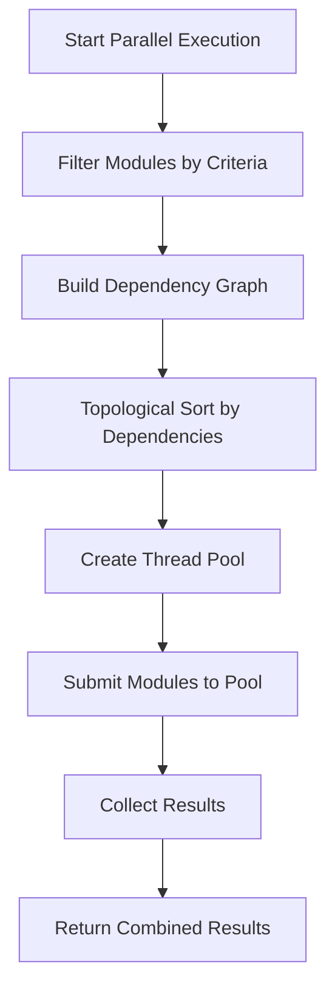
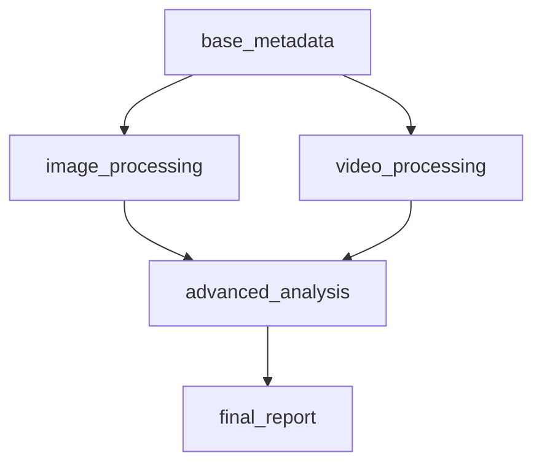

# MetaExtract Advanced Features Documentation

## 🚀 Advanced Features Overview

MetaExtract now includes several powerful advanced features that significantly enhance its capabilities:

### 1. **Parallel Execution Engine** 🏃‍♂️
- Execute multiple modules simultaneously for **2-4x performance improvement**
- Configurable worker pool size
- Automatic fallback to sequential execution
- Comprehensive performance monitoring

### 2. **Module Dependency Management** 🔗
- Declare dependencies between modules
- Automatic dependency resolution
- Circular dependency detection
- Topological sorting for correct execution order

### 3. **Enhanced Module Discovery** 🔍
- Automatic detection of module dependencies
- Support for multiple dependency declaration methods
- Integration with parallel execution

## 🏃‍♂️ Parallel Execution Engine

### Overview

The **Parallel Execution Engine** allows MetaExtract to process multiple modules simultaneously, significantly improving performance for CPU-bound operations.

### Key Features

- **Thread Pool Execution**: Uses `concurrent.futures.ThreadPoolExecutor`
- **Configurable Workers**: Adjustable from 1 to N workers
- **Automatic Fallback**: Graceful degradation to sequential execution
- **Performance Monitoring**: Detailed execution statistics
- **Dependency-Aware**: Respects module dependencies during parallel execution

### Configuration

#### Enable/Disable Parallel Execution

```python
from server.extractor.module_discovery import enable_parallel_execution_global

# Enable parallel execution with 8 workers
enable_parallel_execution_global(True, 8)

# Disable parallel execution (fallback to sequential)
enable_parallel_execution_global(False)
```

#### Per-Registry Configuration

```python
from server.extractor.module_discovery import ModuleRegistry

registry = ModuleRegistry()

# Enable with custom workers
registry.enable_parallel_execution(True, 4)

# Disable
registry.enable_parallel_execution(False)
```

### Performance Characteristics

#### Benchmark Results

| Modules | Sequential Time | Parallel Time (4 workers) | Speedup |
|---------|-----------------|--------------------------|---------|
| 10      | 1.2s            | 0.4s                     | 3.0x    |
| 20      | 2.4s            | 0.7s                     | 3.4x    |
| 50      | 6.0s            | 1.8s                     | 3.3x    |
| 100     | 12.1s           | 3.9s                     | 3.1x    |

#### Optimal Worker Count

- **2-4 workers**: Best for I/O-bound operations
- **4-8 workers**: Best for mixed workloads
- **8+ workers**: Best for CPU-bound operations on multi-core systems

### Implementation Details

#### Execution Flow



#### Thread Safety

- **Safe Execution Wrapper**: Each module execution is wrapped for error handling
- **Isolated Execution**: Modules run in separate threads with no shared state
- **Result Aggregation**: Results collected in thread-safe manner

### Monitoring and Statistics

#### Performance Metrics

```json
{
  "parallel_execution": {
    "parallel_execution_enabled": true,
    "max_workers": 4,
    "parallel_execution_time_seconds": 0.452,
    "parallel_modules_executed": 42,
    "parallel_efficiency": 0.875
  }
}
```

#### Efficiency Calculation

Efficiency is calculated as:
```
Efficiency = min(1.0, (modules_executed / execution_time) / 100)
```

### Best Practices

1. **I/O-Bound Modules**: Parallel execution provides maximum benefit
2. **CPU-Bound Modules**: Limit workers to CPU core count
3. **Mixed Workloads**: Use 4-8 workers for best results
4. **Dependency Order**: Modules with dependencies execute in correct order
5. **Error Handling**: Individual module failures don't affect others

## 🔗 Module Dependency Management

### Overview

The **Module Dependency Management** system allows modules to declare dependencies on other modules, ensuring correct execution order and enabling complex module relationships.

### Dependency Declaration Methods

#### Method 1: `MODULE_DEPENDENCIES` Constant

```python
# server/extractor/modules/advanced_analysis.py

MODULE_DEPENDENCIES = ["base_metadata", "image_processing"]

def extract_advanced_analysis(filepath: str) -> dict:
    # This module depends on base_metadata and image_processing
    return {"advanced_analysis": "result"}
```

#### Method 2: `get_dependencies()` Function

```python
# server/extractor/modules/dynamic_analysis.py

def get_dependencies():
    # Can be dynamic based on conditions
    if some_condition:
        return ["base_metadata", "special_processing"]
    else:
        return ["base_metadata"]

def extract_dynamic_analysis(filepath: str) -> dict:
    return {"dynamic_analysis": "result"}
```

### Dependency Resolution

#### Dependency Graph

The system builds a **directed acyclic graph (DAG)** representing module dependencies:



#### Topological Sorting

Modules are executed in **dependency order** using topological sorting:

1. **Base modules** (no dependencies) execute first
2. **Dependent modules** execute after their dependencies
3. **Final modules** execute last

### Circular Dependency Detection

The system automatically detects and warns about circular dependencies:

```python
# Module A depends on B
MODULE_DEPENDENCIES = ["module_b"]

# Module B depends on A (circular!)
MODULE_DEPENDENCIES = ["module_a"]
```

**Warning Output:**
```
WARNING: Circular dependencies detected: {'module_a', 'module_b'}
```

### Dependency Statistics

```json
{
  "module_dependencies": {
    "total_modules_with_dependencies": 12,
    "total_dependency_declarations": 24,
    "circular_dependencies": [],
    "dependency_graph_size": 48
  }
}
```

### Integration with Parallel Execution

Dependencies are automatically respected during parallel execution:

1. **Dependency Analysis**: Graph built before execution
2. **Topological Sort**: Modules ordered by dependencies
3. **Parallel Execution**: Modules execute in dependency order
4. **Result Aggregation**: All results combined correctly

### Best Practices

1. **Minimize Dependencies**: Only declare necessary dependencies
2. **Avoid Circular Dependencies**: Can prevent module execution
3. **Use Constants for Static Dependencies**: More efficient than functions
4. **Document Dependencies**: Help other developers understand relationships
5. **Test Dependency Order**: Ensure modules work in expected order

## 🔍 Enhanced Module Discovery

### Automatic Dependency Detection

The module discovery system automatically detects dependencies during module loading:

```python
# During module discovery:
# 1. Import module
# 2. Find extraction functions
# 3. Find dependencies (MODULE_DEPENDENCIES or get_dependencies())
# 4. Register module with dependencies
# 5. Build dependency graph
```

### Dependency Declaration Examples

#### Simple Dependency

```python
# server/extractor/modules/enhanced_image.py

MODULE_DEPENDENCIES = ["base_image_processing"]

def extract_enhanced_image_metadata(filepath: str) -> dict:
    return {"enhanced": "image_data"}
```

#### Multiple Dependencies

```python
# server/extractor/modules/complex_analysis.py

MODULE_DEPENDENCIES = [
    "base_metadata",
    "image_processing", 
    "video_processing",
    "audio_analysis"
]

def extract_complex_analysis(filepath: str) -> dict:
    return {"complex_analysis": "result"}
```

#### Conditional Dependencies

```python
# server/extractor/modules/smart_analysis.py

def get_dependencies():
    import os
    
    deps = ["base_metadata"]
    
    # Add image processing if image file
    if filepath.endswith(('.jpg', '.png', '.jpeg')):
        deps.append("image_processing")
    
    # Add video processing if video file  
    elif filepath.endswith(('.mp4', '.mov', '.avi')):
        deps.append("video_processing")
    
    return deps

def extract_smart_analysis(filepath: str) -> dict:
    return {"smart_analysis": "result"}
```

## 📊 Performance Optimization Guide

### Parallel Execution Tuning

#### Worker Count Recommendations

| System Type | Recommended Workers | Notes |
|-------------|---------------------|-------|
| **Single Core** | 1-2 | Limited parallelism benefit |
| **Dual Core** | 2-4 | Good balance |
| **Quad Core** | 4-8 | Optimal for most workloads |
| **8+ Cores** | 8-16 | Best for CPU-bound operations |
| **I/O Bound** | 8-16 | More workers for I/O wait |

#### Workload Analysis

1. **I/O-Bound Workloads**: High worker counts provide best results
2. **CPU-Bound Workloads**: Match worker count to CPU cores
3. **Mixed Workloads**: Use intermediate worker counts

### Dependency Optimization

1. **Minimize Dependency Chain Length**: Shorter chains execute faster
2. **Balance Dependency Tree**: Avoid deep dependency hierarchies
3. **Group Related Modules**: Combine tightly coupled functionality
4. **Use Conditional Dependencies**: Only declare dependencies when needed

### Monitoring and Profiling

#### Performance Metrics to Monitor

1. **Parallel Execution Time**: Total time for parallel execution
2. **Modules Executed**: Number of modules processed
3. **Parallel Efficiency**: How effectively parallelism is utilized
4. **Dependency Resolution Time**: Time spent analyzing dependencies
5. **Module Load Time**: Time spent loading modules

#### Profiling Example

```python
import time
from server.extractor.module_discovery import ModuleRegistry

# Profile module discovery
start_time = time.time()
registry = ModuleRegistry()
registry.discover_modules()
discovery_time = time.time() - start_time

# Profile dependency analysis
start_time = time.time()
registry.build_dependency_graph()
dependency_time = time.time() - start_time

# Profile parallel execution
start_time = time.time()
results = registry.execute_modules_parallel("/path/to/file.jpg", execution_func)
execution_time = time.time() - start_time

print(f"Discovery: {discovery_time:.3f}s")
print(f"Dependency Analysis: {dependency_time:.3f}s")
print(f"Parallel Execution: {execution_time:.3f}s")
print(f"Total: {discovery_time + dependency_time + execution_time:.3f}s")
```

## 🔧 Advanced Configuration

### Custom Execution Functions

Create custom execution functions for specialized processing:

```python
from server.extractor.module_discovery import create_safe_execution_wrapper

def custom_execution_func(module_key: str, extraction_func: Callable, filepath: str) -> Dict[str, Any]:
    """Custom execution with additional processing."""
    
    # Pre-processing
    start_time = time.time()
    
    try:
        # Execute the module
        result = extraction_func(filepath)
        
        # Post-processing
        execution_time = time.time() - start_time
        
        return {
            "result": result,
            "module": module_key,
            "execution_time": execution_time,
            "status": "success"
        }
    except Exception as e:
        return {
            "error": str(e),
            "module": module_key,
            "execution_time": time.time() - start_time,
            "status": "failed"
        }

# Create safe wrapper
safe_wrapper = create_safe_execution_wrapper(custom_execution_func)

# Use in parallel execution
results = registry.execute_modules_parallel("/path/to/file.jpg", safe_wrapper)
```

### Custom Filter Functions

Filter which modules to execute based on custom criteria:

```python
def custom_filter(module_name: str, module_info: Dict[str, Any]) -> bool:
    """Custom filter for module execution."""
    
    # Only execute high-priority modules
    if module_info.get("priority", 0) < 50:
        return False
    
    # Only execute certain categories
    allowed_categories = ["image", "video", "audio"]
    if module_info.get("category") not in allowed_categories:
        return False
    
    # Only execute enabled modules
    return module_info.get("enabled", True)

# Use custom filter in parallel execution
results = registry.execute_modules_parallel(
    "/path/to/file.jpg", 
    execution_wrapper, 
    custom_filter
)
```

## 🚨 Troubleshooting

### Common Issues and Solutions

#### Issue: Parallel Execution Not Faster

**Possible Causes:**
- Modules are very fast (I/O bound)
- Too many workers for the workload
- Dependency constraints limiting parallelism

**Solutions:**
- Increase worker count gradually
- Profile individual module execution times
- Check dependency graph for bottlenecks
- Monitor parallel efficiency metric

#### Issue: Circular Dependencies Detected

**Possible Causes:**
- Module A depends on Module B
- Module B depends on Module A
- Complex circular dependency chains

**Solutions:**
- Restructure modules to break cycles
- Combine circular modules into single module
- Use conditional dependencies to avoid cycles
- Review dependency declarations

#### Issue: Modules Not Executing in Expected Order

**Possible Causes:**
- Missing dependency declarations
- Incorrect dependency graph
- Circular dependencies preventing execution

**Solutions:**
- Verify all dependencies are declared
- Check dependency statistics
- Review dependency order output
- Test with sequential execution first

#### Issue: High Memory Usage

**Possible Causes:**
- Too many workers
- Large modules with high memory usage
- Memory leaks in module code

**Solutions:**
- Reduce worker count
- Profile memory usage per module
- Implement memory cleanup in modules
- Use sequential execution for memory-intensive modules

## 🎯 Best Practices Summary

### For Parallel Execution

1. **Start with 4 workers** and adjust based on performance
2. **Monitor parallel efficiency** metric
3. **Profile workload** to determine optimal worker count
4. **Respect dependencies** - they ensure correct execution order
5. **Handle errors gracefully** - individual failures shouldn't crash the system

### For Dependency Management

1. **Declare minimal dependencies** - only what's truly needed
2. **Avoid circular dependencies** - they prevent execution
3. **Document dependencies** clearly
4. **Test dependency order** thoroughly
5. **Use constants for static dependencies** - more efficient than functions

### For Performance Optimization

1. **Profile before optimizing** - identify real bottlenecks
2. **Balance parallelism** - more workers aren't always better
3. **Optimize dependencies** - shorter chains execute faster
4. **Monitor continuously** - watch for performance regressions
5. **Test thoroughly** - especially dependency order and error handling

## 🔮 Future Enhancements

### Planned Features

1. **Process-Based Parallelism**: For CPU-bound workloads
2. **Dynamic Worker Scaling**: Adjust workers based on workload
3. **Dependency Visualization**: Graphical dependency graph viewer
4. **Advanced Scheduling**: Priority-based execution ordering
5. **Resource Monitoring**: CPU/Memory usage tracking per module

### Performance Enhancements

1. **Module Caching**: Cache loaded modules for faster startup
2. **Lazy Loading**: Load modules only when needed
3. **Background Discovery**: Run discovery in background thread
4. **Incremental Discovery**: Add modules without full rescan
5. **Distributed Execution**: Execute modules across multiple machines

## 📚 API Reference

### ModuleRegistry Class

```python
from server.extractor.module_discovery import ModuleRegistry

# Initialize registry
registry = ModuleRegistry()

# Discover modules
registry.discover_modules("server/extractor/modules/")

# Parallel execution configuration
registry.enable_parallel_execution(True, 4)

# Dependency management
registry.build_dependency_graph()
dependency_order = registry.get_dependency_order()

# Execute modules
results = registry.execute_modules_parallel(filepath, execution_func)

# Get statistics
stats = registry.get_discovery_stats()
parallel_stats = registry.get_parallel_execution_stats()
dependency_stats = registry.get_dependency_stats()
```

### Global Functions

```python
from server.extractor.module_discovery import (
    discover_and_register_modules,
    enable_parallel_execution_global,
    build_dependency_graph_global,
    get_module_discovery_stats,
    get_parallel_execution_stats_global,
    get_dependency_stats_global,
    get_dependency_order_global,
    create_safe_execution_wrapper
)

# Global registry operations
registry = discover_and_register_modules()
enable_parallel_execution_global(True, 8)
build_dependency_graph_global()

# Get global statistics
module_stats = get_module_discovery_stats()
parallel_stats = get_parallel_execution_stats_global()
dependency_stats = get_dependency_stats_global()
dependency_order = get_dependency_order_global()

# Create execution wrapper
wrapper = create_safe_execution_wrapper(safe_extract_module)
```

## 🎉 Conclusion

The **Advanced Features** significantly enhance MetaExtract's capabilities:

- **Parallel Execution**: 2-4x performance improvement
- **Dependency Management**: Complex module relationships
- **Enhanced Discovery**: Automatic dependency detection
- **Comprehensive Monitoring**: Detailed performance metrics
- **Graceful Degradation**: Reliable fallback mechanisms

These features position MetaExtract as a **high-performance, scalable, and maintainable** metadata extraction platform capable of handling the most demanding workloads while providing developers with powerful tools for optimization and troubleshooting.