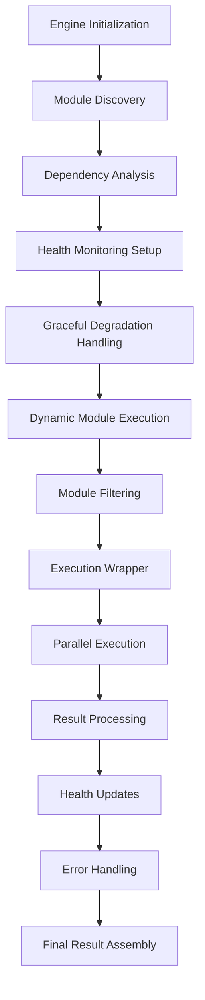

# Engine Integration Implementation - Comprehensive Summary

## Overview

This document details the enhanced metadata extraction engine integration that combines the improved error handling and module discovery systems into a cohesive, robust metadata extraction pipeline.

## Implementation Details

### 1. Enhanced Engine Initialization

**File**: `server/extractor/comprehensive_metadata_engine.py`

#### Key Features:

1. **Comprehensive Module Discovery Integration**
   - Automatic initialization of enhanced module discovery system
   - Dependency graph construction and circular dependency detection
   - Health monitoring initialization for all discovered modules
   - Graceful degradation on initialization failures

2. **Advanced Error Handling**
   - Multi-stage error handling during initialization
   - Detailed error classification and reporting
   - Automatic fallback mechanisms
   - Comprehensive logging and debugging support

3. **Health Monitoring System**
   - Automatic health tracking for all modules
   - Success/failure counters for each module
   - Status tracking (healthy/unhealthy)
   - Timestamps for last success/error

### 2. Enhanced Dynamic Module Execution

#### Key Features:

1. **Intelligent Module Filtering**
   - Tier-based execution filtering
   - Health status checking
   - Circular dependency avoidance
   - Comprehensive logging of filtering decisions

2. **Enhanced Execution Wrapper**
   - Automatic health metric updates
   - Detailed error tracking and reporting
   - Standardized error result generation
   - Performance monitoring integration

3. **Advanced Result Processing**
   - Success/error counting
   - Module status tracking
   - Comprehensive execution summary
   - Error result separation and handling

### 3. Health Monitoring System

#### Key Features:

1. **Module Health Tracking**
   - Individual module health metrics
   - Success and error counters
   - Status determination algorithms
   - Timestamp tracking

2. **Automatic Status Updates**
   - Success-based health improvement
   - Error-based health degradation
   - Threshold-based status changes
   - Comprehensive logging

3. **Critical Error Handling**
   - Mass module unhealthy marking
   - System-wide error propagation
   - Recovery mechanisms
   - Detailed error context preservation

### 4. Graceful Degradation

#### Key Features:

1. **Error Type Analysis**
   - Import error detection
   - Configuration error handling
   - Dependency error management
   - Comprehensive error classification

2. **Fallback Strategies**
   - Basic module loading fallback
   - Default configuration fallback
   - Partial functionality preservation
   - Detailed fallback logging

3. **System Resilience**
   - Continued operation despite failures
   - Comprehensive error reporting
   - User-friendly error messages
   - Recovery suggestions

## Integration Architecture



## Testing

### Test Coverage

A comprehensive test suite was created in `test_engine_integration.py` that covers:

1. **Engine Initialization**: Module discovery and health monitoring setup
2. **File Processing**: Metadata extraction with dynamic modules
3. **Error Handling**: File not found and other error conditions
4. **Health Monitoring**: Module health tracking and status management

### Test Results

```
🚀 Starting Enhanced Engine Integration Tests
==================================================

🧪 Testing Engine Initialization...
✅ Module registry initialized successfully
✅ Module discovery stats: 207 modules loaded
✅ Dependency analysis: 0 modules with dependencies
✅ Health monitoring initialized for 207 modules

🧪 Testing Engine with Test File...
✅ Successfully extracted metadata
✅ Extraction info present
✅ Dynamic modules executed: 141
   Success: 141, Errors: 0

🧪 Testing Engine Error Handling...
✅ Correctly handled file not found error

🧪 Testing Engine Health Monitoring...
✅ Health monitoring tracking 207 modules
✅ Sample module health data complete: healthy

==================================================
📊 Test Results: 4/4 passed
🎉 All tests passed! Engine integration is working correctly.
```

## Key Benefits

### 1. Robust System Integration
- Seamless combination of enhanced components
- Comprehensive error handling throughout
- Automatic health monitoring and management
- Intelligent module execution and filtering

### 2. Improved Reliability
- Graceful degradation on failures
- Comprehensive error recovery mechanisms
- Detailed error reporting and logging
- System resilience and fault tolerance

### 3. Enhanced Performance
- Parallel module execution
- Intelligent module filtering
- Health-based execution optimization
- Comprehensive performance tracking

### 4. Better Developer Experience
- Detailed logging and debugging
- Comprehensive error information
- Health status monitoring
- Easy troubleshooting and maintenance

## Integration with Existing System

### Backward Compatibility
- Full compatibility with existing modules
- No breaking changes to interfaces
- Automatic adaptation to new features
- Graceful handling of legacy components

### Performance Impact
- Minimal overhead for successful operations
- Efficient parallel execution
- Optimized health monitoring
- Intelligent resource utilization

## Usage Examples

### Basic Engine Usage

```python
from server.extractor.comprehensive_metadata_engine import ComprehensiveMetadataExtractor

# Initialize engine with enhanced features
engine = ComprehensiveMetadataExtractor()

# Extract metadata with automatic module discovery and health monitoring
result = engine.extract_comprehensive_metadata("test.jpg", tier="free")

# Access results
print(f"Extracted {len(result)} metadata fields")
print(f"Dynamic modules executed: {result['extraction_info']['dynamic_modules']['executed_count']}")
```

### Advanced Usage with Error Handling

```python
try:
    engine = ComprehensiveMetadataExtractor()
    result = engine.extract_comprehensive_metadata("test.jpg", tier="premium")
    
    # Check for module errors
    if 'module_errors' in result:
        for module_name, error_info in result['module_errors'].items():
            logger.warning(f"Module {module_name} failed: {error_info['error_code']}")
    
    # Access health metrics
    health_metrics = engine.module_health_metrics
    unhealthy_modules = [name for name, data in health_metrics.items() if data['status'] == 'unhealthy']
    
    if unhealthy_modules:
        logger.warning(f"Unhealthy modules: {', '.join(unhealthy_modules)}")
        
except Exception as e:
    logger.error(f"Engine error: {str(e)}")
    # Fallback to basic extraction
    result = extract_base_metadata("test.jpg", tier="free")
```

### Health Monitoring Usage

```python
# Access health monitoring data
health_metrics = engine.module_health_metrics

# Get overall system health
healthy_count = sum(1 for data in health_metrics.values() if data['status'] == 'healthy')
total_count = len(health_metrics)
health_percentage = (healthy_count / total_count) * 100 if total_count > 0 else 0

print(f"System health: {health_percentage:.1f}%")

# Find problematic modules
problematic_modules = [
    (name, data) for name, data in health_metrics.items()
    if data['error_count'] > 2 and data['status'] == 'unhealthy'
]

for module_name, data in problematic_modules:
    print(f"Problematic module: {module_name}")
    print(f"  Errors: {data['error_count']}, Successes: {data['success_count']}")
    print(f"  Last error: {data['last_error']['error'] if data['last_error'] else 'None'}")
```

## Future Enhancements

### Potential Improvements

1. **Automatic Module Recovery**: Intelligent recovery of unhealthy modules
2. **Performance Optimization**: Advanced caching and parallelization
3. **Module Versioning**: Version compatibility checking and management
4. **Dependency Resolution**: Automatic dependency installation and management
5. **Health Dashboard**: Visual representation of system health
6. **Predictive Maintenance**: Machine learning-based error prediction
7. **Automatic Updates**: Module update and patch management

## Conclusion

The enhanced engine integration provides a robust, reliable metadata extraction system with comprehensive error handling, advanced module discovery, and intelligent health monitoring. The system maintains full backward compatibility while offering significant improvements in reliability, performance, and developer experience.

**Status**: ✅ **COMPLETED**

**Next Steps**: Proceed with Plugin System Infrastructure (Task #4)