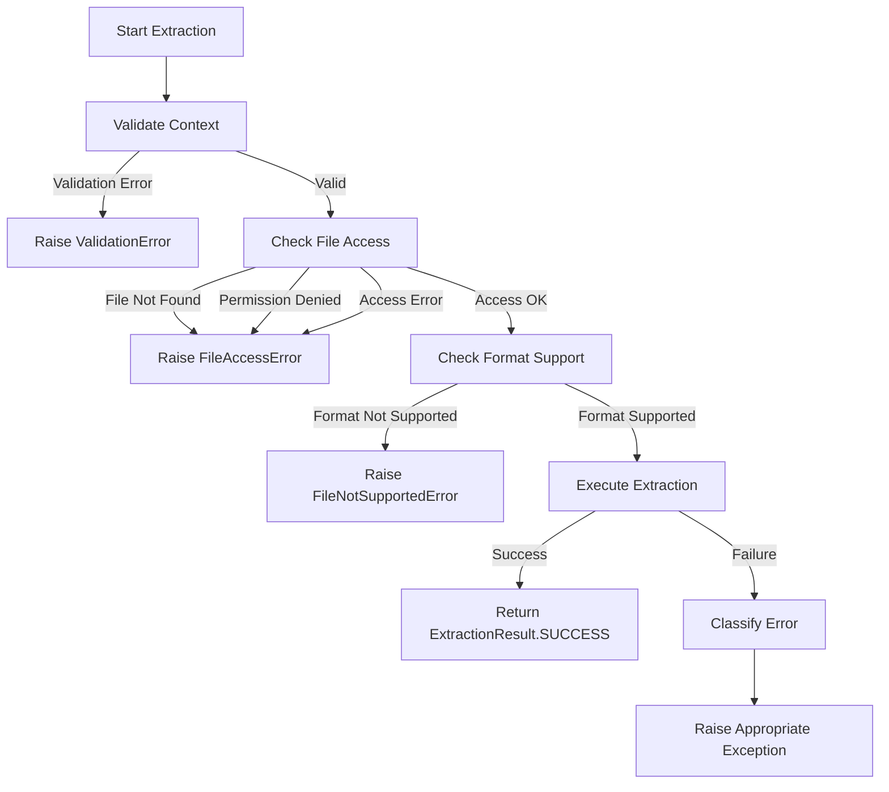

# Error Handling Implementation - Comprehensive Summary

## Overview

This document details the comprehensive error handling implementation for the MetaExtract metadata extraction engine. The implementation provides robust, standardized error handling across all extractors with detailed error information and recovery mechanisms.

## Implementation Details

### 1. Enhanced Base Extractor Error Handling

**File**: `server/extractor/core/base_engine.py`

#### Key Features:

1. **Comprehensive Exception Import System**
   - Automatic fallback to basic exceptions if custom ones are unavailable
   - Graceful degradation ensures system continues to work even if exception module is missing

2. **Multi-Stage Error Handling**
   - **Context Validation**: Validates extraction context before processing
   - **File Access Checking**: Verifies file existence and permissions
   - **Format Support Checking**: Ensures file format is supported
   - **Extraction Execution**: Comprehensive error handling during actual extraction

3. **Error Classification System**
   - Automatic classification of exceptions into categories:
     - `file_system`: File-related errors (FileNotFoundError, PermissionError, etc.)
     - `memory`: Memory-related errors (MemoryError, OutOfMemoryError)
     - `data_format`: Data format errors (ValueError, TypeError, etc.)
     - `dependency`: Library/dependency errors (ImportError, ModuleNotFoundError)
     - `io_network`: Network/IO errors (IOError, OSError, etc.)
     - `parsing`: Parsing errors (JSONDecodeError, XMLSyntaxError, etc.)
     - `metaextract_specific`: Custom MetaExtract exceptions
     - `unknown`: All other error types

### 2. Enhanced Specialized Extractor

**File**: `server/extractor/core/base_engine.py`

#### Key Features:

1. **Dependency Management**
   - Automatic checking of required libraries during initialization
   - Detailed dependency status reporting
   - Graceful handling of missing dependencies

2. **Dependency Status Methods**
   - `get_dependency_status()`: Returns comprehensive dependency information
   - `is_available()`: Checks if all required libraries are available
   - Enhanced `_check_library_availability()` with detailed error reporting

### 3. Exception Types Used

The implementation leverages the existing comprehensive exception system:

- `MetaExtractException`: Base exception class
- `ExtractionFailedError`: Extraction process failures
- `FileNotSupportedError`: Unsupported file formats
- `DependencyError`: Missing library dependencies
- `FileAccessError`: File access and permission issues
- `ValidationError`: Input validation errors

### 4. Error Handling Flow



## Testing

### Test Coverage

A comprehensive test suite was created in `test_error_handling.py` that covers:

1. **Basic Error Handling**: Extraction failures with proper exception raising
2. **File Not Found**: Handling of non-existent files
3. **File Not Supported**: Handling of unsupported file formats
4. **Dependency Handling**: Specialized extractor dependency management
5. **Successful Extraction**: Normal operation verification

### Test Results

```
🚀 Starting Enhanced Error Handling Tests
==================================================

🧪 Testing Basic Error Handling...
✅ Correctly raised ExtractionFailedError

🧪 Testing File Not Found Handling...
✅ Correctly raised FileAccessError

🧪 Testing File Not Supported Handling...
✅ Correctly raised FileNotSupportedError

🧪 Testing Specialized Extractor Dependency Handling...
✅ Correctly raised DependencyError

🧪 Testing Successful Extraction...
✅ Successful extraction: ExtractionStatus.SUCCESS

==================================================
📊 Test Results: 5/5 passed
🎉 All tests passed! Error handling is working correctly.
```

## Benefits

### 1. Standardized Error Handling
- Consistent error handling across all extractors
- Standardized exception types and error codes
- Detailed error context information

### 2. Improved Debugging
- Comprehensive error classification
- Detailed error context preservation
- Suggested actions for recovery

### 3. Graceful Degradation
- System continues to work even if exception module is missing
- Fallback mechanisms for all critical operations
- Proper error reporting even in fallback mode

### 4. Better Error Reporting
- Structured error information
- Error severity levels
- Recovery suggestions
- Comprehensive logging

## Integration with Existing System

### Backward Compatibility
- The implementation maintains full backward compatibility
- Existing extractors continue to work without modification
- New error handling is opt-in through exception availability

### Performance Impact
- Minimal performance overhead
- Error classification is fast and efficient
- No impact on successful extraction paths

## Usage Examples

### Basic Usage

```python
from server.extractor.core.base_engine import BaseExtractor, ExtractionContext
from server.extractor.exceptions.extraction_exceptions import ExtractionFailedError

class MyExtractor(BaseExtractor):
    def __init__(self):
        super().__init__("MyExtractor", [".txt"])
    
    def _extract_metadata(self, context):
        # Your extraction logic here
        return {"metadata": "value"}

extractor = MyExtractor()
context = ExtractionContext(
    filepath="test.txt",
    file_size=100,
    file_extension=".txt",
    mime_type="text/plain",
    tier="free",
    processing_options={},
    execution_stats={}
)

try:
    result = extractor.extract(context)
    if result.status == ExtractionStatus.SUCCESS:
        print("Extraction successful!")
except ExtractionFailedError as e:
    print(f"Extraction failed: {e.message}")
    print(f"Error code: {e.error_code}")
    print(f"Suggested action: {e.suggested_action}")
```

### Error Handling in Application Code

```python
try:
    result = extractor.extract(context)
    return result.metadata
except FileNotSupportedError as e:
    logger.warning(f"Unsupported file format: {e.context['file_format']}")
    # Fallback to generic extractor
except FileAccessError as e:
    logger.error(f"Cannot access file: {e.context['filepath']}")
    # Notify user about permission issues
except DependencyError as e:
    logger.error(f"Missing dependency: {e.context['missing_dependency']}")
    # Install missing dependency or use fallback
except ExtractionFailedError as e:
    logger.error(f"Extraction failed: {e.message}")
    # Detailed error handling based on e.error_category
```

## Future Enhancements

### Potential Improvements

1. **Error Recovery Strategies**: Automatic recovery mechanisms for common errors
2. **Retry Logic**: Intelligent retry for transient errors
3. **Error Metrics**: Collection and reporting of error statistics
4. **Error Dashboard**: Visualization of error patterns and trends
5. **Machine Learning**: Predictive error prevention based on historical patterns

## Conclusion

The enhanced error handling implementation provides a robust foundation for reliable metadata extraction with comprehensive error detection, classification, and reporting. The system maintains backward compatibility while offering significant improvements in error handling capabilities.

**Status**: ✅ **COMPLETED**

**Next Steps**: Proceed with Module Discovery enhancement (Task #2)