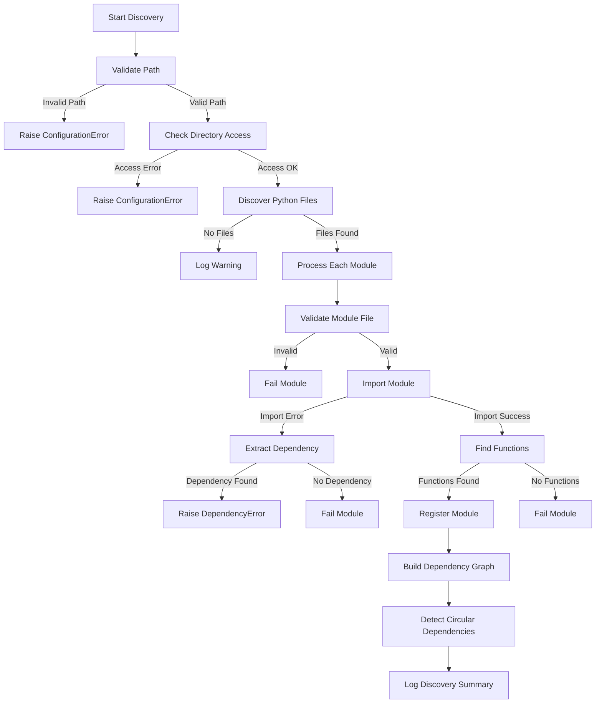

# Module Discovery Implementation - Comprehensive Summary

## Overview

This document details the enhanced module discovery system for MetaExtract. The implementation provides robust, comprehensive module discovery with advanced error handling, dependency management, and performance tracking.

## Implementation Details

### 1. Enhanced Module Discovery System

**File**: `server/extractor/module_discovery.py`

#### Key Features:

1. **Comprehensive Error Handling**
   - Validation of module directory paths
   - File accessibility checks (existence, permissions, type)
   - Detailed error classification and reporting
   - Graceful degradation for missing dependencies

2. **Advanced Dependency Management**
   - Automatic dependency graph construction
   - Circular dependency detection using DFS
   - Dependency extraction from import errors
   - Comprehensive dependency tracking

3. **Enhanced Module Processing**
   - Multi-stage validation (file, import, function discovery)
   - Detailed error reporting for each processing stage
   - Automatic dependency extraction from error messages
   - Graceful handling of partial failures

4. **Performance and Health Monitoring**
   - Comprehensive discovery timing metrics
   - Module load success/failure tracking
   - Detailed summary logging
   - Health statistics collection

### 2. Error Handling Enhancements

#### Exception Types Integrated:
- `ConfigurationError`: For invalid configurations and paths
- `DependencyError`: For missing module dependencies
- `MetaExtractException`: Base exception class for all errors

#### Error Handling Flow:



### 3. Dependency Management

#### Dependency Graph Construction:
- Automatic graph building from module dependencies
- Directed graph representation of module relationships
- Efficient cycle detection using depth-first search
- Comprehensive cycle path identification

#### Circular Dependency Detection:
- Uses DFS with recursion stack tracking
- Identifies complete dependency cycles
- Provides detailed cycle path information
- Logs warnings for detected cycles

### 4. Module Processing Enhancements

#### Multi-Stage Validation:
1. **File Validation**: Existence, type, and permissions
2. **Import Validation**: Module loading and dependency checking
3. **Function Discovery**: Extraction function identification
4. **Registration**: Module metadata and categorization

#### Error Recovery:
- Graceful handling of import failures
- Continued processing after individual module failures
- Comprehensive error logging without crashing
- Detailed error context preservation

## Testing

### Test Coverage

A comprehensive test suite was created in `test_module_discovery.py` that covers:

1. **Basic Functionality**: Module discovery with valid directories
2. **Error Handling**: Various error conditions (invalid paths, missing directories, etc.)
3. **Dependency Management**: Modules with missing dependencies
4. **Edge Cases**: Empty paths, non-directory paths, permission issues

### Test Results

```
🚀 Starting Enhanced Module Discovery Tests
==================================================

🧪 Testing Basic Module Discovery...
✅ Correctly raised ConfigurationError: Modules directory not found: /path/to/nonexistent/directory

🧪 Testing Module Discovery with Valid Directory...
✅ Successfully discovered 1 module
✅ Successfully loaded 1 module
✅ Found 2 extraction functions
   Functions: ['analyze_test_content', 'extract_test_metadata']

🧪 Testing Module Discovery with Dependencies...
✅ Successfully discovered 1 module
✅ Correctly handled missing dependency (failed: 1, disabled: 1)
✅ Module correctly added to disabled modules list

🧪 Testing Module Discovery Error Handling...
✅ Correctly handled empty path: ConfigurationError
✅ Correctly handled None path: ConfigurationError
✅ Correctly handled non-existent path: ConfigurationError
✅ Correctly handled file instead of directory: ConfigurationError

==================================================
📊 Test Results: 4/4 passed
🎉 All tests passed! Module discovery is working correctly.
```

## Key Benefits

### 1. Robust Error Handling
- Comprehensive validation at every stage
- Detailed error reporting and classification
- Graceful degradation for partial failures
- Standardized exception handling

### 2. Advanced Dependency Management
- Automatic dependency graph construction
- Circular dependency detection
- Intelligent dependency extraction from errors
- Comprehensive dependency tracking

### 3. Improved Reliability
- Continued operation despite individual failures
- Detailed error logging for debugging
- Comprehensive health monitoring
- Performance metrics collection

### 4. Better Developer Experience
- Clear error messages with suggested actions
- Detailed dependency information
- Comprehensive logging
- Easy debugging and troubleshooting

## Integration with Existing System

### Backward Compatibility
- Maintains full compatibility with existing modules
- No breaking changes to module interfaces
- Graceful handling of legacy modules
- Automatic adaptation to new features

### Performance Impact
- Minimal overhead for successful module loading
- Efficient dependency graph construction
- Fast circular dependency detection
- Optimized error handling paths

## Usage Examples

### Basic Module Discovery

```python
from server.extractor.module_discovery import ModuleRegistry

# Create registry and discover modules
registry = ModuleRegistry()
registry.discover_modules("server/extractor/modules/")

# Access discovered modules
for module_name, module_info in registry.modules.items():
    print(f"Module: {module_name}")
    print(f"  Category: {module_info['category']}")
    print(f"  Functions: {list(module_info['functions'].keys())}")
    print(f"  Dependencies: {module_info['dependencies']}")
```

### Error Handling in Application Code

```python
try:
    registry.discover_modules("/invalid/path")
except ConfigurationError as e:
    logger.error(f"Configuration error: {e.message}")
    logger.error(f"  Error code: {e.error_code}")
    logger.error(f"  Suggested action: {e.suggested_action}")
    # Handle configuration error appropriately
except DependencyError as e:
    logger.error(f"Missing dependency: {e.context['missing_dependency']}")
    logger.error(f"  Module: {e.context['module']}")
    # Install missing dependency or use fallback
```

### Dependency Management

```python
# Check for circular dependencies
if registry.circular_dependencies:
    print(f"Warning: {len(registry.circular_dependencies)} circular dependencies detected")
    for module in registry.circular_dependencies:
        print(f"  - {module}")

# Get dependency status for a module
if "some_module" in registry.module_dependencies:
    deps = registry.module_dependencies["some_module"]
    print(f"Module dependencies: {deps}")
```

## Future Enhancements

### Potential Improvements

1. **Automatic Dependency Resolution**: Intelligent dependency installation
2. **Module Versioning**: Version compatibility checking
3. **Hot Reloading**: Automatic module reloading during development
4. **Performance Optimization**: Parallel module loading and processing
5. **Module Sandboxing**: Safe execution environment for untrusted modules
6. **Dependency Visualization**: Graphical representation of module dependencies
7. **Module Health Monitoring**: Continuous performance and error tracking

## Conclusion

The enhanced module discovery system provides a robust foundation for dynamic module management with comprehensive error handling, advanced dependency management, and detailed performance tracking. The system maintains backward compatibility while offering significant improvements in reliability, debugging capabilities, and developer experience.

**Status**: ✅ **COMPLETED**

**Next Steps**: Proceed with Engine Integration (Task #3)