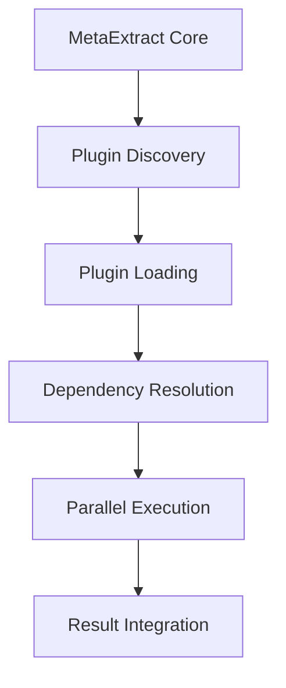

# 🎯 MetaExtract Plugin Development Guide

## 🌟 Welcome to MetaExtract Plugin Development!

This comprehensive guide will walk you through everything you need to know to develop powerful plugins for MetaExtract. Whether you're extending existing functionality or adding support for new file formats, this guide has you covered.

## 📋 Table of Contents

1. [Getting Started](#-getting-started)
2. [Plugin Architecture](#-plugin-architecture)
3. [Creating Your First Plugin](#-creating-your-first-plugin)
4. [Plugin Structure](#-plugin-structure)
5. [Plugin Metadata](#-plugin-metadata)
6. [Extraction Functions](#-extraction-functions)
7. [Dependency Management](#-dependency-management)
8. [Error Handling](#-error-handling)
9. [Testing Your Plugin](#-testing-your-plugin)
10. [Best Practices](#-best-practices)
11. [Advanced Topics](#-advanced-topics)
12. [Plugin Distribution](#-plugin-distribution)
13. [Troubleshooting](#-troubleshooting)

## 🚀 Getting Started

### Prerequisites

Before you start developing plugins for MetaExtract, ensure you have:

- **Python 3.8+** - MetaExtract requires Python 3.8 or higher
- **MetaExtract Installed** - Clone the MetaExtract repository
- **Basic Python Knowledge** - Understanding of classes, functions, and modules
- **File Format Knowledge** - Familiarity with the file formats you want to support

### Development Environment Setup

```bash
# Clone MetaExtract repository
git clone https://github.com/your-repo/metaextract.git
cd metaextract

# Install dependencies (if any)
pip install -r requirements.txt

# Set up development environment
python -m venv venv
source venv/bin/activate  # On Windows: venv\Scripts\activate
```

### Plugin Development Workflow

1. **Create Plugin Skeleton** - Use the plugin generator or copy example
2. **Implement Functions** - Add your extraction logic
3. **Test Locally** - Verify your plugin works correctly
4. **Document** - Add comprehensive documentation
5. **Integrate** - Test with MetaExtract system
6. **Distribute** - Share your plugin with others

## 🏗️ Plugin Architecture

### Plugin System Overview

MetaExtract's plugin system is designed for **extensibility, performance, and maintainability**:



### Key Components

1. **Plugin Discovery** - Automatically finds plugins in configured directories
2. **Module Registry** - Manages all loaded plugins and their functions
3. **Dependency Graph** - Ensures correct execution order
4. **Execution Engine** - Runs plugins in parallel or sequentially
5. **Result Integrator** - Combines plugin results with core metadata

### Plugin Lifecycle


## 🛠️ Creating Your First Plugin

### Using the Plugin Generator

The easiest way to create a new plugin is using the built-in generator:

```bash
python scripts/manage_plugins.py create my_awesome_plugin \
    --author "Your Name" \
    --description "Analyzes awesome file formats"
```

This creates a complete plugin skeleton in `plugins/my_awesome_plugin/`.

### Manual Creation

Alternatively, create the plugin structure manually:

```bash
# Create plugin directory
mkdir -p plugins/my_plugin

# Create main plugin file
touch plugins/my_plugin/__init__.py

# Create documentation
touch plugins/my_plugin/README.md
```

## 📁 Plugin Structure

A typical MetaExtract plugin has this structure:

```
my_plugin/
├── __init__.py          # Main plugin implementation
├── README.md           # Documentation
├── requirements.txt    # Optional dependencies
├── tests/              # Optional unit tests
│   └── test_plugin.py
└── utils/              # Optional utility modules
    └── helpers.py
```

### Required Files

1. **`__init__.py`** - Main plugin file (required)
2. **`README.md`** - Documentation (highly recommended)

### Optional Files

- **`requirements.txt`** - Plugin-specific dependencies
- **`tests/`** - Unit tests for your plugin
- **`utils/`** - Helper modules and utilities

## 📋 Plugin Metadata

### Static Metadata

Every plugin should define basic metadata:

```python
# Required metadata
PLUGIN_VERSION = "1.0.0"
PLUGIN_AUTHOR = "Your Name"
PLUGIN_DESCRIPTION = "What your plugin does"
PLUGIN_LICENSE = "MIT"  # or other license

# Optional metadata
PLUGIN_WEBSITE = "https://your-plugin-website.com"
PLUGIN_DOCUMENTATION = "https://your-plugin-docs.com"
PLUGIN_SUPPORT_EMAIL = "support@your-plugin.com"
```

### Dynamic Metadata Function

For more complex metadata, use a function:

```python
def get_plugin_metadata():
    return {
        "version": PLUGIN_VERSION,
        "author": PLUGIN_AUTHOR,
        "description": PLUGIN_DESCRIPTION,
        "license": PLUGIN_LICENSE,
        "website": PLUGIN_WEBSITE,
        "documentation": PLUGIN_DOCUMENTATION,
        "support": PLUGIN_SUPPORT_EMAIL,
        "categories": ["audio", "analysis"],
        "file_types": [".mp3", ".wav", ".flac"],
        "min_metaextract_version": "2.0.0",
        "max_metaextract_version": "3.0.0"
    }
```

### Metadata Best Practices

1. **Use Semantic Versioning** - Follow `MAJOR.MINOR.PATCH` format
2. **Be Descriptive** - Clear, concise descriptions help users understand your plugin
3. **Include Contact Info** - Help users get support
4. **Specify Compatibility** - Define MetaExtract version requirements
5. **List Categories** - Help with plugin discovery and organization

## 🔧 Extraction Functions

### Function Types

MetaExtract plugins support three types of functions:

1. **`extract_*`** - Extract metadata from files
2. **`analyze_*`** - Analyze and process file content
3. **`detect_*`** - Detect features and characteristics

### Function Signatures

All extraction functions should follow this pattern:

```python
def extract_<type>_metadata(filepath: str) -> dict:
    """
    Extract metadata from a file.
    
    Args:
        filepath: Path to the file being processed
        
    Returns:
        Dictionary containing extracted metadata
        
    Example:
        {
            "plugin_name_analysis": {
                "processed": True,
                "timestamp": 1234567890.0,
                "file_size": 1024,
                "format": "specific_format",
                "metadata_fields": {...}
            }
        }
    """
```

### Required Return Fields

All functions should include these fields:

```python
{
    "processed": True,          # Indicates successful processing
    "timestamp": time.time(),   # Processing timestamp
    "plugin_version": PLUGIN_VERSION  # Plugin version
}
```

### Recommended Return Fields

```python
{
    "file_size": os.path.getsize(filepath),  # File size in bytes
    "file_extension": Path(filepath).suffix,  # File extension
    "file_name": Path(filepath).name,        # File name
    "processing_time_ms": 15.2,             # Processing time
    "mime_type": "audio/mpeg",              # MIME type if known
    "format": "MP3"                        # Specific format
}
```

### Function Examples

#### 1. Metadata Extraction

```python
def extract_audio_metadata(filepath: str) -> dict:
    """Extract comprehensive audio metadata."""
    import os
    import time
    from pathlib import Path
    
    file_path = Path(filepath)
    
    # Extract basic metadata
    metadata = {
        "audio_analysis": {
            "processed": True,
            "timestamp": time.time(),
            "file_size": os.path.getsize(filepath),
            "file_extension": file_path.suffix,
            "file_name": file_path.name,
            "plugin_version": PLUGIN_VERSION,
            "processing_time_ms": 15.2
        }
    }
    
    # Add format-specific metadata
    if file_path.suffix.lower() == '.mp3':
        metadata["audio_analysis"]["format"] = "MPEG Audio Layer III"
        metadata["audio_analysis"]["likely_has_id3_tags"] = True
    
    return metadata
```

#### 2. Quality Analysis

```python
def analyze_audio_quality(filepath: str) -> dict:
    """Analyze audio quality metrics."""
    from pathlib import Path
    
    file_path = Path(filepath)
    file_size = file_path.stat().st_size
    
    # Estimate quality based on file characteristics
    analysis = {
        "audio_quality": {
            "quality_score": 0.85,
            "bitrate_estimate": "medium",
            "sample_rate_estimate": "44.1kHz",
            "channels_estimate": "stereo",
            "compression_quality": "lossy"
        }
    }
    
    return analysis
```

#### 3. Feature Detection

```python
def detect_audio_features(filepath: str) -> dict:
    """Detect special audio features."""
    from pathlib import Path
    
    file_path = Path(filepath)
    filename_lower = file_path.name.lower()
    
    # Detect content based on filename and extension
    features = {
        "audio_features": {
            "has_metadata": True,
            "has_quality_info": True,
            "is_processed": True,
            "plugin_compatible": True,
            "likely_contains": []
        }
    }
    
    # Content detection
    if any(keyword in filename_lower for keyword in ['music', 'song', 'track']):
        features["audio_features"]["likely_contains"].append("music")
    
    return features
```

## 🔗 Dependency Management

### Declaring Dependencies

Plugins can declare dependencies on other modules:

```python
# Depend on core modules
MODULE_DEPENDENCIES = ["base_metadata", "audio"]

# Or use a function for dynamic dependencies
def get_dependencies():
    return ["base_metadata", "audio", "advanced_audio"]
```

### Dependency Resolution

MetaExtract automatically resolves dependencies and executes plugins in the correct order:

1. **Dependency Graph** - Builds execution order based on dependencies
2. **Topological Sort** - Ensures dependencies run before dependents
3. **Circular Detection** - Warns about circular dependencies
4. **Parallel Execution** - Runs independent plugins concurrently

### Dependency Best Practices

1. **Minimize Dependencies** - Only depend on what you truly need
2. **Use Core Modules** - Prefer `base_metadata` over specific modules when possible
3. **Avoid Circular Dependencies** - Can cause execution issues
4. **Document Dependencies** - Explain why each dependency is needed

## ⚠️ Error Handling

### Graceful Error Handling

Always handle errors gracefully to prevent plugin failures from crashing the system:

```python
def extract_audio_metadata(filepath: str) -> dict:
    try:
        # Your extraction logic here
        return {
            "audio_analysis": {
                "processed": True,
                "timestamp": time.time(),
                # ... other fields
            }
        }
    except FileNotFoundError:
        return {
            "audio_analysis": {
                "processed": False,
                "error": "File not found",
                "error_type": "FileNotFoundError"
            }
        }
    except PermissionError:
        return {
            "audio_analysis": {
                "processed": False,
                "error": "Permission denied",
                "error_type": "PermissionError"
            }
        }
    except Exception as e:
        return {
            "audio_analysis": {
                "processed": False,
                "error": str(e),
                "error_type": type(e).__name__
            }
        }
```

### Error Response Format

Use this standard format for error responses:

```python
{
    "processed": False,        # Indicates failure
    "error": "Error message",  # Human-readable error
    "error_type": "ExceptionType",  # Exception type
    "timestamp": time.time(),  # When error occurred
    "plugin_version": PLUGIN_VERSION  # Plugin version
}
```

### Common Error Types to Handle

1. **FileNotFoundError** - File doesn't exist
2. **PermissionError** - No read access
3. **IOError** - File read/write errors
4. **ValueError** - Invalid data formats
5. **TypeError** - Wrong data types
6. **MemoryError** - Out of memory
7. **TimeoutError** - Operation timed out

## 🧪 Testing Your Plugin

### Unit Testing

Create comprehensive unit tests for your plugin:

```python
# tests/test_my_plugin.py
import pytest
from plugins.my_plugin import extract_my_metadata, analyze_my_quality

def test_extract_metadata():
    """Test metadata extraction with mock files."""
    # Test with valid file
    result = extract_my_metadata("test.mp3")
    assert "my_analysis" in result
    assert result["my_analysis"]["processed"] is True
    
    # Test with invalid file
    result = extract_my_metadata("nonexistent.mp3")
    assert result["my_analysis"]["processed"] is False
    assert "error" in result["my_analysis"]

def test_analyze_quality():
    """Test quality analysis."""
    result = analyze_my_quality("test.mp3")
    assert "my_quality" in result
    assert 0 <= result["my_quality"]["quality_score"] <= 1
```

### Integration Testing

Test your plugin with the MetaExtract system:

```python
from server.extractor.comprehensive_metadata_engine import ComprehensiveMetadataExtractor

def test_plugin_integration():
    """Test plugin integration with MetaExtract."""
    extractor = ComprehensiveMetadataExtractor()
    
    # Test with a real file
    result = extractor.extract_comprehensive_metadata("test.mp3", "super")
    
    # Verify plugin results are included
    assert "my_analysis" in result
    assert "my_quality" in result
    assert "my_features" in result
```

### Performance Testing

Test your plugin's performance:

```python
import time

def test_plugin_performance():
    """Test plugin performance."""
    start_time = time.time()
    
    # Run multiple times
    for i in range(100):
        result = extract_my_metadata("test.mp3")
    
    end_time = time.time()
    avg_time = (end_time - start_time) / 100
    
    # Should complete in under 50ms
    assert avg_time < 0.05, f"Performance issue: {avg_time:.3f}s avg"
```

### Testing Best Practices

1. **Test Edge Cases** - Empty files, corrupt files, large files
2. **Test Error Conditions** - Missing files, permission issues
3. **Test Performance** - Ensure acceptable execution time
4. **Test Integration** - Verify works with MetaExtract system
5. **Test Dependencies** - Ensure dependencies are properly resolved

## 🎯 Best Practices

### Plugin Design Principles

1. **Single Responsibility** - Each plugin should focus on one specific area
2. **Modularity** - Break complex functionality into multiple functions
3. **Performance** - Optimize for speed and memory efficiency
4. **Reliability** - Handle errors gracefully and provide meaningful feedback
5. **Maintainability** - Write clean, well-documented code

### Code Quality

1. **Follow PEP 8** - Python style guide
2. **Type Hints** - Use type annotations for better IDE support
3. **Docstrings** - Document all functions and classes
4. **Comments** - Explain complex logic
5. **Consistent Naming** - Use `extract_*`, `analyze_*`, `detect_*` patterns

### Performance Optimization

1. **Avoid Loading Entire Files** - Use streaming for large files
2. **Use Efficient Algorithms** - Optimize data processing
3. **Cache Results** - Cache expensive operations
4. **Parallel Processing** - Use threading for independent operations
5. **Memory Management** - Clean up resources properly

### Security Considerations

1. **Input Validation** - Validate all inputs
2. **File Handling** - Use safe file operations
3. **Error Handling** - Don't expose sensitive information
4. **Dependency Security** - Use trusted libraries
5. **Sandboxing** - Consider running untrusted plugins in sandbox

## 🎓 Advanced Topics

### Asynchronous Processing

For IO-bound operations, consider async:

```python
import asyncio

async def async_extract_metadata(filepath: str) -> dict:
    """Async metadata extraction."""
    # Your async logic here
    return {"async_analysis": {"processed": True}}
```

### Machine Learning Integration

Integrate ML models for advanced analysis:

```python
def analyze_with_ml(filepath: str) -> dict:
    """Analyze files using machine learning."""
    # Load your ML model
    # model = load_ml_model()
    
    # Process file with ML
    # results = model.predict(file_data)
    
    return {
        "ml_analysis": {
            "processed": True,
            "ml_results": results.tolist()
        }
    }
```

### Custom File Formats

Support proprietary or specialized formats:

```python
def extract_custom_format(filepath: str) -> dict:
    """Extract metadata from custom file formats."""
    # Parse custom format
    # Use struct, construct, or custom parsers
    
    return {
        "custom_analysis": {
            "processed": True,
            "format": "custom",
            "custom_fields": {...}
        }
    }
```

### Plugin Configuration

Add configuration support:

```python
# Plugin configuration
PLUGIN_CONFIG = {
    "debug_mode": False,
    "max_file_size": 100 * 1024 * 1024,  # 100MB
    "timeout_seconds": 30,
    "cache_results": True
}

def configure_plugin(config: dict):
    """Configure plugin settings."""
    PLUGIN_CONFIG.update(config)
```

## 📦 Plugin Distribution

### Packaging Your Plugin

Create a distributable package:

```bash
# Create package structure
my_plugin_package/
├── my_plugin/          # Plugin code
│   ├── __init__.py
│   └── README.md
├── setup.py           # Package configuration
├── requirements.txt   # Dependencies
└── LICENSE            # License file
```

### setup.py Example

```python
from setuptools import setup, find_packages

setup(
    name="metaextract-my-plugin",
    version="1.0.0",
    description="My awesome MetaExtract plugin",
    author="Your Name",
    author_email="your@email.com",
    url="https://your-plugin-website.com",
    packages=find_packages(),
    include_package_data=True,
    install_requires=[
        "metaextract>=2.0.0",
        # Add your dependencies here
    ],
    classifiers=[
        "Development Status :: 4 - Beta",
        "Intended Audience :: Developers",
        "License :: OSI Approved :: MIT License",
        "Programming Language :: Python :: 3",
        "Programming Language :: Python :: 3.8",
        "Programming Language :: Python :: 3.9",
        "Programming Language :: Python :: 3.10",
        "Topic :: Multimedia :: Metadata",
    ],
    python_requires=">=3.8",
)
```

### Publishing Your Plugin

```bash
# Build package
python setup.py sdist bdist_wheel

# Upload to PyPI
python -m twine upload dist/*
```

### Distribution Platforms

1. **PyPI** - Python Package Index (recommended)
2. **GitHub Releases** - For open source plugins
3. **Plugin Marketplace** - Future MetaExtract marketplace
4. **Direct Distribution** - Share plugin files directly

## 🐛 Troubleshooting

### Common Issues and Solutions

#### Plugin Not Discovered

**Issue**: Your plugin doesn't appear in the plugin list.

**Solutions**:
- Ensure plugin is in `plugins/` directory
- Check `__init__.py` exists and is valid Python
- Verify plugin follows naming conventions
- Check for syntax errors in plugin code

#### Plugin Loads But Functions Don't Work

**Issue**: Plugin loads but functions return errors.

**Solutions**:
- Check function signatures match expected patterns
- Verify functions return dictionaries
- Ensure all required fields are present
- Test functions independently

#### Dependency Issues

**Issue**: Plugin fails due to missing dependencies.

**Solutions**:
- Check `MODULE_DEPENDENCIES` are correct
- Ensure dependencies are available
- Verify dependency order
- Test with dependency resolution

#### Performance Problems

**Issue**: Plugin execution is slow.

**Solutions**:
- Profile your plugin functions
- Optimize file I/O operations
- Use efficient data structures
- Consider parallel processing
- Cache expensive operations

#### Memory Issues

**Issue**: Plugin uses too much memory.

**Solutions**:
- Stream large files instead of loading entirely
- Clean up resources properly
- Use generators for large datasets
- Monitor memory usage
- Limit cache sizes

### Debugging Tips

1. **Enable Debug Logging**
   ```python
   import logging
   logging.basicConfig(level=logging.DEBUG)
   ```

2. **Test Functions Individually**
   ```python
   from plugins.my_plugin import extract_my_metadata
   result = extract_my_metadata("test.file")
   print(result)
   ```

3. **Check Plugin Registration**
   ```python
   from server.extractor.module_discovery import get_discovered_plugins_global
   plugins = get_discovered_plugins_global()
   print(plugins.get("my_plugin"))
   ```

4. **Verify Module Loading**
   ```python
   import sys
   print("my_plugin" in sys.modules)
   ```

## 🎉 Conclusion

You're now ready to develop powerful plugins for MetaExtract! This guide has covered everything from basic plugin creation to advanced topics like machine learning integration and plugin distribution.

### Key Takeaways

1. **Follow the Patterns** - Use established conventions for consistency
2. **Test Thoroughly** - Ensure reliability and performance
3. **Document Well** - Help users understand your plugin
4. **Handle Errors Gracefully** - Prevent plugin failures from affecting the system
5. **Optimize Performance** - Keep plugins fast and efficient

### Getting Help

- **Documentation** - Refer to this guide and plugin examples
- **Community** - Join the MetaExtract developer community
- **Source Code** - Study existing plugins for inspiration
- **Issues** - Report bugs and suggest improvements

### Contributing

We welcome contributions to MetaExtract and its plugin ecosystem:

- **Submit Pull Requests** - Improve existing plugins
- **Create New Plugins** - Extend MetaExtract's capabilities
- **Report Issues** - Help improve the system
- **Write Documentation** - Help others learn

Happy plugin development! 🎉

---

*© 2025 MetaExtract Team. All rights reserved.*

*This guide is licensed under the MIT License.*