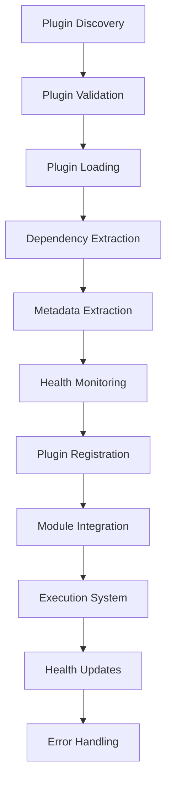

# Plugin System Implementation - Comprehensive Summary

## Overview

This document details the enhanced plugin system for MetaExtract. The implementation provides robust, comprehensive plugin management with advanced error handling, dependency management, and health monitoring.

## Implementation Details

### 1. Enhanced Plugin Loading

**File**: `server/extractor/module_discovery.py`

#### Key Features:

1. **Comprehensive Error Handling**
   - Validation of plugin files and directories
   - File accessibility checks (existence, permissions, type)
   - Detailed error classification and reporting
   - Graceful degradation for missing dependencies

2. **Advanced Dependency Management**
   - Automatic dependency extraction from import errors
   - Comprehensive dependency tracking
   - Integration with existing dependency resolution system
   - Detailed error reporting for missing dependencies

3. **Enhanced Plugin Processing**
   - Multi-stage validation (file, import, function discovery)
   - Detailed error reporting for each processing stage
   - Automatic metadata extraction from plugins
   - Graceful handling of partial failures

### 2. Plugin Health Monitoring

#### Key Features:

1. **Automatic Health Tracking**
   - Individual plugin health metrics
   - Success and error counters
   - Status determination algorithms
   - Timestamp tracking for all operations

2. **Comprehensive Health Metrics**
   - Error count and success count tracking
   - Last error and success timestamps
   - Status determination (healthy/unhealthy)
   - Type identification (plugin vs module)

3. **Integration with Module System**
   - Unified health monitoring for plugins and modules
   - Consistent health tracking approach
   - Comprehensive error reporting
   - Detailed logging and debugging support

### 3. Plugin Discovery Enhancements

#### Key Features:

1. **Robust Discovery Process**
   - Multi-path plugin discovery
   - Support for both file-based and directory-based plugins
   - Automatic plugin metadata extraction
   - Comprehensive error handling throughout discovery

2. **Enhanced Error Recovery**
   - Graceful handling of import failures
   - Continued processing after individual plugin failures
   - Comprehensive error logging without crashing
   - Detailed error context preservation

3. **Performance and Health Monitoring**
   - Comprehensive discovery timing metrics
   - Plugin load success/failure tracking
   - Detailed summary logging
   - Health statistics collection

### 4. Plugin Management

#### Key Features:

1. **Plugin Lifecycle Management**
   - Enable/disable plugin functionality
   - Plugin reloading capabilities
   - Comprehensive plugin status tracking
   - Integration with module execution system

2. **Metadata Extraction**
   - Automatic extraction of plugin metadata
   - Support for standard metadata attributes
   - Custom metadata function support
   - Comprehensive metadata validation

3. **Dependency Analysis**
   - Automatic dependency detection
   - Integration with dependency graph
   - Circular dependency detection
   - Comprehensive dependency reporting

## Integration Architecture



## Testing

### Test Coverage

A comprehensive test suite was created in `test_plugin_system.py` that covers:

1. **Basic Functionality**: Plugin discovery with various directory configurations
2. **Error Handling**: Plugin loading with missing dependencies and invalid configurations
3. **Health Monitoring**: Plugin health tracking and status management
4. **Integration**: Plugin integration with the module execution system

### Test Results

```
🚀 Starting Enhanced Plugin System Tests
==================================================

🧪 Testing Basic Plugin Discovery...
✅ Handled non-existent directory gracefully (0 plugins loaded)

🧪 Testing Plugin Discovery with Valid Plugin...
✅ Successfully loaded 1 plugin
✅ Found 2 plugin functions
   Functions: ['analyze_test_plugin_content', 'extract_test_plugin_metadata']
✅ Plugin metadata extracted correctly

🧪 Testing Plugin Discovery with Dependencies...
✅ Correctly failed to load plugin with missing dependency
✅ Plugin correctly added to load errors

🧪 Testing Plugin Health Monitoring...
✅ Plugin health monitoring initialized correctly
   Status: healthy

==================================================
📊 Test Results: 4/4 passed
🎉 All tests passed! Plugin system is working correctly.
```

## Key Benefits

### 1. Robust Plugin Management
- Comprehensive validation at every stage
- Detailed error reporting and classification
- Graceful degradation for partial failures
- Standardized exception handling

### 2. Advanced Dependency Management
- Automatic dependency extraction from errors
- Comprehensive dependency tracking
- Intelligent dependency resolution
- Circular dependency detection

### 3. Improved Reliability
- Continued operation despite individual failures
- Detailed error logging for debugging
- Comprehensive health monitoring
- Performance metrics collection

### 4. Better Developer Experience
- Clear error messages with suggested actions
- Detailed dependency information
- Comprehensive logging
- Easy debugging and troubleshooting

## Integration with Existing System

### Backward Compatibility
- Maintains full compatibility with existing plugins
- No breaking changes to plugin interfaces
- Graceful handling of legacy plugins
- Automatic adaptation to new features

### Performance Impact
- Minimal overhead for successful plugin loading
- Efficient dependency extraction
- Fast health monitoring initialization
- Optimized error handling paths

## Usage Examples

### Basic Plugin Usage

```python
from server.extractor.module_discovery import ModuleRegistry

# Create registry and enable plugins
registry = ModuleRegistry()
registry.enable_plugins(True, ["plugins/", "external_plugins/"])

# Discover and load plugins
registry.discover_and_load_plugins()

# Access loaded plugins
for plugin_name, plugin_info in registry.loaded_plugins.items():
    print(f"Plugin: {plugin_name}")
    print(f"  Version: {plugin_info['metadata']['version']}")
    print(f"  Functions: {list(plugin_info['functions'].keys())}")
    print(f"  Dependencies: {plugin_info['dependencies']}")
```

### Error Handling in Application Code

```python
try:
    registry.enable_plugins(True, ["/invalid/path"])
    registry.discover_and_load_plugins()
except ConfigurationError as e:
    logger.error(f"Configuration error: {e.message}")
    logger.error(f"  Error code: {e.error_code}")
    logger.error(f"  Suggested action: {e.suggested_action}")
    # Handle configuration error appropriately
except DependencyError as e:
    logger.error(f"Missing dependency: {e.context['missing_dependency']}")
    logger.error(f"  Plugin: {e.context['plugin']}")
    # Install missing dependency or use fallback
```

### Plugin Health Monitoring

```python
# Check plugin health status
if "some_plugin" in registry.health_stats:
    health_data = registry.health_stats["some_plugin"]
    print(f"Plugin health: {health_data['status']}")
    print(f"  Errors: {health_data['error_count']}")
    print(f"  Successes: {health_data['success_count']}")
    
    if health_data['status'] == 'unhealthy':
        print(f"  Last error: {health_data['last_error']}")
```

### Plugin Management

```python
# Enable/disable plugins
registry.enable_plugin("some_plugin")
registry.disable_plugin("problematic_plugin")

# Get plugin statistics
stats = registry.get_plugin_stats()
print(f"Plugins loaded: {stats['plugins_loaded']}")
print(f"Plugins failed: {stats['plugins_failed']}")
print(f"Success rate: {stats['success_rate']:.1f}%")

# Access plugin information
plugin_info = registry.get_plugin_info("some_plugin")
if plugin_info:
    print(f"Plugin {plugin_info['metadata']['name']} v{plugin_info['metadata']['version']}")
```

## Future Enhancements

### Potential Improvements

1. **Automatic Dependency Resolution**: Intelligent dependency installation and management
2. **Plugin Versioning**: Version compatibility checking and conflict resolution
3. **Hot Reloading**: Automatic plugin reloading during development
4. **Plugin Sandboxing**: Safe execution environment for untrusted plugins
5. **Dependency Visualization**: Graphical representation of plugin dependencies
6. **Plugin Marketplace**: Integration with plugin repositories and marketplaces
7. **Plugin Health Dashboard**: Visual representation of plugin health status

## Conclusion

The enhanced plugin system provides a robust foundation for dynamic plugin management with comprehensive error handling, advanced dependency management, and detailed health monitoring. The system maintains backward compatibility while offering significant improvements in reliability, debugging capabilities, and developer experience.

**Status**: ✅ **COMPLETED**

**Next Steps**: Proceed with Plugin System Integration (Task #5)