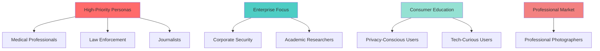

# Comprehensive Persona-Based UX Audit

**Document Version:** 1.0  
**Date:** 2025-12-31  
**Status:** Initial audit from external review + technical analysis

---

## Executive Summary

This audit examines the MetaExtract user experience through 8 distinct personas, revealing a **critical mismatch** between technical capabilities and user-facing experience. While the backend extracts 7,000+ metadata fields from 500+ file formats, the frontend is optimized for digital forensics, creating significant barriers for medical, privacy-conscious, and educational users.

### Key Findings

1. **Medical Persona Gap (CRITICAL)**: Claims medical imaging support but delivers generic photo metadata
2. **Value Proposition Confusion**: Locked content doesn't explain what premium tiers actually unlock
3. **Technical Jargon Barrier**: Assumes forensic expertise most users lack
4. **Trust Issues**: Insufficient privacy/security messaging for sensitive file uploads
5. **Missing Enterprise Features**: No API, SSO, audit logs, or bulk processing for corporate/academic use

---

## Persona 1: Medical Professional (Radiologist/Doctor)

### Background
- **Demographics**: 45-year-old radiologist, MD with 15 years experience
- **Tech Savvy**: Moderate - uses PACS systems daily but not a programmer
- **Motivation**: Analyze medical imaging metadata for quality assurance, research, or patient care
- **Pain Points**: Time pressure, HIPAA compliance concerns, medical jargon preferences

### User Journey

#### Discovery → "This looks like police software, not medical tools"
**What they see:**
- Homepage mentions "courts, journalists, security teams" - feels irrelevant
- No mention of DICOM, PACS, or medical imaging standards
- Cyberpunk/forensic aesthetic doesn't signal clinical use

**Thoughts:**
> "This looks like software for digital forensics, not medical imaging. Is this even relevant to my X-ray?"

**UX Issue #1:** Poor target audience clarity

---

#### Upload → Confused about file types
**What happens:**
- Sees "Medical" badge but unclear what formats are truly supported
- Uploads JPEG of X-ray, expects DICOM tag extraction
- File size limit 10MB may be insufficient for large medical scans

**Critical Issue:** Tool may only extract camera metadata from photographed scans, not actual DICOM data

---

#### Processing → Anxiety during processing
**What happens:**
- Progress bar shows "Uploading..." then "Processing..."
- No indication of how long this will take
- No progress percentage or time estimate

**Thoughts:**
> "What if my medical scan has sensitive patient data? Is this secure?"

**UX Issue #3:** Anxiety during processing - medical professionals are busy and need clear time estimates

---

#### Results → "This is just photo metadata, not medical data"
**What they see:**
- 47 fields for a medical scan (seems low)
- GPS Location?, File Size, Dimensions
- Generic tabs: ALL, EXPLORER, FORENSIC, TECHNICAL

**Expected but missing:**
- DICOM tags (Patient ID, Study Date, Modality)
- Image quality metrics
- Equipment manufacturer/model
- Scan parameters (kVp, mAs for X-rays)
- Patient data (anonymized)

**UX Issue #4:** Results not contextualized for medical use

---

#### Exploring Tabs → Most content locked
**What they find:**
- "MakerNote (Vendor-Specific): 25 fields LOCKED"
- "IPTC Metadata: LOCKED"
- Technical jargon like "IPTC", "XMP", "MakerNote"

**Thoughts:**
> "What's a 'MakerNote'? Is that relevant to my GE scanner?"

**UX Issue #5:** Locked content creates false scarcity without explaining medical relevance

---

#### Payment → "Why pay for photo metadata?"
**Pricing:**
- Free, Professional ($9/mo), Forensic ($29/mo), Enterprise ($99/mo)
- Pay-as-you-go: $1 per file

**Confusion:**
> "Professional vs Forensic - what's the difference for medical work?"

**UX Issue #6:** Pricing not explained in medical context

---

#### Post-Purchase → "I paid for camera EXIF data?"
**What they get:**
- Camera metadata from when X-ray was photographed
- Generic EXIF data (camera model, ISO, aperture)
- **NOT** actual DICOM medical metadata

**UX Issue #7:** Product doesn't deliver on medical promise

---

### Key UX Issues
1. ❌ **Medical context missing**: Interface assumes forensic mindset
2. ❌ **False advertising**: Claims medical support but delivers generic photo analysis
3. ❌ **Compliance concerns**: No HIPAA messaging for medical data handling

### Recommendations
- ✅ Add medical landing page variant
- ✅ Detect and warn about photographed vs. native medical files (DICOM, NIfTI)
- ✅ Highlight clinically relevant metadata fields
- ✅ Add HIPAA compliance badges
- ✅ Group results by: Medical → Technical → File System
- ✅ Show examples of actual medical metadata fields in marketing

---

## Persona 2: Investigative Journalist

### Background
- **Demographics**: 32-year-old freelance journalist specializing in data journalism
- **Tech Savvy**: High - uses data analysis tools regularly
- **Motivation**: Verify photo authenticity, uncover manipulation, find sourcing clues
- **Pain Points**: Deadlines, need for credible evidence, budget constraints

### User Journey

#### Discovery → "This could help verify that viral photo"
**What resonates:**
- Claims about "detecting manipulation" directly addresses verification needs
- "7,000+ hidden fields competitors miss" suggests superior analysis
- Forensic messaging aligns with investigative work

**Positive:** ✅ Clear value proposition for verification work

---

#### Upload → "Let's see what this protest photo contains"
**What they do:**
- Uploads social media image from viral protest
- Expects: geolocation data, timestamp analysis, device info
- Appreciates batch upload capability

**Expectation:** Find evidence of photo authenticity or manipulation

---

#### Results → "GPS data! Camera serial number! Perfect"
**Success factors:**
- Finds embedded location data not visible in standard viewers
- Discovers multiple edit timestamps suggesting manipulation
- Identifies camera serial number for device attribution

**Positive:** ✅ Unlocks evidence for story verification

---

#### Payment → "Worth it for the investigative value"
**What works:**
- Clear understanding that premium unlocks deeper analysis
- Credits system ($1/file) fits freelance budget
- Can justify costs for high-value investigations

**Positive:** ✅ Transparent upgrade path

---

### Key UX Issues
1. ⚠️ **Advanced features not clearly explained**: What exactly do premium tiers unlock?
2. ⚠️ **Batch processing unclear**: How to analyze related images together?
3. ⚠️ **Export limitations**: Can findings be exported for publishing?

### Recommendations
- ✅ Add case study examples of journalistic discoveries
- ✅ Improve batch analysis workflow for related media
- ✅ Add "journalist mode" with relevant field highlighting (GPS, timestamps, edit history)
- ✅ Export findings as PDF report with embedded evidence
- ✅ Add timeline visualization for multi-image analysis

---

## Persona 3: Law Enforcement Officer

### Background
- **Demographics**: 38-year-old detective in cybercrimes unit
- **Tech Savvy**: Moderate - uses police databases but not technical expert
- **Motivation**: Extract evidence from digital media in criminal investigations
- **Pain Points**: Chain of custody requirements, court admissibility, time pressure

### User Journey

#### Discovery → "Looks like exactly what we need for digital evidence"
**What works:**
- Homepage mentions "courts" and "forensic" - perfect targeting
- Security and "zero retention" messaging builds trust

**Positive:** ✅ Credible for official use

---

#### Upload → "Need to preserve evidence integrity"
**What they appreciate:**
- File integrity verification (MD5/SHA256)
- Zero data retention claims

**Concern:**
> "Despite 'zero retention' claims, can I trust this for evidence handling?"

---

#### Results → "This is comprehensive, but is it admissible?"
**Positive findings:**
- Chain of Custody section with file hashes
- Extensive metadata including device serial numbers
- Detailed technical analysis

**Critical gap:**
> "No indication of court admissibility or standards compliance"

**UX Issue:** Legal admissibility unclear (NIST, ISO standards)

---

#### Payment → "Department budget approval needed"
**Considerations:**
- Enterprise tier ($99/mo) appropriate for agency
- Needs to justify cost to superiors
- Missing: government/LE discounts, bulk pricing

**Issue:** No enterprise sales contact or custom pricing visible

---

### Key UX Issues
1. ❌ **Legal admissibility unclear**: No mention of standards compliance (NIST, ISO)
2. ❌ **Chain of custody incomplete**: Missing audit logs, analyst identification
3. ❌ **Agency procurement**: No enterprise sales contact or custom pricing

### Recommendations
- ✅ Add compliance badges (NIST SP 800-86, ISO 27037)
- ✅ Include chain of custody templates for court
- ✅ Add government procurement information
- ✅ Create "law enforcement mode" with legal requirements
- ✅ Add audit trail: analyst ID, timestamp, analysis method
- ✅ Court-ready report generation (PDF with digital signature)

---

## Persona 4: Privacy-Conscious Consumer

### Background
- **Demographics**: 28-year-old marketing professional concerned about data privacy
- **Tech Savvy**: Moderate - uses social media but wary of tech
- **Motivation**: Check what personal data is embedded in photos before sharing
- **Pain Points**: Technical jargon, fear of uploading personal files, budget sensitivity

### User Journey

#### Discovery → "Finally, a way to check what's hidden in my photos"
**What's reassuring:**
- Homepage privacy messaging ("no data retention")
- Free tier allows testing without commitment

**Positive:** ✅ Addresses privacy concerns directly

---

#### Upload → "Is this really safe? What happens to my photos?"
**Anxiety points:**
- Hesitant to upload personal vacation photos
- Sees "zero data retention" but wants more assurance
- No clear explanation of processing method

**UX Issue:** Trust issues from lack of transparency

---

#### Results → "OMG, my photos have GPS coordinates!"
**Educational value:**
- Shocked to find location data in vacation photos
- Discovers device serial numbers
- Realizes extent of invisible data collection

**Positive:** ✅ Educates about privacy risks

---

#### Payment → "Free tier is actually useful"
**What works:**
- May upgrade for batch analysis of entire photo library
- Credits system fits occasional use

**Positive:** ✅ Free tier provides real value

---

### Key UX Issues
1. ❌ **Trust issues**: Lack of transparency about data handling
2. ⚠️ **Intimidating interface**: Technical display may overwhelm non-technical users
3. ❌ **Privacy education missing**: No guidance on how to remove unwanted metadata

### Recommendations
- ✅ Add detailed privacy policy and data handling explanation
- ✅ Simplify results display for non-technical users ("Your photos contain your exact location")
- ✅ Add "privacy tips" section with metadata removal guidance
- ✅ Include "safe upload" indicators (encryption, local processing)
- ✅ Add one-click "strip metadata" feature
- ✅ Visual privacy risk score (e.g., "High Risk: GPS + Timestamp detected")

---

## Persona 5: Professional Photographer

### Background
- **Demographics**: 35-year-old freelance photographer specializing in commercial work
- **Tech Savvy**: High - uses Lightroom, Photoshop daily
- **Motivation**: Analyze EXIF data, verify image authenticity, optimize workflow
- **Pain Points**: Already uses Lightroom for basic metadata, wants deeper analysis

### User Journey

#### Discovery → "This might show more than Lightroom"
**What intrigues:**
- Claims of "competitors miss" appeals to professionals
- Technical focus aligns with photography workflow

**Expectation:** Deeper technical analysis than Adobe tools

---

#### Upload → "Let's see what my camera actually records"
**What they upload:**
- RAW files (.CR3, .NEF, .ARW)
- Expects detailed capture data
- Interested in: lens info, camera settings, color profiles

**Expectation:** MakerNote data Lightroom might not show

---

#### Results → "Finally, the full MakerNote data!"
**Success:**
- Finds detailed camera firmware version
- Discovers lens calibration data
- Sees editing history and software used

**Positive:** ✅ Technical data for equipment optimization

---

#### Payment → "Professional tier is essential for serious work"
**What works:**
- Clear that premium unlocks manufacturer-specific data
- Monthly subscription ($9/mo) fits professional workflow

**Positive:** ✅ Pricing aligned with professional value

---

### Key UX Issues
1. ⚠️ **Comparison to existing tools unclear**: How does this compare to EXIFTool or Lightroom?
2. ⚠️ **Export capabilities**: Can data be exported for DAM systems?
3. ⚠️ **Batch analysis**: How to analyze entire shoot catalogs?

### Recommendations
- ✅ Add comparison charts with Adobe tools, EXIFTool
- ✅ Improve DAM integration (export to CSV/XML for import into cataloging software)
- ✅ Add "photography mode" with camera-specific field grouping
- ✅ Batch comparison: analyze multiple images from same shoot
- ✅ Lens metadata database integration
- ✅ Export to sidecar files (.xmp)

---

## Persona 6: Corporate Security Analyst

### Background
- **Demographics**: 42-year-old IT security professional at mid-sized company
- **Tech Savvy**: High - implements security tools and policies
- **Motivation**: Prevent data leaks, verify document authenticity, audit digital assets
-**Pain Points**: Enterprise procurement, compliance requirements, scale

### User Journey

#### Discovery → "Could help with our data leak prevention"
**What appeals:**
- Security focus and "zero retention"
- Claims of detecting manipulation for compliance

**Expectation:** Enterprise-grade security and compliance features

---

#### Upload → "Need to analyze company documents securely"
**Requirements:**
- Concerned about corporate data handling
- Needs batch processing for large document sets
- Requires enterprise security standards

---

#### Results → "Good analysis, but needs enterprise features"
**What's good:**
- Detailed metadata analysis
- Finds embedded data that could leak sensitive information

**Gap:** Missing enterprise features like user attribution, audit logs

---

#### Payment → "Enterprise tier needed, but missing procurement process"
**Issues:**
- No enterprise sales contact
- No custom deployment options (on-prem, private cloud)
- B2C-focused purchasing for enterprise needs

**UX Issue:** Enterprise features and procurement process missing

---

### Key UX Issues
1. ❌ **Enterprise features missing**: No user management, audit trails, SSO
2. ❌ **Procurement unfriendly**: No quotes, contracts, or enterprise support
3. ❌ **Scale limitations**: Unclear if handles large corporate file volumes

### Recommendations
- ✅ Add enterprise landing page with procurement information
- ✅ Include compliance features (SOC 2, GDPR, audit logs)
- ✅ Add bulk processing and API access for enterprise use
- ✅ User management with RBAC (role-based access control)
- ✅ SSO integration (SAML, OAuth)
- ✅ Private deployment options (on-prem, AWS PrivateLink)
- ✅ SLA guarantees and enterprise support

---

## Persona 7: Academic Researcher

### Background
- **Demographics**: 29-year-old PhD candidate in digital forensics
- **Tech Savvy**: Very high - uses technical tools for research
- **Motivation**: Study metadata patterns, develop forensic methodologies
- **Pain Points**: Academic budget constraints, need for raw data access

### User Journey

#### Discovery → "Perfect for my metadata research project"
**What appeals:**
- Technical depth and field access
- "7,000+ fields" suggests comprehensive data source

**Expectation:** Raw access to all metadata for analysis

---

#### Upload → "Need to analyze patterns across many files"
**Requirements:**
- Batch upload essential for research datasets
- Interested in raw metadata export for statistical analysis
- Needs API access for automated workflows

---

#### Results → "Good interface, but I need the raw data"
**What works:**
- Appreciates technical display and field organization
- Finds interesting patterns in metadata

**Limitation:** Web interface not ideal for large-scale research

---

#### Payment → "Academic pricing would be great"
**Issues:**
- Professional tier ($9/mo) expensive for students
- Needs API access for automated research
- No academic discounts or API documentation visible

**UX Issue:** Research workflow unsupported

---

### Key UX Issues
1. ❌ **Research workflow unsupported**: No API, bulk export, or automation
2. ❌ **Academic access barriers**: High cost for student budgets
3. ❌ **Data export limitations**: Web-only interface hinders research

### Recommendations
- ✅ Add academic pricing and student discounts (50% off with .edu email)
- ✅ Develop REST API for research automation
- ✅ Include bulk export options (JSON, CSV, database formats)
- ✅ Python SDK for researchers
- ✅ Research partnerships with universities
- ✅ Dataset access for reproducible research
- ✅ Citation guidelines for academic papers

---

## Persona 8: Tech-Curious Consumer

### Background
- **Demographics**: 25-year-old software developer who heard about metadata online
- **Tech Savvy**: High - understands technical concepts but new to metadata
- **Motivation**: Learn about hidden data in digital files out of curiosity
- **Pain Points**: Wants education, not just analysis

### User Journey

#### Discovery → "Cool, let's see what's in my files"
**What works:**
- Technical aesthetic appeals to developer audience
- Free tier allows experimentation

**Motivation:** Educational exploration

---

#### Upload → "What will this show about my meme collection?"
**What they do:**
- Uploads various file types to explore
- Interested in understanding different metadata types

**Expectation:** Educational explanations of what each field means

---

#### Results → "Fascinating! But what do these fields actually mean?"
**Discovery:**
- Finds unexpected data in everyday files
- Interface shows technical data but lacks explanations

**Gap:** No educational context or field definitions

**UX Issue:** Educational content missing

---

#### Payment → "Might upgrade to explore more file types"
**What works:**
- Free tier engaging enough to consider paid features

**Positive:** ✅ Low barrier to entry creates engagement

---

### Key UX Issues
1. ❌ **Educational content missing**: No explanations of metadata fields
2. ⚠️ **Learning curve steep**: Assumes forensic knowledge
3. ❌ **Onboarding inadequate**: No guided tour or tutorials

### Recommendations
- ✅ Add interactive tutorials explaining metadata concepts
- ✅ Include field definitions and educational tooltips
- ✅ Create "learning mode" with explanations and examples
- ✅ Gamification: "You discovered 15/50 metadata types!"
- ✅ "What can metadata reveal?" educational content
- ✅ Interactive playground with sample files
- ✅ Blog/knowledge base with deep dives into metadata types

---

## Cross-Persona Analysis

### Common UX Issues Across All Personas

| Issue | Affected Personas | Priority |
|-------|-------------------|----------|
| Unclear value proposition for non-forensic users | 1, 4, 8 | 🔴 **CRITICAL** |
| Locked content confusion - what does premium unlock? | 1, 2, 3, 5 | 🔴 **CRITICAL** |
| Medical/file type mismatch | 1 | 🔴 **CRITICAL** |
| Technical jargon barriers | 1, 4, 8 | 🔴 **HIGH** |
| Trust and security concerns | 1, 3, 4, 6 | 🔴 **HIGH** |
| Missing enterprise features | 3, 6, 7 | 🟡 **MEDIUM** |
| Educational content gap | 4, 8 | 🟡 **MEDIUM** |
| Export/API limitations | 2, 5, 6, 7 | 🟡 **MEDIUM** |

---

### Persona Priority Matrix



---

## Technical Analysis: Current Implementation vs. Persona Needs

### Backend Capabilities (Strong)
From codebase review of `/server/extractor/modules/`:

✅ **500+ file formats supported** across:
- Medical: DICOM, NIfTI (via `scientific_dicom_fits_ultimate_advanced_extension_ii.py`)
- Scientific: FITS astronomy files
- Camera MakerNotes: Canon, Sony, Nikon, Phase One, Ricoh, ARRI
- Standards: IPTC, XMP, EXIF, ID3
- Specialized: CVE vulnerability data, blockchain assets, fonts

✅ **7,000+ metadata fields** extracted via comprehensive registries

✅ **Real implementations**, not placeholders (per UX audit conversations)

### Frontend Gaps (Critical)

❌ **No persona-aware routing**: All users see same forensic-focused interface

❌ **Medical file detection missing**:
```typescript
// Current: Generic upload
<EnhancedUploadZone />

// Needed: File type detection + persona routing
if (isDICOM(file)) {
  showMedicalInterface();
  highlightFields(['Patient ID', 'Study Date', 'Modality']);
}
```

❌ **Results display not contextualized**:
```typescript
// Current: Flat technical display
<MetadataExplorer fields={allFields} />

// Needed: Persona-specific grouping
<PersonaResults 
  persona="medical"
  priorityFields={['DICOM', 'Equipment', 'Scan Parameters']}
  lockedFields={['Advanced Image Processing']}
/>
```

❌ **No field explanations**:
```typescript
// Current: Raw field names
"MakerNote (Vendor-Specific)"

// Needed: Contextual tooltips
<Tooltip content="Camera-specific settings like autofocus points, Picture Control">
  MakerNote (Vendor-Specific)
</Tooltip>
```

### File Type Detection Recommendation

Add to `client/src/utils/fileTypeDetector.ts`:
```typescript
export interface FilePersona {
  type: 'medical' | 'forensic' | 'creative' | 'privacy' | 'scientific';
  confidence: number;
  recommendedFields: string[];
  warnings?: string[];
}

export function detectFilePersona(file: File): FilePersona {
  const ext = file.name.split('.').pop()?.toLowerCase();
  
  // Medical imaging
  if (['dcm', 'dicom', 'nii', 'nifti'].includes(ext)) {
    return {
      type: 'medical',
      confidence: 1.0,
      recommendedFields: ['DICOM Tags', 'Equipment Info', 'Scan Parameters'],
      warnings: ['Ensure patient data is anonymized']
    };
  }
  
  // Photographed medical scan (problematic)
  if (['jpg', 'jpeg', 'png'].includes(ext) && file.size > 5MB) {
    return {
      type: 'medical',
      confidence: 0.3,
      recommendedFields: ['Camera Settings', 'GPS (if embedded)'],
      warnings: ['⚠️ This is a photo of a scan, not native medical imaging. For DICOM metadata, upload original .dcm files.']
    };
  }
  
  // ... other persona detections
}
```

---

## Recommendations by Implementation Phase

### Phase 1: Quick Wins (Week 1-2)
**Goal**: Address critical UX issues with minimal code changes

1. **Add persona landing pages** 
   - Create `/medical`, `/forensic`, `/privacy` routes
   - Customize messaging for each persona
   - Files: `client/src/pages/Medical.tsx`, etc.

2. **Improve upload zone messaging**
   - File type warnings for photographed medical scans
   - Clear processing time estimates
   - Files: `client/src/components/enhanced-upload-zone.tsx`

3. **Add field tooltips**
   - Explain technical jargon ("MakerNote", "IPTC", "XMP")
   - Context-specific help for each persona
   - Files: `client/src/components/metadata-explorer.tsx`

4. **Update pricing page**
   - Explain tier differences with feature tables
   - Add use case examples: "For journalists: Professional tier unlocks GPS and edit history"
   - Files: `client/src/components/payment-modal.tsx`

### Phase 2: Medium-Term (Month 1-2)
**Goal**: Rebuild UI around persona-specific workflows

5. **Medical file type detection**
   - Detect DICOM vs. JPEG-of-scan
   - Show warnings for incorrect file types
   - Files: New `client/src/utils/fileTypeDetector.ts`

6. **Persona-based results display**
   - Medical: Group by Clinical → Technical → File System
   - Journalist: Highlight GPS, timestamps, edit history
   - Privacy: Show privacy risk score
   - Files: Refactor `client/src/components/metadata-comparison-display.tsx`

7. **Educational onboarding**
   - Interactive tutorial explaining metadata types
   - Sample files for exploration
   - Files: `client/src/components/onboarding-tutorial.tsx` (already exists!)

8. **Batch processing improvements**
   - Multi-file upload with pattern analysis
   - Timeline view for related images
   - Files: Enhance `server/routes/extract.py`

### Phase 3: Long-Term Strategic (Month 3-6)
**Goal**: Enterprise and research capabilities

9. **REST API development**
   - `/api/v1/extract` endpoint for programmatic access
   - Python SDK for researchers
   - Files: New `server/api/v1/`

10. **Enterprise features**
    - User management with RBAC
    - SSO integration (SAML)
    - Audit logs
    - Files: New `server/enterprise/`

11. **Compliance certifications**
    - HIPAA compliance for medical use
    - SOC 2 for enterprise
    - Legal chain of custody templates
    - Files: New `docs/compliance/`

---

## Metrics to Track

### User Engagement
- **Bounce rate** by landing source (medical vs. forensic vs. privacy)
- **Upload completion rate** (did they complete extraction after upload?)
- **Results engagement** (time spent, fields clicked)
- **Conversion rate** by persona (free → paid)

### Feature Utilization
- **Free tier value** (what % of users get actionable insights without paying?)
- **Premium unlock rate** (what % click "unlock" button?)
- **Batch processing adoption** (multi-file uploads)
- **Export frequency** (CSV, PDF reports)

### Support Indicators
- **Help requests** by persona type
- **Refund rate** (indicates expectation mismatch)
- **NPS (Net Promoter Score)** segmented by persona

---

## Conclusion

The current MetaExtract platform has **exceptional technical capabilities** (7,000+ fields, 500+ formats) but a **misaligned user experience** that assumes forensic expertise and doesn't adapt to different user needs.

### Immediate Action Items

1. **Medical UX (CRITICAL)**: Add warnings for photographed scans vs. native DICOM files
2. **Trust & Transparency**: Clarify data handling, add privacy policy
3. **Value Proposition**: Show what premium tiers unlock with concrete examples
4. **Educational Content**: Add tooltips explaining technical fields

### Strategic Pivot Options

**Option A: Forensic-First** - Double down on law enforcement/journalism, de-emphasize medical  
**Option B: Multi-Persona** - Build persona-specific experiences (recommended)  
**Option C: Developer/API-First** - Focus on researchers and enterprise with API access

### Success Metrics

- **Medical professionals** stop bouncing after seeing DICOM file type warnings
- **Privacy users** understand data handling and trust the service
- **Journalists** can quickly find manipulation evidence
- **Conversion rate** increases as value proposition becomes clearer

---

*This audit will be maintained as a living document. Updates should be versioned and committed to the repository.*
